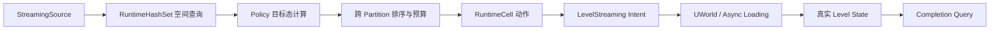
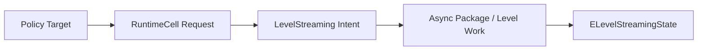
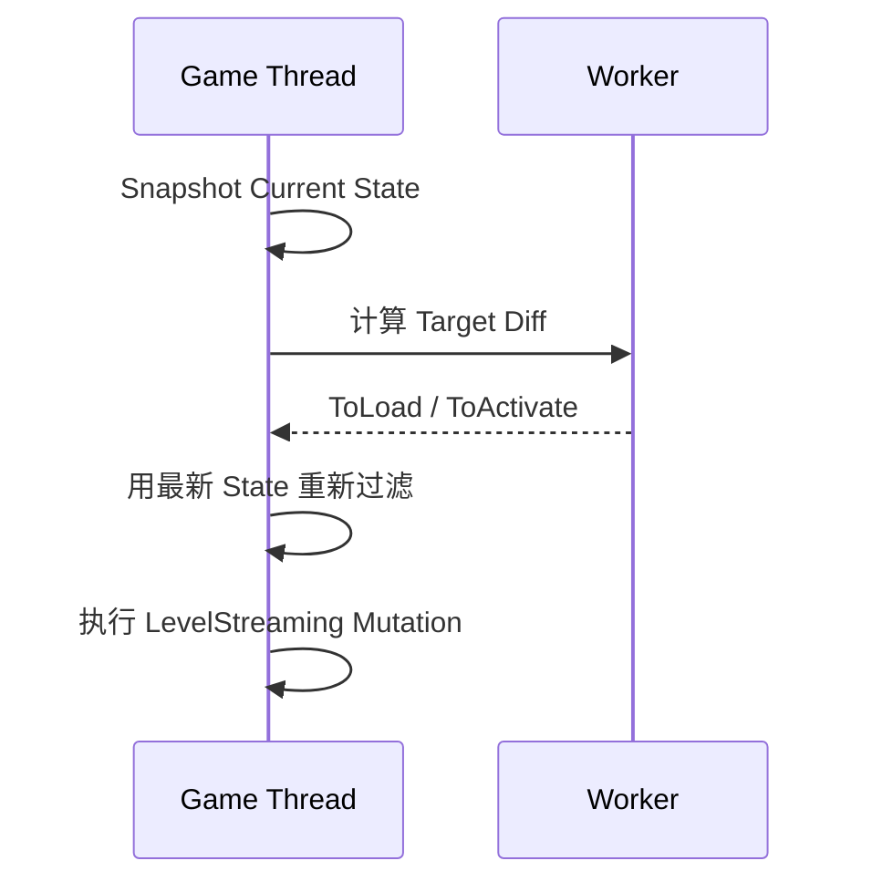

# 流送状态收敛：World Partition 的空间查询、帧预算与 LevelStreaming 交接

> 系列：从 Unreal Engine 源码理解引擎设计
>
> 日期：2026-08-19
>
> 状态：草稿
>
> 核心问题：大型开放世界中，玩家附近的内容怎样从“应该加载”逐步变成“已经真正进入世界”，同时避免空间查询、异步加载、可见性和帧预算互相混成一个不可解释的状态？
>
> 关键词：Unreal Engine、World Partition、StreamingSource、RuntimeCell、LevelStreaming、State Convergence

[系列目录](../blog.html)

开放世界流送最容易形成一个直觉模型：

```text
玩家进入某个格子
→
加载这个格子

玩家离开
→
卸载这个格子
```

这个模型非常适合解释概念。

但真正开始调试大型世界以后，很快会遇到一些看起来互相矛盾的现象：

- 玩家已经靠近某片区域，但对应 Cell 没有进入加载；
- Cell 已经被标记为 Activated，画面里却仍然看不到；
- StreamingSource 明明命中了空间范围，Data Layer 仍然让它保持 Unloaded；
- 调高“每帧加载数量”以后，流送仍然没有明显加快；
- Policy 日志显示请求已经全部处理，`IsStreamingCompleted()` 却仍然返回 false；
- 多个 World Partition 同时存在时，近处内容似乎仍然被其他 Partition 的请求抢占预算；
- 开启异步 Update 后，目标态计算可以进入 Worker，但真正的 LevelStreaming 修改仍然发生在 Game Thread；
- Dedicated Server 与客户端面对完全相同的 Source，Cell 生命周期却并不一致。

如果只使用：

```text
Loaded = true / false
```

解释这些状态，很多问题都会显得像随机 Bug。

但 World Partition 真正的模型并不是：

```text
距离判断
→
加载。
```

它是一套持续把“世界需求”收敛成“底层真实状态”的控制系统。

## 先说结论：World Partition 运行时是一条状态收敛链

**流送状态收敛（后文简称“从想要加载到真的加载完”）**：系统先根据 StreamingSource 和世界规则计算 RuntimeCell 的目标状态，再经过优先级、帧预算和 LevelStreaming 异步执行，使实际世界状态逐步追上目标状态。

可以先把主链压缩为：



这里最重要的是：

> 每个箭头都代表一次状态转换，不是同一个状态换了不同名字。

整个系统至少存在三本账：

| 状态层 | 回答的问题 |
|---|---|
| Policy Target | 这一轮希望 Cell 变成什么 |
| LevelStreaming Intent | 已经向底层提出什么加载/可见性要求 |
| Actual Streaming State | Level 当前真正完成到哪里 |

这三层一旦混在一起，排障就会变得非常困难。

## RuntimeCell 在运行时开始前就已经被生产出来

**RuntimeCell（后文简称“运行时可流送单元”）**并不是每一帧根据玩家位置重新把世界切一遍格子。

运行时所查询的 Cell，来自此前的世界生成结果。

可以粗略理解为：

```text
Actor / ActorSet
→
Runtime Partition
→
Cell Descriptor
→
Data Layer 拆分
→
RuntimeCell
→
静态空间索引
```

也就是说，大量复杂的：

- Actor 归属；
- Runtime Grid；
- Data Layer；
- Cell Bounds；
- HLOD；
- Priority；
- Content Bundle；

已经在运行时查询以前被压缩成稳定的 Cell 数据。

所以玩家移动时，系统不需要重新问：

> 世界中每一个 Actor 是否离玩家够近？

它只需要问：

> 已经生成的 RuntimeCell 中，哪些命中了当前 StreamingSource？

这是 World Partition 能够支撑大型世界的重要前提之一：

> 把高复杂度的世界描述尽可能留在生产期，把运行时问题压缩成稳定数据上的查询。

## StreamingSource 不是一个玩家坐标

**StreamingSource（后文简称“世界内容需求来源”）**：告诉 World Partition“从什么位置、以什么形状、什么目标状态和什么优先级需要内容”的统一输入。

最简单的 Source 确实可以来自玩家。

但它本身表达的信息远多于：

```text
Player.Position
```

一个 Source 可以携带：

- Location；
- Rotation；
- Priority；
- Velocity；
- TargetState；
- TargetGrids；
- Include / Exclude；
- 一个或多个 Shapes；
- 是否需要 Block On Slow Loading；
- 是否强制使用 2D 查询。

因此两个处于相同坐标的 Source，也可能要求完全不同的内容。

例如：

```text
玩家主体 Source
→
要求 Activated

远距离预取 Source
→
只要求 Loaded
```

二者虽然都命中同一个 Cell，含义并不相同。

## Loaded 与 Activated 是两种不同需求

这里是整个流送模型最重要的区别之一。

```text
Loaded
```

可以理解为：

> 内容需要进入内存，但暂时不要求真正可见并参与世界。

而：

```text
Activated
```

更接近：

> 内容不仅要加载，还需要进入可见、可参与 World 的状态。

因此：

```text
Prefetch
```

并不一定应该直接：

```text
Activate。
```

如果所有提前准备都直接要求 Activated，就会失去“提前进入内存，但暂时不进入世界”的中间层。

这也是为什么 Cell State 不是简单的：

```text
Loaded / Unloaded。
```

而存在一个有序关系：

```text
Unloaded
<
Loaded
<
Activated
```

这个顺序还会直接参与完成状态判断。

## 多个 Source 对同一个 Cell 的目标应当单调合并

一个 RuntimeCell 可能同时被多个 Source 命中。

例如：

```text
Source A
要求 Loaded

Source B
要求 Activated
```

系统不应该让 Cell：

```text
这一帧 Loaded
下一帧 Activated
再下一帧因为 Source A 又降回 Loaded
```

在相互冲突的需求之间抖动。

更稳定的做法是：

```text
Activated
覆盖
Loaded。
```

所以 Policy 在得到本轮：

```text
FrameLoadCells
FrameActivateCells
```

之后，会把：

```text
FrameLoadCells -= FrameActivateCells
```

即：

> 同一个 Cell 只保留这一轮要求的更高状态。

这是一个很通用的控制系统原则：

**单调目标合并（后文简称“多个需求同时存在时保留更强要求”）**：多个请求作用于同一对象时，如果状态存在明确包含关系，就合并为最高合法目标，而不是让各请求反复覆盖彼此。

## 空间命中并不是最终加载许可

即使 Source Shape 与某个 Cell 相交，也不代表它一定会加载。

空间只是第一层候选条件。

后续仍可能受到：

- Data Layer；
- HLOD；
- Client / Server Relevance；
- Target Grid；
- Server Streaming Policy；
- Slow Loading Policy；

继续过滤。

这意味着：

```text
Source 命中了 Cell
```

只能证明：

> 它进入了候选范围。

不能证明：

> 它已经获得加载许可。

因此排查：

```text
玩家明明站在这里，为什么内容没加载？
```

时，不能只画一个 Streaming Radius。

还需要继续检查：

```text
空间命中
→
Data Layer Wanted State
→
Relevance
→
Policy
→
Budget
→
LevelStreaming
```

## Data Layer 更接近状态门，而不是普通标签

如果把 Data Layer 只理解为：

```text
Cell 上的一个分类 Tag
```

很容易低估它对 Runtime Streaming 的影响。

运行时真正使用的是：

```text
Effective Wanted State。
```

假设 StreamingSource 要求：

```text
Activated。
```

但当前 Data Layer 只允许：

```text
Loaded。
```

那么最终目标仍然只能是：

```text
Loaded。
```

如果 Data Layer 当前：

```text
Unloaded，
```

即使玩家就站在 Cell 中央，空间查询也不能把它越权提升到 Activated。

因此这里的关系更像：

```text
Source
提出需求

Data Layer
规定当前允许达到的最高世界状态
```

两者共同决定最终目标。

## 非空间 Cell 说明“距离”从来不是唯一规则

World Partition 中还存在 Non-Spatial Cell。

它们不会因为：

```text
距离 Source 太远
```

就自然排除。

这类内容可能依赖：

- Always Loaded；
- Data Layer；
- 其他非空间世界规则。

所以：

```text
没有 StreamingSource
=
世界一定全部卸载
```

并不成立。

这再次说明：

> World Partition 不是单纯的距离 Streaming 系统，而是包含空间查询在内的世界状态策略系统。

## Policy 真正做的是“目标状态差分”

StreamingSource 查询结束以后，系统并不会对所有 Cell 重新执行一次：

```text
Load / Unload。
```

Policy 会把：

```text
本轮目标
```

与：

```text
当前 Policy 状态
```

进行比较。

由此得到四类变化：

| 差分 | 含义 |
|---|---|
| ToActivate | 需要提升到 Activated |
| ToLoad | 需要进入 Loaded |
| ToDeactivate | Activated 降为 Loaded |
| ToUnload | 不再需要保留 |

这比：

```text
每帧把所有命中的 Cell 全 Load 一遍
```

稳定得多。

整个系统真正计算的是：

> 与上一轮相比，哪些 Cell 的目标发生了变化？

这是一种典型的增量控制模型。

## Policy CurrentState 不是 Level 的真实状态

这是最容易产生误判的一层。

假设 Policy 决定：

```text
Cell A
→
Activated。
```

系统调用：

```text
Activate()
```

以后，Policy 可以立即把它记录到：

```text
ActivatedCells。
```

但此时底层 Level 可能仍然处于：

```text
Loading
```

甚至：

```text
LoadedNotVisible。
```

也就是说：

```text
Policy Activated
```

更准确的含义是：

> 我已经接受并发出了 Activated 目标。

它并不是：

> 这个 Level 已经真正显示出来。

**请求状态（后文简称“系统已经下单”）**和**事实状态（后文简称“底层真的完成”）**必须明确分开。

## LevelStreaming 还有自己的意图层

RuntimeCell 的动作最终会转换到 LevelStreaming。

例如：

```text
Load
→
ShouldBeLoaded = true
ShouldBeVisible = false

Activate
→
ShouldBeLoaded = true
ShouldBeVisible = true

Deactivate
→
ShouldBeVisible = false

Unload
→
ShouldBeLoaded = false
ShouldBeVisible = false
```

这些字段仍然只是：

```text
Intent。
```

它们表达：

> LevelStreaming 接下来应该向哪里走。

并不表示底层已经走到那里。

因此 World Partition 的完整状态关系是：



任何一层都不能直接替代下一层。

## `Activate()` 真正做的是开始一段收敛过程

从这个角度看：

```text
Activate()
```

并不是状态赋值：

```text
State = Activated。
```

而是：

```text
RequestedState = Activated
→
底层逐步追赶。
```

这是一种很值得迁移到其他异步系统的 API 设计思想：

> 会产生异步副作用的“状态修改”，最好被理解成 Request，而不是瞬时完成。

例如：

```text
Scene.Activate()
Service.Start()
Connection.Connect()
Asset.Load()
```

如果这些 API 都隐藏了异步收敛，却只暴露一个 Boolean，调用方很容易把“命令已发出”误认为“工作已完成”。

## `IsStreamingCompleted()` 才是真正的事实核验

Policy 已经处理完：

```text
ToLoad
ToActivate
```

并不代表流送已经完成。

它只意味着：

```text
当前目标请求已经全部发出。
```

真正的完成判断仍然需要重新查询：

```text
相关 Cell 当前 GetCurrentState() 到哪里？
```

**完成重验证（后文简称“最后重新看事实，而不是相信自己的命令”）**：异步控制系统不能仅根据“请求队列已经发空”判断成功，而应该重新读取底层实际状态并验证目标是否真正达成。

默认查询中，如果要求：

```text
Loaded，
```

但实际已经：

```text
Activated，
```

通常可以视为：

```text
目标至少已经达到。
```

所以：

```text
Activated >= Loaded。
```

但如果要求：

```text
Activated，
```

而当前只有：

```text
Loaded，
```

当然还不能完成。

这也是 Cell State 使用有序状态，而不是几个独立 Boolean 的价值之一。

## 有序状态本身是一项算法合同

如果完成逻辑依赖：

```text
CurrentState >= TargetState
```

那么：

```text
Unloaded < Loaded < Activated
```

就不再只是 Enum 排版。

它已经成为算法不变量。

此时有人为了：

```text
让枚举看起来更整齐
```

调整顺序，

就可能直接破坏 Completion Query。

这是一条非常普遍的工程规则：

> 如果数值顺序被算法用来表达状态包含关系，Enum Ordering 就属于行为合同。

## Subsystem 才是真正的跨 Partition 控制面

每个 WorldPartition 的 Policy 可以计算自己的目标集合。

但如果每一个 Partition 都独立说：

```text
我本帧加载 20 个 Cell，
```

三个 Partition 就可能同时制造：

```text
60 个新加载。
```

所以真正的执行控制被提升到：

```text
UWorldPartitionSubsystem。
```

Subsystem 会：

1. 汇总多个 Partition 的 Load / Activate 请求；
2. 跨 Partition 统一排序；
3. 计算本帧允许引入的新 Loading Cell；
4. 优先处理更重要的请求；
5. 继续调整 pending Cell 的 Streaming Priority。

这是一项非常关键的架构升级：

> **局部模块产生需求，全局 Owner 控制共享资源。**

各 Partition 决定：

```text
我需要什么。
```

Subsystem 决定：

```text
当前整个世界能承受多少。
```

## 加载预算控制的是“新压力”，不是所有状态变化

`MaxLoadingStreamingCells` 很容易被理解成：

```text
每帧最多允许处理 N 个 Cell。
```

但它控制的并不是所有状态操作。

真正需要消耗新 Load Budget 的主要是：

```text
Unloaded
→
Loaded

Unloaded
→
Activated
```

因为两者都会引入新的 Level Loading。

而：

```text
Loaded
→
Activated
```

已经拥有数据，更多是在推进可见性。

同样：

```text
Activated
→
Loaded
```

也不代表引入新加载压力。

所以：

**加载压力预算（后文简称“这一帧最多再新开多少份加载工作”）**管理的是新增 IO / Level Load 压力，而不是抽象状态操作数量。

这一区分非常重要。

否则调参时会把：

```text
状态操作很多
```

错误等价成：

```text
IO 一定很多。
```

## CPU Update Budget 与 Load Budget 是两套预算

World Partition 还有另一项独立限制：

```text
UpdateStreamingStateTimeLimit。
```

它限制的是：

> 一帧中用于更新多个 WorldPartition Policy 的 CPU 时间。

所以存在两个完全不同的资源：

### Policy CPU Budget

回答：

```text
这一帧可以花多少 CPU 去算目标状态？
```

### Loading Pressure Budget

回答：

```text
这一帧可以再引入多少新的 Level Load？
```

一个项目可能：

```text
空间查询太贵
但 IO 很轻。
```

另一个项目可能：

```text
查询极快
但加载吞吐追不上玩家移动。
```

如果只有一个：

```text
StreamingBudget
```

参数，无法正确表达这两类问题。

## 预算耗尽以后，目标不能被当作失败或丢弃

假设本轮 Policy 得到：

```text
ToLoad = 30
```

但当前预算只允许：

```text
10。
```

正确结果不是：

```text
剩余 20 个 Cell 不加载。
```

而是：

```text
本轮先处理 10
剩余目标继续存在
下一轮重新排序并继续推进。
```

因此：

**预算化收敛（后文简称“做不完就留到下一帧继续追”）**：帧预算只能限制单次执行速度，不能让仍然合法的目标从控制系统中消失。

如果预算耗尽直接丢请求，玩家站着不动时内容可能永远缺失。

Budget 应该改变：

```text
多久完成。
```

而不是改变：

```text
最终是否完成。
```

## Priority 必须在等待期间继续有意义

一个 Cell 没有因为预算立即加载，并不意味着它的优先级被冻结。

玩家可能继续移动。

新的 Source 可能出现。

其他 Cell 可能完成。

因此 pending Cell 仍然需要根据最新信息继续排序和传递 LevelStreaming Priority。

否则会出现：

```text
玩家已经移动到新区域
但旧的一批低价值请求仍然占据前排。
```

动态优先级实际上是：

> 预算受限系统保持响应性的关键。

## Source Velocity 是“未来价值”的输入

StreamingSource 不只包含当前位置。

速度同样可以参与 Cell Priority。

这让系统有机会区分：

```text
玩家正在快速朝某区域移动
```

与：

```text
玩家只是暂时站在附近。
```

换句话说，Streaming 不只在回答：

```text
什么离我最近？
```

还可以考虑：

```text
什么更可能马上被需要？
```

但需要注意：当前研究中 Source Hash 优化并不直接把 velocity 纳入位置/旋转哈希；输入 Hash 没变化时，速度仍然存在单独更新路径。

这说明性能优化不能简单写成：

```text
Hash 没变
→
所有 Source 信息都没变。
```

## 可选异步更新只计算目标，不直接修改 World

当前源码快照中，异步 Policy Update 是可选能力，并不是默认开启状态。

即使开启，Worker 执行的也是：

```text
目标集合计算。
```

而不是：

```text
直接 Load Level。
```

主线更接近：



这体现了一个很稳健的并发边界：

**异步求解、主线程提交（后文简称“后台算答案，Owner 线程真正改世界”）**。

Worker 负责：

```text
算应该怎么办。
```

Game Thread 负责：

```text
真正修改有线程归属的运行时状态。
```

## 异步计算必须使用快照，而不是读不断变化的 Live State

如果 Worker 在后台持续读取：

```text
Policy.CurrentState
DataLayerState
Streaming Content
```

而 Game Thread 同时修改这些对象，

目标结果就会来自一个不存在的混合时间点。

因此异步路径需要：

```text
Snapshot Input
→
Worker Compute
→
Return Result
```

任务完成后，还需要根据最新 CurrentState 重新过滤结果。

例如 Worker 得到：

```text
Cell A → ToLoad
```

但任务运行期间主线程已经因为另一个路径加载了 A。

结果回来以后就不能再次重复请求。

这是一套非常典型的：

```text
Snapshot
→
Compute
→
Revalidate
→
Commit
```

协议。

## 修改 Streaming Content 前必须等待仍在查询它的任务

Snapshot 只能保护：

```text
状态值。
```

如果 Worker 仍然持有某些 RuntimeCell 或空间索引对象，而主线程直接：

```text
删除 Streaming Content
重新生成 Cell
替换外部 Streaming Object
```

就可能产生真正生命周期冲突。

所以内容变更还需要一个更强的边界：

> 在修改 Worker 可能仍在访问的结构之前，先等待正在运行的 Policy Task。

这说明异步优化不仅需要：

```text
Thread-safe container。
```

还需要明确：

```text
内容结构什么时候允许被替换。
```

## Slow Streaming 是“目标移动速度超过系统追赶能力”

当玩家快速移动时，可能出现：

```text
Source 不断前移
↓
新的 Cell 不断进入目标集合
↓
Level Loading 长时间追不上
```

此时 Streaming Performance 进入 Slow / Critical。

这里真正发生的是：

> 控制目标移动速度超过了执行层收敛速度。

对于标记了：

```text
BlockOnSlowLoading
```

的关键 Source，

系统可以请求更激进的追赶策略。

但 Policy 本身并不是：

```text
检测到 Critical
→
立刻自己同步完成所有 IO。
```

它更多是在向 World 提出：

```text
需要进入 Block / Catch-up 行为。
```

这仍然保持了：

```text
Policy
≠
IO Executor。
```

## Server Streaming 不能直接复制 Client 逻辑

客户端最常见的需求是：

```text
围绕当前玩家 Source 加载世界。
```

服务器面对的问题更复杂。

它可能：

- 不按普通 Source Stream；
- 保留更多 Cell；
- 禁止 Streaming Out；
- 等待客户端 Level Visibility；
- 针对 Data Layer 采用不同保留政策。

所以：

```text
客户端这里会 Unload
```

不能直接推出：

```text
Dedicated Server 也会同样 Unload。
```

这是大型网络世界中非常重要的一项边界：

> Client 与 Server 可以共享 RuntimeCell 和 Streaming Framework，但不必共享同一种生命周期 Policy。

## 完成查询应该重新构造需求

`IsStreamingCompleted()` 并不是：

```text
看看上一轮 ToLoad 数组空不空。
```

它会重新基于：

- Non-Spatial Cells；
- Active / Loaded Data Layers；
- Streaming Sources；
- HLOD；
- Cell Current State；

检查当前需求是否真正满足。

这种做法有一个明显好处：

> 完成判断基于当前世界事实，而不是基于某次过去的计划。

假设玩家在等待期间已经移动。

原本需要的 Cell 可能已经不再重要。

新 Cell 又可能加入需求。

真正合理的 Completion 应该针对：

```text
现在的目标集合。
```

而不是：

```text
三帧前那份工作单。
```

## 流送系统需要分层诊断，而不是一个“Streaming 很慢”

当玩家看到地形 Pop-in 或区域迟迟不出现时，问题至少可能来自四层。

### Source 层

- Provider 没注册；
- Target Grid 错误；
- Shape 没命中；
- Instance Transform 错误。

### Policy 层

- Data Layer 不允许；
- Relevance 被过滤；
- 目标 Diff 没生成；
- Update Hash 跳过。

### Budget 层

- Global Load Budget 已满；
- 目标排序靠后；
- 其他 Partition 正在消耗预算。

### LevelStreaming 层

- Package Loading 慢；
- Pending Add To World；
- Failed To Load；
- ShouldBeVisible 尚未真正达成。

所以：

```text
Source Trace 存在
```

不能证明：

```text
Level 已经加载。
```

同样：

```text
Policy 日志出现 Activate
```

也不能证明：

```text
画面应该立即出现内容。
```

**跨层流送诊断（后文简称“同一个 Cell 从需求一路追到底”）**应该能够关联：

```text
Source
→
Cell
→
Target
→
Budget
→
Level State
```

而不是每个系统输出互相没有身份关联的日志。

## 一个典型问题：已 Activated 但仍不可见

假设调试面板显示：

```text
Policy:
Cell_42 = Activated
```

玩家却仍然看不到区域。

错误结论是：

```text
World Partition 状态错了。
```

正确排查应该继续：

```text
Policy Activated
↓
ShouldBeLoaded ?
↓
ShouldBeVisible ?
↓
ELevelStreamingState ?
↓
是否仍 Pending Add To World ?
↓
OnLevelShown 是否触发？
```

可能最后发现：

```text
Policy 已经发出正确请求
但 Level 仍然处于 LoadedNotVisible。
```

此时问题并不在 Source 或 RuntimeHash。

而在更下游的收敛过程。

这就是三层状态模型真正的调试价值。

## 一个典型问题：附近 Cell 总被远处内容抢先加载

另一个常见体验是：

```text
玩家眼前的区域没有加载
远处某些内容却先进入内存。
```

这时首先需要检查的不是：

```text
Streaming Distance。
```

因为排序可能同时考虑：

- Source Priority；
- Cell Priority；
- Velocity；
- Shape；
- Grid；
- Pending Reprioritization。

多个 Partition 还会在 Subsystem 层进入统一排序。

因此真正的问题可能是：

> 当前优先级模型把“对玩家最迫切”表达错了。

Streaming 排序不应该只等价于：

```text
距离越近越先加载。
```

它需要表达：

```text
未来使用价值。
```

## 一个典型问题：把所有 Streaming CVar 都当成速度参数

World Partition 有很多配置项。

它们看起来都和：

```text
Streaming Performance
```

有关。

但实际分属完全不同控制面：

| 配置类型 | 主要作用 |
|---|---|
| Update Optimization | 是否重复计算目标集合 |
| Async Update | Policy Diff 是否可在 Worker 计算 |
| Max Loading Cells | 同时引入多少新 Load 压力 |
| Update Time Limit | Policy CPU 每帧投入多少 |
| Block On Slow | Critical 时是否请求追赶 |
| Server Streaming | Server 是否按 Source 执行生命周期 |

如果项目：

```text
空间 Query CPU 爆炸，
```

调高：

```text
MaxLoadingStreamingCells
```

几乎没有帮助。

如果问题是：

```text
IO 长期追不上 Source，
```

只优化：

```text
Policy Diff
```

同样不会解决。

所以调优前首先需要明确：

> 当前瓶颈到底属于哪一层？

## World Partition 最值得迁移的是控制系统分层

很多自研引擎或大型场景系统不需要复制：

```text
RuntimeHashSet
WorldPartitionSubsystem
UWorldPartitionLevelStreamingDynamic
```

但它们可以借鉴同一组结构：

```text
需求输入
↓
候选查询
↓
目标规划
↓
预算调度
↓
副作用执行
↓
实际状态核验
```

这六层一旦分开，系统就自然拥有加入：

- 异步计算；
- 帧预算；
- 多 Source；
- 多世界实例；
- 优先级；
- 完成等待；
- 调试追踪；

的空间。

反过来，如果系统一开始就是：

```text
if distance < 100:
    LoadScene()
else:
    UnloadScene()
```

后续每增加一项能力都会继续堆进同一个条件函数。

## 对 Unity 大世界流送系统的迁移方式

一个更轻量的 Unity 方案也可以使用类似结构：

```text
StreamingSource
→
SpatialIndex Query
→
DesiredChunkState
→
GlobalScheduler
→
Addressables / Scene Load
→
ActualChunkState
```

状态可以简化为：

```text
Unloaded
Loaded
Activated
```

但要保持：

```text
DesiredState
≠
ActualState。
```

然后 Scheduler 统一控制：

- 每帧最多开启多少 Load；
- 最大并发 Addressables Operation；
- Activate 优先级；
- 玩家速度预测；
- Scene Scope；
- Cancellation；
- Completion。

这样，即使底层不是 Unreal，核心控制逻辑仍然成立。

## 对普通 Asset Streaming 的迁移方式

这套模型甚至不要求对象是 Scene。

例如开放世界 Texture / Mesh Streaming 可以使用：

```text
Observer Demand
→
Wanted Quality
→
Budget Arbitration
→
IO / Upload
→
Actual Resident Quality
```

同样存在：

```text
Wanted
≠
Requested
≠
Resident。
```

World Partition 的 Cell State 只是这种控制模型的一种具体形式。

## 这套模型不能机械复制到小型项目

如果一个项目只有：

- 十几个小场景；
- 没有多人；
- 没有多个 Streaming Source；
- 没有复杂 Data Layer；
- 内存余量充分；
- 加载耗时很低；

那么建立完整：

```text
Policy
Global Scheduler
Priority
Snapshot
Completion Query
```

可能反而增加维护成本。

简单的：

```text
Trigger
→
Load Additive Scene
→
Unload Previous
```

完全可能更加适合。

World Partition 的复杂度服务的是：

> 多个持续变化的需求正在竞争有限加载能力。

只有问题规模达到这个层级以后，完整状态收敛模型才真正值得建立。

## 常见设计失败

### 直接使用玩家距离调用 Load / Unload

空间判断、调度、预算和副作用全部耦合在同一个函数。

### 每帧重新扫描所有世界对象

生产期可以压缩的数据没有被固化成 Runtime Cell。

### Source 只保存位置

无法表达预取、方向、优先级和不同 Target State。

### 所有 Source 都直接要求 Activated

失去 Loaded / Activated 两阶段流送空间。

### Spatial Hit 被直接当成加载许可

Data Layer、Server Policy 和 Relevance 被绕过。

### 用一个 Boolean 表示 Cell 生命周期

无法区分 Wanted、Requested、Loaded 和 Visible。

### Policy CurrentState 被当成 Level 实际状态

日志显示 Activated，就误判画面必须已经出现。

### 发出所有 Load 请求以后就宣称完成

没有重新核验底层真实状态。

### 每个 Partition 独立消耗自己的加载预算

多个 Partition 同时把世界加载压力推爆。

### 一个参数同时控制 CPU 与 IO Budget

无法独立调节查询成本和加载吞吐。

### Budget 耗尽后直接丢弃剩余目标

静止玩家附近的内容可能永久无法最终收敛。

### Worker 直接执行 LevelStreaming Mutation

线程所有权与目标计算耦合。

### Async Task 读取持续变化的 Live State

目标结果来自不存在的混合时间点。

### 修改 Streaming Content 时不等待 Worker

后台查询访问已经被销毁或替换的 Cell。

### Client 与 Server 共用一套 Streaming-Out 假设

服务器生命周期和客户端视野需求被混为一谈。

### 所有 Streaming CVar 都按“速度参数”调

没有定位真正瓶颈所属控制层。

## 我的流送状态收敛检查表

1. 运行时流送单元是否在生产期提前稳定生成？
2. Runtime 查询是否使用空间索引，而不是遍历全部世界对象？
3. StreamingSource 是否是统一输入协议？
4. Source 是否能明确区分 Loaded 与 Activated？
5. 多个 Source 的目标状态是否采用单调合并？
6. Data Layer 是否进入目标态计算，而不是事后补过滤？
7. Non-Spatial 内容是否拥有独立规则？
8. Desired State 与 Actual State 是否是两个数据模型？
9. Policy CurrentState 是否被明确解释成请求账本？
10. LevelStreaming Intent 是否不会被当成完成事实？
11. 是否能够区分 LoadedNotVisible 与 LoadedVisible？
12. Completion 是否重新读取实际状态？
13. 状态枚举顺序是否被算法依赖？
14. 多个 Streaming Region / Partition 是否共享全局预算？
15. Load Budget 是否只计算真正新增的 Load Pressure？
16. CPU Update Budget 与 IO / Load Budget 是否独立？
17. Budget 耗尽后未完成目标是否会进入下一轮继续收敛？
18. Pending Cell 是否会根据最新信息重新排序？
19. Source Velocity 是否可以影响未来优先级？
20. 异步任务是否只计算目标，而不直接修改线程敏感状态？
21. Worker 是否基于 Immutable Snapshot？
22. Worker Result 回主线程后是否会重新验证 Current State？
23. Streaming Content 变更以前是否等待正在访问它的任务？
24. Slow Streaming 是否有独立诊断，而不是简单降低 FPS？
25. Critical Streaming 是否能够区分 Blocking 与 Non-Blocking 内容？
26. Server Streaming Policy 是否与 Client 独立验证？
27. Completion Query 是否基于当前 Source 和 Data Layer？
28. Source、Policy、Budget 和 LevelState 是否拥有可关联身份？
29. 调试工具能否回答“为什么这个 Cell 没有加载”？
30. 调试工具能否回答“为什么它已经 Activated 却仍然不可见”？
31. 性能测试是否分别记录 Query CPU、Policy CPU、IO Latency 和 Visibility Latency？
32. 项目是否真的需要完整 World Partition 式控制面，而不是简单 Additive Scene Streaming？

World Partition 表面上解决的是：

```text
开放世界太大，不能一次全部加载。
```

但源码真正展示出来的问题更深一层。

大型世界并不是简单地决定：

```text
加载谁。
```

它需要持续处理：

```text
谁现在需要内容
需要到什么程度
哪些需求优先
当前预算允许做多少
命令已经推进到哪里
底层事实到底完成没有
```

于是整个系统形成了一条不断追赶的控制链：

```text
StreamingSource
→
Target State
→
Budgeted Request
→
LevelStreaming Intent
→
Actual State
→
Completion Revalidation
```

玩家移动以后，目标会变化。

目标变化以后，Policy 重新求解。

预算不足时，系统不会放弃目标，而是下一帧继续追赶。

底层 Level 完成以后，事实状态再向目标收敛。

因此 World Partition 最值得迁移的思想，并不是“把地图切成格子”。

而是：

> **把需求计算、调度意图和真实完成拆成不同层，让一个持续变化的大世界能够在有限预算下稳定追赶目标。**

## 术语对照

| 正式术语 | 文中通俗称呼 |
|---|---|
| 流送状态收敛 | 从想要加载到真的加载完 |
| RuntimeCell | 运行时可流送单元 |
| StreamingSource | 世界内容需求来源 |
| 单调目标合并 | 多个需求同时存在时保留更强要求 |
| 请求状态 | 系统已经下单 |
| 事实状态 | 底层真的完成 |
| 完成重验证 | 最后重新看事实，而不是相信自己的命令 |
| 加载压力预算 | 这一帧最多再新开多少份加载工作 |
| 预算化收敛 | 做不完就留到下一帧继续追 |
| 异步求解、主线程提交 | 后台算答案，Owner 线程真正改世界 |
| 跨层流送诊断 | 同一个 Cell 从需求一路追到底 |

---

## 内部资料依据

本文主要基于以下材料整理：

- `notes/UnrealEngine源码研究/UE6/05_WorldPartition从StreamingSource到RuntimeCell_流送查询与状态收敛.md`
- `notes/UnrealEngine源码研究/UE6/README.md`
- `notes/UnrealEngine源码研究/UE5/05_UWorld与AActor生命周期及Tick调度.md`
- `notes/UnrealEngine源码研究/UE6/03_DDC与Cook生产控制面_工厂ArtifactView与ChunkAssignment.md`
- `blogs/从UnrealEngine源码理解引擎设计/01-UnrealEngine的第一帧提交链.md`
- `blogs/从UnrealEngine源码理解引擎设计/02-UnrealEngine的资源生产线.md`
- `blogs/从UnrealEngine源码理解引擎设计/03-AsyncLoading2对象发布协议.md`

本文主要依据 2026-08-18 的 UE6-main 源码快照整理。

当前研究已经通过源码入口、状态机与现有测试入口核对 `StreamingSource → RuntimeHashSet → Policy → Subsystem → RuntimeCell → LevelStreaming → IsStreamingCompleted` 主链，但没有运行 PIE、Cook、Automation Test 或真实开放世界 Benchmark。

因此本文不声称：

- 当前 UE6-main 的 World Partition API 已冻结为正式 Release 合同；
- UE6 默认开启异步 Streaming Policy Update；
- Policy 中的 Activated 状态等价于 Level 已经 LoadedVisible；
- Source Shape 命中一定导致加载；
- `MaxLoadingStreamingCells` 等于底层 IO 请求数量限制；
- Client 与 Dedicated Server 拥有完全相同的 Streaming 生命周期；
- 当前源码结构已经证明某种具体开放世界性能水平。

文中将状态收敛模型迁移到 Unity Additive Scene、Addressables 和其他 Streaming 系统的部分属于工程归纳，不表示这些系统需要复制 Unreal 的具体 RuntimeHash、Cell、CVar 或 LevelStreaming 实现。