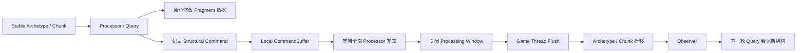
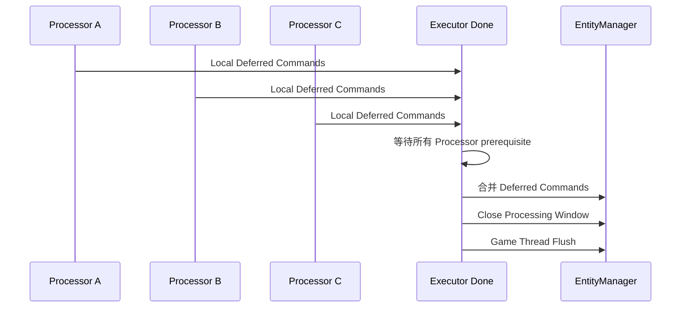

# 结构变更延迟提交：Unreal Mass 的稳定查询窗口、Archetype 迁移与 Observer 时序

> 系列：从 Unreal Engine 源码理解引擎设计
>
> 日期：2026-08-20
>
> 状态：草稿
>
> 核心问题：Archetype ECS 一边需要让 Processor 在稳定的 Chunk 数据上高效批量运行，一边又必须允许实体创建、销毁、增删 Tag 和改变 Fragment 组成，这两种要求怎样在同一帧中安全共存？
>
> 关键词：Unreal Engine、Mass、ECS、Archetype、Chunk、Deferred Mutation、CommandBuffer

[系列目录](../blog.html)

假设一个 Processor 正在遍历所有拥有：

```text
Position
Velocity
AliveTag
```

的 Entity。

当前 Chunk 中有 128 个实体。

Processor 已经拿到了连续的：

```text
Position[]
Velocity[]
```

Fragment View，并开始逐个更新位置。

运行到第 37 个 Entity 时，业务逻辑判断：

```text
这个实体死亡了。
```

最直接的写法似乎是：

```text
Remove<AliveTag>(Entity)
Add<DeadTag>(Entity)
```

两个 Tag 都没有数据。

看起来只是：

```text
两个 Boolean 状态发生了变化。
```

但在 Archetype ECS 中，这可能完全不是一个简单字段修改。

Entity 原本属于：

```text
Archetype A
Position
Velocity
AliveTag
```

修改后则应该属于：

```text
Archetype B
Position
Velocity
DeadTag
```

这意味着：

```text
Entity
可能要从当前 Chunk 中移走
↓
进入另一个 Archetype 的另一个 Chunk
↓
当前 Chunk 的实体排列可能发生变化
↓
正在被 Processor 使用的 Range 和 Fragment View 可能失效
```

如果另一个 Worker 此时还在读取同一个 Archetype，

问题就不再是：

> Tag 写入是否线程安全。

而是：

> 正在被并行读取的数据结构能不能在处理过程中突然改变形状。

这正是 Mass 基础运行时最值得研究的地方。

## 先说结论：Mass 把数值计算与结构修改拆成两个阶段

**结构变更延迟提交（后文简称“先记账，安全点再搬家”）**：Processor 在稳定存储视图上运行时不立即修改 Entity 的 Archetype、Chunk 或生命周期结构，而是先记录变更命令，等当前 Processing Window 完全结束后，再由安全执行点统一提交。

整个过程可以压缩成：



这里最重要的不是：

```text
Mass 有一个 CommandBuffer。
```

而是：

> **正在读取结构时，结构本身保持稳定；结构变化只在明确提交边界生效。**

这是 Archetype ECS 能够把批量查询、并行处理和动态游戏状态同时放在一个运行时中的关键。

## Mass 不是一个单体 ECS 模块

在进入存储模型之前，当前 Mass 的模块边界本身就很值得注意。

可以粗略拆成：

```text
MassCore
→
纯 ECS 运行时

MassEntity
→
UWorld / Subsystem / Tick 宿主

MassEngine
→
Rendering / Physics / Navigation 桥接

MassGameplay / MassAI
→
更上层玩法能力
```

其中 MassCore 负责：

- EntityManager；
- EntityHandle；
- Archetype；
- Chunk；
- Fragment；
- Query；
- Processor；
- Observer；
- CommandBuffer；
- ProcessingQueue。

它不需要反向依赖完整 Engine 世界。

MassEntity 则负责：

- 每个 UWorld 的 Manager 托管；
- World 生命周期；
- Mass Phase 接入 TickGroup；
- Settings；
- World-aware hooks。

MassEngine 再向上接：

- Render；
- Physics；
- Navigation。

这个拆分表达了一条很清楚的原则：

> ECS 数据运行时不应该为了接入某个世界对象，就让整个内核反向依赖场景、渲染和物理系统。

对于自己的框架来说，这比某一个具体 Mass API 更值得迁移。

## 每个 World 拥有自己的 EntityManager

Mass 在 Gameplay / Engine 场景中，并不是依赖一个全局静态 ECS World。

`UMassEntitySubsystem` 为对应 `UWorld` 托管默认的：

```text
FMassEntityManager
```

于是 Entity 的有效性天然依赖：

```text
Handle
+
Manager
```

而不是 Handle 自己。

这会直接影响下面的身份模型。

## EntityHandle 是票据，不是对象

**代际实体句柄（后文简称“这张票据现在还指不指向原来那个人”）**：使用 Index 与 Serial/Generation 组合表示一次 Entity 身份，并由对应的 EntityManager 最终判断该身份当前是否仍然有效。

可以近似理解为：

```text
FMassEntityHandle
=
Index
+
SerialNumber
```

Index 负责定位存储位置。

Serial 负责区分：

```text
同一个 Index
前后两代不同 Entity。
```

例如：

```text
Entity A
Index = 42
Serial = 7
```

A 被销毁以后，

Index 42 未来可能重新被利用：

```text
Entity B
Index = 42
Serial = 8
```

旧 Handle：

```text
42 / 7
```

不能因此重新命中 B。

但还有一个容易忽略的边界：

```text
Handle.IsValid()
```

并不自动意味着：

> 这个 Entity 当前一定属于这里，并且已经完成 Build，可以直接访问。

Handle 自己并不知道：

- 当前 Manager 是谁；
- Storage 当前保存的是哪一代；
- Entity 是否已经销毁；
- 是否仍只是 Reserved；
- 是否已经进入 Archetype。

真正有效性仍然需要 Manager / Storage 参与判断。

所以 EntityHandle 更接近：

> 一张需要到对应管理机构重新核验的票据。

而不是一个可以永久解引用的对象指针。

## Composition 决定 Entity 属于哪个 Archetype

**Archetype Composition（后文简称“这个实体现在拥有哪些结构组件”）**：由 Entity 当前具有的 Fragment、Tag、Shared Fragment 等结构元素组合形成的类型身份。

例如：

```text
Position
Velocity
Health
EnemyTag
```

和：

```text
Position
Velocity
Health
DeadTag
```

属于两个不同 Composition。

即使：

```text
EnemyTag
DeadTag
```

都没有任何 payload，

它们仍然参与结构身份。

因此：

```text
Add Tag
Remove Tag
```

并不天然是低成本字段更新。

如果 Composition 改变，

Mass 通常需要：

```text
旧 Composition
→
找到 / 创建新 Archetype
→
找到目标 Chunk
→
复制仍然共有的 Fragment 数据
→
更新 Entity Storage
→
从旧 Chunk 移除
→
触发 Composition Observer
```

这就是：

**Archetype 迁移（后文简称“结构变了，实体要搬到另一类存储里”）**。

一旦理解这一点，

Mass 中很多看起来过度谨慎的限制都会变得合理。

## Chunk 的价值来自同构与连续

同一个 Archetype 内的 Entity 拥有相同结构。

因此 Chunk 可以按列保存：

```text
EntityHandle[]
Position[]
Velocity[]
Health[]
```

而不是每个 Entity 都保存一堆分散对象引用。

Processor 查询：

```text
Position + Velocity
```

以后，

可以直接得到一段连续的：

```text
Position View
Velocity View
```

随后批量迭代。

这正是 Archetype / Chunk 模型的高价值区域：

```text
结构稳定
+
数据同构
+
批量访问。
```

但这个优势同时带来了一个条件：

> 当前正在遍历的这段 Chunk 不能在迭代中任意改变结构。

否则优化所依赖的连续 View 自己就不再稳定。

## Query 热路径依赖的是稳定视图

**稳定查询窗口（后文简称“这一段时间里先别搬 Entity”）**：Query 已经选择匹配 Archetype、取得 Chunk Range 并绑定 Fragment View 后，到本轮 Processor 结束前，相关结构必须保持满足当前遍历假设。

典型主链可以理解成：

```text
Query Requirements
↓
匹配 Archetype
↓
取得 Chunk / Range
↓
绑定 Fragment Views
↓
Processor Execute
↓
清理当前 Views
```

Processor 内部更理想的工作是：

```text
读取 Position
读取 Velocity
修改 Position
```

这些都是当前 Chunk 内部已有数据的原位更新。

危险的工作则是：

```text
Create Entity
Destroy Entity
Add Fragment
Remove Fragment
Add Tag
Remove Tag
Change Shared Fragment
```

因为这些动作会改变：

```text
谁属于当前 Archetype
当前 Chunk 有多少 Entity
数据应该存在哪一块 Chunk
下一轮 Query 应该匹配谁。
```

两类修改应该从概念上彻底分开。

## 数据修改与结构修改不是同一种 Mutation

这是设计自己的 ECS 时非常值得显式表达的一条边界。

### 数据修改

例如：

```text
Position.X += Velocity.X * DeltaTime
Health -= Damage
Cooldown -= DeltaTime
```

这些操作没有改变 Entity 的 Composition。

因此在正确声明 Read / Write Requirement 后，可以在当前 Chunk View 上执行。

### 结构修改

例如：

```text
Add<DeadTag>
Remove<AliveTag>
Add<NavigationFragment>
DestroyEntity
CreateEntity
```

这些操作会改变实体结构或生命周期。

所以更合理的模型是：

```text
Data Mutation
→
当前 Processing Window 内执行

Structural Mutation
→
记录
→
安全点统一提交
```

如果 API 也能体现这种差异，使用者会更难误用。

## Processing Window 是结构稳定合同

**Processing Window（后文简称“批量计算期间的结构冻结区间”）**：一个或多个 Processor 正在基于当前 Entity Storage 和 Archetype/Chunk 视图执行的时间段；在该区间内禁止同步 Flush 结构变更。

Mass 对 Flush 有非常明确的约束：

```text
必须在 Game Thread
并且
IsProcessing() == false
```

这不是为了让 API 显得保守。

如果 Processing 过程中立即 Flush：

```text
Query A
正在遍历 Chunk 1

Processor B
Remove Tag
→
Entity 离开 Chunk 1

Processor C
仍然持有 Chunk 1 的旧 Fragment View
```

此时就必须处理：

- View 失效；
- Range 变化；
- Entity 重排；
- Query Cache 变化；
- 并行读写冲突；
- Observer 数据可见性。

与其让每一种查询路径都承担动态结构修补，

Mass 选择了更明确的合同：

> Processing 时保持结构稳定。

## Processor 不直接执行结构操作，而是记录命令

Processor 需要改变结构时，可以：

```text
Context.Defer()
```

把意图写进 CommandBuffer。

例如：

```text
Entity X
→
Remove AliveTag

Entity X
→
Add DeadTag

Entity Y
→
Destroy
```

此时 Processor 只是在说：

> 当前计算结果要求后续发生这些结构变化。

它还没有真正修改 Archetype。

因此当前 Query 可以继续基于旧世界结构完成本轮计算。

这种思路可以理解成：

```text
Compute
→
Record Mutation
→
Commit Later
```

和数据库事务、Render Command、Scene Deferred Mutation 都有明显共性。

## 并行 Processor 需要局部 CommandBuffer

如果多个 Worker 同时把结构命令直接写进同一个可变队列，

CommandBuffer 自己就会成为新的共享热点。

Mass 的并行执行可以让不同 ExecutionContext 持有各自的局部 Deferred Buffer。

于是：

```text
Worker A
→ Local Commands A

Worker B
→ Local Commands B

Worker C
→ Local Commands C
```

Processor 完成以后，

这些局部命令才进入统一收口阶段。

可以把执行过程画成：



这里有一条非常关键的关系：

```text
Processor Task Completed
!=
Structural Mutation Applied
```

任务完成只表示：

> 计算结束，命令已经产生。

只有：

```text
Processing Window 关闭
+
Command Flush 完成
```

以后，

结构变化才真正成为下一轮查询事实。

## 并行完成与状态提交是两个完成概念

这是并发系统中非常普遍的一类误判。

开发者看到：

```text
All Tasks Complete
```

很容易理解成：

```text
这一批工作造成的所有状态变化已经全部可见。
```

但 Deferred Architecture 中不是这样。

更准确的是：

```text
Task Completion
→
计算结果已经准备好

Commit Completion
→
结果已经进入权威结构
```

如果系统拥有：

```text
Deferred Spawn
Deferred Destroy
Deferred Composition Change
```

测试与诊断也应该区分这两个阶段。

否则会出现：

```text
测试等待所有 Processor
→
立刻 Query 新 Tag
→
发现没有
→
误判 Processor 没执行。
```

真正缺少的可能只是：

```text
Flush。
```

## CommandBuffer 不是普通 FIFO

如果三个 Worker 分别产生：

```text
Create Entity
Set Fragment
Destroy Entity
Add Fragment
```

最终提交如果只按照：

```text
谁先抢到队列
```

决定顺序，

结果会依赖线程调度。

Mass 的 CommandBuffer 会按结构语义对命令组进行稳定排序。

可以粗略理解为：

```text
Create
→
Add
→
ChangeComposition
→
Set
→
Remove / Destroy
```

**结构提交顺序（后文简称“先把对象建立完整，再处理删除”）**：不同类别的结构命令按照生命周期依赖关系确定提交顺序，同组内部再保持稳定次序。

这解决的是一个很实际的问题。

例如：

```text
创建 Entity
```

必须先于：

```text
给新 Entity 增加结构
```

而：

```text
Destroy
```

通常又应该位于更后的结构阶段。

因此 Deferred CommandBuffer 不是：

> 一个为了线程安全而存在的消息队列。

它同时承担：

> 一次结构事务应该按什么顺序落地。

## Flush 期间新产生的命令也需要有界处理

Observer 或某些 Command 执行过程中，

仍然可能产生新的 Deferred Command。

如果 Flush 简单写成：

```text
while buffer not empty:
    execute all
```

一个 Observer 就可能不断产生新命令，

形成无限自激。

因此 Flush 需要：

- 有限迭代；
- 明确命令组；
- 失效 Manager 时取消；
- 防止无限递归。

这里再次体现了：

> Deferred 并不意味着“以后随便执行”。

延迟提交仍然需要自己的终止合同。

## Observer 是结构事务的一部分

**结构观察者（后文简称“在结构真正改变的正确时刻看一眼”）**：针对 Entity Composition 创建、增加、删除或销毁过程，在旧数据或新数据仍具有正确可见性的阶段执行的生命周期回调。

它和普通 EventBus 有一个根本区别。

EventBus 常见语义是：

```text
事情发生完
→
广播一个通知。
```

Mass Observer 并不总是这样。

### Add / Create

Observer 通常需要看到：

```text
新 Fragment 已经存在
```

因此更适合后置通知。

### Remove / Destroy

Observer 可能需要读取：

```text
马上要被删除的 Fragment。
```

所以必须在真正删除数据之前执行。

如果统一改成：

```text
所有结构操作全部结束
→
最后广播 Observer
```

Remove Observer 会发现：

```text
它想看的数据已经没了。
```

因此 Observer 时序实际上属于结构事务协议。

## Remove Observer 必须发生在旧数据仍然可读时

假设 Entity 当前拥有：

```text
NavigationFragment
```

某个桥接系统需要在 Fragment 被删除时：

```text
从外部 Navigation Runtime 注销对应状态。
```

如果过程是：

```text
先删 Fragment
→
再发 Observer
```

Observer 已经无法读取：

- 旧 Navigation Id；
- 旧 Handle；
- 旧配置；
- 注销所需数据。

更稳健的顺序是：

```text
准备 Remove
→
Pre-Remove Observer
→
Observer 读取旧 Fragment
→
真正迁移 / 删除
```

而 Add 则相反：

```text
建立新 Fragment
→
Post-Add Observer
→
Observer 读取新结构。
```

所以：

**前后置可见性（后文简称“删之前看旧值，加之后看新值”）**是 Observer API 真正需要保护的合同。

## Observer 不能被抽象成一个万能 Gameplay Event

这也意味着，不应该简单把：

```text
Mass Observer
```

和：

```text
Gameplay Event Bus
```

完全统一。

两者服务不同层次。

Mass Observer 更接近：

```text
Storage / Composition Transaction Hook。
```

Gameplay Event 更接近：

```text
业务事实通知。
```

例如：

```text
DeadTag 被加入
```

可能会触发一个 Mass Composition Observer。

但业务真正想表达的：

```text
CharacterDied
```

未必应该由底层 Storage Observer 直接承担。

否则游戏逻辑会开始依赖：

```text
Fragment 到底在事务中的哪一刻迁移。
```

更稳健的方式通常是：

```text
底层 Observer
→
维护结构一致性

上层 Gameplay System
→
发布业务语义。
```

## Concurrent Storage 不代表可以任意线程同步修改结构

当前 Mass 的 Entity Storage 已经明显走向 Concurrent Storage。

这很容易产生一个危险结论：

```text
底层 Storage 并发安全
→
任何线程都可以随时 Add / Remove Entity。
```

并不成立。

**并发分配安全（后文简称“底层能安全发票号，不代表运行时能随便搬仓库”）**和**结构修改安全**是两个不同问题。

Concurrent Storage 可以改善：

- Handle reserve；
- 分配；
- 某些底层存储并发。

但它并不会取消：

- Query View；
- Processing Window；
- CommandBuffer；
- Access Requirement；
- Observer 时序。

这是并发基础设施中非常常见的一种误区：

> 某一层使用原子或并发容器，不代表上层业务协议因此消失。

## Processor 的访问声明也是正确性合同

Processor 通过 Query 声明：

- ReadOnly Fragment；
- ReadWrite Fragment；
- Tag Presence；
- Shared Fragment；
- 外部 Subsystem；
- Before / After；
- Execution Group。

这些信息显然可以帮助调度器提高并行度。

但更重要的是：

> 它们决定哪些 Processor 实际上可以安全并行。

例如：

```text
Processor A
Read Position

Processor B
Write Position
```

就不能被当成两个完全独立任务。

同样，如果某个外部 Subsystem 实际只能在 Game Thread 使用，

却被错误标记为 Thread Safe，

Processor 就可能被调度到 Worker。

因此：

**访问声明（后文简称“先告诉调度器你准备读写什么”）**不仅是性能提示，也是并发正确性合同。

如果这些声明不准确，

错误可能表现成：

```text
偶发线程竞争
```

而不是一个清楚的编译错误。

## Query Cache 也依赖 Archetype 版本

随着游戏运行，

新的 Archetype 可能不断出现。

如果每次 Query 都从头遍历：

```text
所有 Archetype
```

成本会持续增加。

因此 Query 可以缓存：

```text
当前已经匹配的 Archetype。
```

当新的 Archetype 创建以后，

通过 Archetype Version 增量更新匹配集合。

这意味着：

```text
Create Archetype
```

本身也属于 Query 基础设施需要知道的结构事件。

再次说明：

> Archetype 不是一个纯内部内存布局细节，它是整个查询系统的结构索引单位。

## World Tick 只负责提供执行宿主

Mass 会把处理阶段映射到标准 TickGroup，例如：

```text
PrePhysics
StartPhysics
DuringPhysics
EndPhysics
PostPhysics
FrameEnd
```

但这并不意味着：

```text
Mass Processor = 普通 Actor Tick。
```

TickGroup 负责提供：

```text
这一批 Mass 工作应该处于一帧的哪个大阶段。
```

真正 Processor 间的：

- Query；
- Dependency；
- Parallel Execution；
- Deferred Flush；

仍由 Mass 自己管理。

因此 Engine Tick 与 ECS Scheduling 是上下两层系统：

```text
World Tick
→
决定什么时候进入 Mass Phase

Mass Runtime
→
决定这一 Phase 内怎样运行 Processor。
```

这和把所有逻辑直接挂在 MonoBehaviour.Update / Actor.Tick 上是很不同的组织方式。

## World 退出时必须先把 Deferred 生命周期结清

`UMassEntitySubsystem` 退出时，并不是：

```text
直接 Destroy EntityManager。
```

当前顺序会先：

```text
FlushCommands()
```

然后再：

```text
EntityManager.Deinitialize()
EntityManager.Reset()
```

原因非常重要。

World Cleanup 过程中，

其他系统可能刚刚把：

- Render 注销；
- Physics 清理；
- Navigation 清理；
- Entity Destroy；

写进 Deferred Buffer。

如果 Runtime Owner 先消失：

```text
这些命令就永远没有合法提交点。
```

所以：

**退出前结账（后文简称“Owner 销毁以前先把最后一批结构事务做完”）**同样属于生命周期合同。

这和很多异步 Runtime 的 Shutdown 非常相似：

```text
停止产生新工作
→
收口已有工作
→
Flush / Cancel
→
最后销毁 Owner。
```

## Mass 的核心并不是“ECS 比 Actor 快”

看到 Archetype、Chunk 和并行 Processor，

很容易把讨论快速转向：

```text
Mass 可以同时跑多少实体？
```

但仅从当前研究材料，并不能得出：

```text
Mass 一定比 Actor 快多少。
```

当前真正能够从源码确认的是：

- Chunk 使用同构列式布局；
- Query 按 Archetype / Chunk 绑定 View；
- Processor 可以声明访问要求；
- 部分执行可以并行；
- 结构修改在安全点延迟提交；
- 运行时拥有相应 Trace、Debug 和 Test 入口。

这些条件提供了数据导向和并行优化基础。

具体项目究竟能获得多少收益，

还取决于：

- Entity 数量；
- Fragment 大小；
- Processor 工作量；
- Cache 行为；
- 结构变化频率；
- 外部 Engine Bridge；
- Representation；
- Physics；
- Navigation。

所以更准确的结论是：

> Mass 建立了一套适合稳定批量数据迭代的运行时合同。

而不是：

> 只要用了 Mass，就自动获得高性能。

## 结构变化过多时，Archetype ECS 也可能不是最优选择

Archetype 模型最喜欢的是：

```text
很多结构相同的 Entity
+
大量重复数据计算
+
相对稳定 Composition。
```

如果项目中的实体：

- 数量不大；
- 行为极度异构；
- 每帧频繁增删大量 Component；
- 很少做批量同构查询；

那么：

```text
Archetype Migration
Query Declaration
CommandBuffer
Observer
```

带来的复杂度可能超过收益。

这也是为什么真正值得迁移的是边界思想，

而不是：

> 所有游戏系统都必须 ECS 化。

## 对自研 ECS 的迁移方式

如果设计自己的 Archetype ECS，我会优先建立下面几条不变量。

### Entity Identity

```text
Index
+
Generation
+
Owner World
```

Handle 本身不能无上下文解引用。

### Structural Identity

```text
Component / Tag Composition
→
Archetype Identity。
```

Tag 是否有数据，不影响它是否属于结构。

### Stable Query Window

Query 开始以后：

```text
当前 Archetype / Chunk 布局保持稳定。
```

### Deferred Structural Mutation

Processing 期间：

```text
Create
Destroy
Add
Remove
```

只记录命令。

### Explicit Commit Point

所有 Processor 完成以后：

```text
Close Processing
→
Flush Structural Commands。
```

### Observer Visibility

```text
Add
→
新值存在以后通知

Remove
→
旧值删除以前通知。
```

只要这几条边界先稳定，

并行优化才能在它们上面继续增加。

## 对非 ECS 系统的迁移方式

这套模式同样适合其他批处理系统。

### Scene Graph

遍历 Scene Node 时，

不要让任意 Callback 立即重组整个 Child List。

可以：

```text
Traverse
→
记录 Add / Remove
→
Frame End Commit。
```

### AI 批量更新

多个 AI Job 正在基于同一 Agent Set 计算时，

Entity Spawn / Despawn 可以：

```text
记录
→
任务结束
→
统一提交。
```

### Physics Bridge

Gameplay 计算阶段产生：

```text
Create Body
Destroy Body
Change Shape
```

可以先进入 Command Queue，

随后由 Physics Owner 线程统一执行。

### UI Tree

复杂 UI 在 Layout / Render 遍历中如果随意修改 Hierarchy，

同样容易破坏当前迭代器。

因此很多 UI 系统实际上也存在自己的：

```text
Deferred Hierarchy Mutation。
```

这说明：

> “读取稳定视图，修改延迟提交”并不是 ECS 专属技巧。

它是一种通用的批处理一致性模式。

## 不要把所有 Deferred 系统都统一成一个全局 CommandBus

看到：

- Render Command；
- Mass CommandBuffer；
- Gameplay Command；
- Scene Mutation；

很容易产生一个架构冲动：

```text
全部做成统一 CommandBus。
```

但它们的事务语义并不一样。

Mass CommandBuffer 需要知道：

```text
Create / Add / Change / Set / Remove / Destroy
```

之间的结构顺序。

Render Command 需要遵守：

```text
Render Thread Ownership。
```

Gameplay Command 可能需要：

```text
Undo / Redo / Replay。
```

所以更值得统一的是：

```text
Deferred Mutation Pattern
```

而不是：

```text
一个万能 Command 类型。
```

基础模式可以相同。

提交规则必须属于各自的 Domain Owner。

## 调试工具需要能够区分“已经记录”和“已经提交”

Deferred Mutation 最容易让开发者困惑的地方是：

```text
我刚刚 Add 了 Tag
为什么这里还查不到？
```

因此诊断最好显式展示：

```text
Processing = true

Deferred Commands
- Add DeadTag Entity#42
- Destroy Entity#51

Committed Composition
Entity#42
- AliveTag
```

Flush 后再显示：

```text
Processing = false

Deferred Commands = 0

Committed Composition
Entity#42
- DeadTag
```

**待提交状态（后文简称“已经决定，但还没真正改世界”）**应该成为调试器中可观察的事实。

否则开发者会把：

```text
Deferred
```

误认为：

```text
命令丢了。
```

## Trace 应该围绕 Processing 与 Flush 建立时间线

一个非常有价值的调试时间线可以是：

```text
Frame 120

PrePhysics
  Processor.Move
  Processor.Perception

DuringPhysics
  Processor.Damage
      Defer Add DeadTag Entity#42

PostPhysics
  Processor.Cleanup

Mass Processing End

Command Flush
  Add DeadTag #42
  Remove AliveTag #42
  Observer PreRemove AliveTag
  Archetype A → Archetype B
  Observer PostAdd DeadTag
```

这比只打印：

```text
Entity 42 changed
```

更容易解释：

> 结构究竟在哪一帧、哪一个安全点真正改变。

## 自动化测试需要同时覆盖稳定视图和提交结果

Mass 当前源码已经存在：

- Entity reserve / create / destroy；
- stale handle；
- Archetype composition；
- Entity migration；
- CommandBuffer；
- Deferred Mutation；
- Query / Processor / Parallel；
- Observer；
- Concurrent Storage；

等测试入口。

对于自己的 ECS，也应该把测试分成至少两类。

### Processing 期间不变量

验证：

```text
Deferred Add
```

不会让当前 Query View 在本轮中途变化。

### Flush 以后结果

验证：

```text
Flush
```

完成以后：

- Entity 已进入新 Archetype；
- Query 匹配已经更新；
- Observer 时序正确；
- stale Handle 无法访问新 Entity。

两类测试不能只做其中一半。

否则系统可能：

```text
最终结果正确
```

却在过程中存在未定义行为。

## 常见设计失败

### Tag 没有数据，所以同步增删没关系

Tag 仍然参与 Composition。

增删 Tag 仍然可能触发 Archetype 迁移。

### Handle 有 Index，所以可以直接永久保存

Index 会重用。

Generation 和 Manager Validity 才共同决定当前身份。

### Concurrent Storage 已经线程安全，所以 Processor 可以直接改结构

并发分配能力不取消 Stable Query Window 和 Structural Mutation Contract。

### Processor Task 完成就代表 Defer 已生效

Task Completion 只是命令已经产生。

Flush Completion 才代表结构已经改变。

### CommandBuffer 按提交顺序简单 FIFO

不同 Worker 的偶然调度顺序不应该成为结构生命周期语义。

### Observer 全部放到 Flush 最后统一广播

Remove / Destroy Observer 会失去读取旧 Fragment 的机会。

### Observer 被当成 Gameplay Event Bus

底层存储事务语义开始向业务层泄漏。

### World 销毁时直接拆 EntityManager

尚未 Flush 的跨系统注销命令失去合法执行环境。

### 所有系统都为了性能强制改成 Archetype ECS

高结构变化、低实体规模的业务反而承担额外复杂度。

### Deferred Queue 没有可观测性

开发者无法区分“命令还没提交”和“命令已经丢失”。

## 我的结构变更延迟提交检查表

1. Entity Handle 是否使用 Index + Generation，而不是裸 Index？
2. Handle 最终有效性是否由所属 World / Manager 校验？
3. Component / Fragment Composition 是否有明确结构身份？
4. 无数据 Tag 是否仍被正确视为 Composition 的一部分？
5. Archetype 是否能够复用相同 Composition？
6. Chunk 是否保存同构连续 Fragment 数据？
7. Query 是否按 Archetype / Chunk 批量迭代？
8. Query 执行期间是否存在明确 Stable Processing Window？
9. 数据原位修改和结构修改是否是两套 API 语义？
10. Processor 中的 Create / Destroy / Add / Remove 是否默认 Defer？
11. 并行 Processor 是否拥有局部 CommandBuffer？
12. Local Buffer 是否只在所有相关任务完成后合并？
13. Processing Window 是否在 Flush 之前明确关闭？
14. Structural Flush 是否运行在拥有 Storage Mutation 权限的线程？
15. CommandBuffer 是否拥有结构语义顺序，而不是简单 FIFO？
16. Flush 中新生成的命令是否拥有有界处理规则？
17. Add Observer 是否在新 Fragment 可读后触发？
18. Remove / Destroy Observer 是否在旧 Fragment 删除前触发？
19. Observer 是否与普通 Gameplay Event 保持职责边界？
20. Processor Access Requirement 是否参与并发正确性判断？
21. GameThread-only 外部依赖是否不会被错误调度到 Worker？
22. Concurrent Storage 是否不会被误解释成任意线程同步 Mutation？
23. Query Cache 是否能感知新 Archetype？
24. World Shutdown 是否先 Flush，再销毁 Runtime Owner？
25. 调试器是否能够显示 Pending Structural Commands？
26. Trace 是否能够还原 Processor → Defer → Flush → Observer 时间线？
27. 测试是否验证 Processing 中结构保持稳定？
28. 测试是否验证 Flush 后 Query 能看到新 Composition？
29. Stale Handle 是否不能命中新一代 Entity？
30. 当前业务规模和结构变化频率是否真的值得采用 Archetype ECS？

Mass 最值得迁移的地方，不是：

```text
EntityHandle 长什么样
```

也不是：

```text
一个 Chunk 可以塞多少 Entity。
```

真正重要的是它围绕批量数据计算建立了一条非常清楚的运行时合同：

```text
Query 开始
→
结构保持稳定

Processor 计算
→
可以修改已有数据

需要改变结构
→
只记录意图

所有计算结束
→
关闭 Processing Window

Game Thread Flush
→
按照结构语义统一迁移

Observer
→
在旧数据或新数据仍然正确可见的时机运行

下一轮 Query
→
看到新的世界结构
```

这使高效批量迭代和动态游戏世界不必互相排斥。

结构可以持续变化。

但它不能：

> **在别人正依赖当前结构计算时悄悄变化。**

这就是结构变更延迟提交真正保护的不变量。

## 术语对照

| 正式术语 | 文中通俗称呼 |
|---|---|
| 结构变更延迟提交 | 先记账，安全点再搬家 |
| 代际实体句柄 | 这张票据现在还指不指向原来那个人 |
| Archetype Composition | 这个实体现在拥有哪些结构组件 |
| Archetype 迁移 | 结构变了，实体要搬到另一类存储里 |
| 稳定查询窗口 | 这一段时间里先别搬 Entity |
| Processing Window | 批量计算期间的结构冻结区间 |
| 结构提交顺序 | 先把对象建立完整，再处理删除 |
| 结构观察者 | 在结构真正改变的正确时刻看一眼 |
| 前后置可见性 | 删之前看旧值，加之后看新值 |
| 并发分配安全 | 底层能安全发票号，不代表运行时能随便搬仓库 |
| 访问声明 | 先告诉调度器你准备读写什么 |
| 退出前结账 | Owner 销毁以前先把最后一批结构事务做完 |
| 待提交状态 | 已经决定，但还没真正改世界 |

---

## 内部资料依据

本文主要基于以下材料整理：

- `notes/UnrealEngine源码研究/UE6/06_Mass从World托管到Archetype迭代_模块拆分与延迟结构变更.md`
- `notes/UnrealEngine源码研究/UE6/README.md`
- `notes/UnrealEngine源码研究/UE5/05_UWorld与AActor生命周期及Tick调度.md`
- `blogs/从UnrealEngine源码理解引擎设计/01-UnrealEngine的第一帧提交链.md`
- `blogs/Sakura Framework 工程实践/08-Command历史与确定性Replay.md`
- `blogs/README.md`
- `blogs/publication.v1.json`

本文基于 2026-08-19 研究时的 Unreal Engine UE6-main 源码快照整理。

当前研究已经通过源码入口和现有测试目录核对 MassCore / MassEntity 模块边界、EntityHandle、Archetype/Chunk、Processor/Query、Processing Window、Deferred Command 与 Observer 主链，但没有在当前环境中构建 Unreal Editor、运行 Automation/Catch2 或执行 Mass Benchmark。

因此本文不声称：

- Mass 在具体项目中一定比 Actor / UObject 方案拥有更高性能；
- Concurrent Storage 等价于任意线程可以同步修改 Entity 结构；
- `FMassEntityHandle::IsValid()` 单独就能证明 Entity 当前可访问；
- 所有 MassGameplay、MassAI、Representation、Spawner 和 Relation 能力已经完成当前 UE6-main 源码审计；
- 当前 UE6-main Mass API 已冻结为正式 Release 合同；
- Deferred Command 的思想意味着所有游戏业务 Command 都应该统一进 Mass CommandBuffer。

文中把“稳定查询窗口 → 延迟结构变更 → 安全点提交”的模式迁移到 Scene Graph、AI Batch、Physics Bridge 和其他批处理系统，属于工程设计归纳，不表示这些系统必须复制 Mass 的 Archetype、Chunk、Command Group 或 Observer 实现。