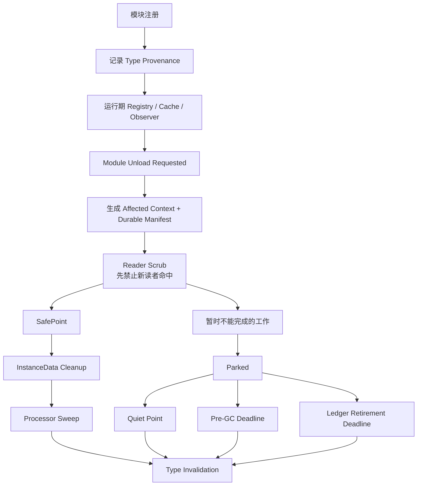
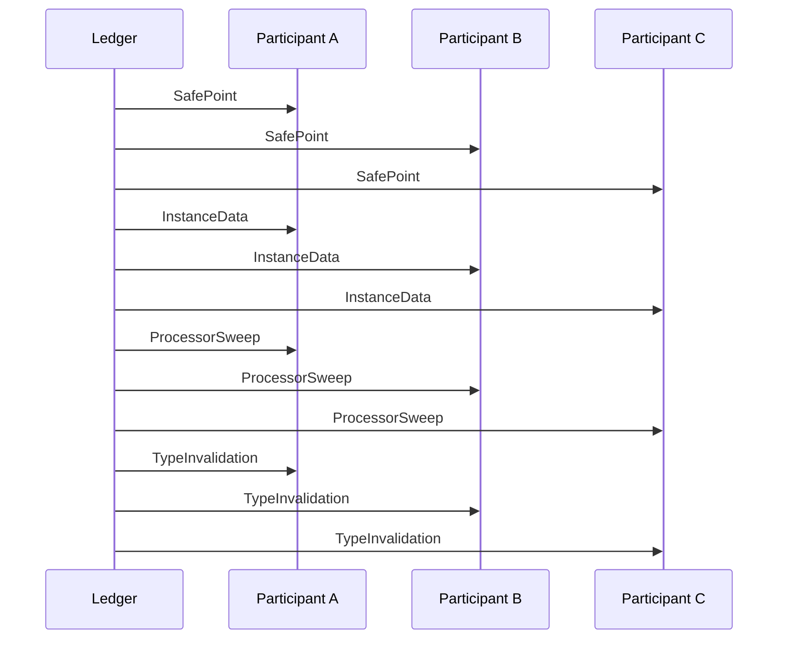
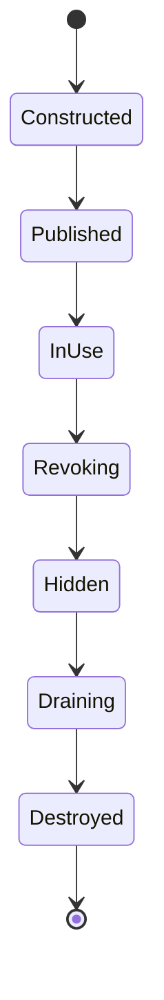

# 类型身份撤销：Unreal Mass 的模块来源账本、读者隔离与分阶段卸载

> 系列：从 Unreal Engine 源码理解引擎设计
>
> 日期：2026-09-03
>
> 状态：草稿
>
> 核心问题：一个动态模块准备卸载时，如果它定义的 Processor、Fragment、Tag 与其他类型已经被多个进程级 Registry、Observer 和运行时缓存引用，系统怎样在真正销毁类型以前，让所有读者、实例和派生状态安全停止使用这些身份？
>
> 关键词：Unreal Engine、Mass、Module Unload、Provenance、Type Identity、Lifecycle

[系列目录](../blog.html)

一个 Gameplay Plugin 正在被卸载。

这个模块定义了：

```text
UEnemyProcessor
FEnemyMovementFragment
FEnemyEliteTag
FCombatMassSystem
```

从模块系统的角度看，过程似乎很简单：

```text
Module Shutdown
→
卸载代码
→
释放 UObject / UScriptStruct
→
完成。
```

但 Mass 运行时看到的世界并没有这么简单。

这些类型可能已经被写入：

- Type Registry；

- Observer Registry；

- Processor Template；

- Instance Cache；

- Archetype / Element BitSet；

- System Wrapper Registry；

- 某个仍在执行的查询或通知上下文。


甚至某个 Worker 并不直接保存：

```text
UScriptStruct*
```

而是保存了一个更间接的：

```text
TypeIndex。
```

于是，即使模块自己的 Shutdown 已经结束，

下一帧某个 Observer 仍然可能通过旧索引重新选中这项即将消失的类型。

真正的崩溃可能发生在模块已经被卸载很久以后。

这类问题最危险的地方正在于：

> **释放发生在这里，错误却发生在另一个长期存活的 Registry 中。**

因此，“模块卸载”不能只被理解成销毁模块对象。

它首先是一场**类型身份撤销**。

## 先说结论：安全卸载的核心是先撤销可达性，再撤销身份

**类型身份撤销（后文简称“让所有系统先停止认得这个类型，再真正让类型消失”）**：模块定义的类型准备离开运行时时，系统先识别所有仍可能访问它的派生状态，阻止新的 Reader 继续命中，然后按依赖顺序清理实例、执行器和缓存，最后才从类型目录中正式移除其身份。

可以把整个过程压缩成：



这里真正需要保护的顺序不是：

```text
找到对象
→
delete。
```

而是：

```text
停止产生新的引用
→
清除已经存在的消费者
→
最后删除身份来源。
```

这是一条可以迁移到大量插件和热重载系统的通用原则。

## 这和 Mass 原来的结构变更安全点不是同一个问题

Mass 已经有另一条非常重要的 Safe Point 规则。

Processor 正在 Query：

```text
Position
Velocity
AliveTag
```

时，

Entity 不能突然：

```text
Remove AliveTag
Add DeadTag
```

并立刻从当前 Archetype / Chunk 搬走。

因为 Query 正持有稳定 Fragment View。

所以原来的主链是：

```text
Processor 读取稳定 Chunk
→
结构修改写 Deferred Command
→
Processing Window 结束
→
Flush
→
下一轮 Query 看见新结构。
```

这保护的是：

**实体结构稳定窗口（后文简称“别人正在遍历这批 Entity 时先不要搬家”）**。

模块卸载面对的是另一件事：

```text
这个 Fragment Type 本身
马上就不再属于运行时。
```

它保护的是：

**类型身份生命周期（后文简称“别人仍可能按这个类型找东西时，类型本身不能先消失”）**。

两条链都使用：

```text
Reader 先稳定
Writer 延后提交。
```

但它们的 Owner、状态对象与截止点完全不同。

### Entity Structural Mutation

```text
Entity
→
Archetype / Chunk 迁移

边界：
Processing Window
```

### Module Type Unload

```text
Type / Processor / Registry Identity
→
整体退出运行时

边界：
Unload / GC / Ledger Retirement
```

把两者混成一个：

```text
反正都等下一帧 Flush
```

会掩盖真正的生命周期差异。

## 模块卸载最困难的问题，是状态已经扩散出模块自身

假设一个模块只拥有：

```text
一个 UObject Instance。
```

那它的生命周期很容易理解：

```text
Owner Destroy
→
Object Destroy。
```

Mass Type 不一样。

类型一旦注册以后，

它会产生大量**派生状态**。

例如一个 Fragment Type 可能进一步影响：

```text
Type Registry
→
分配 TypeIndex

TypeIndex
→
进入 BitSet

BitSet
→
进入 Observer Filter

Observer Filter
→
进入长期 Cache

Processor Class
→
生成 Template / Execution State。
```

真正的运行时对象图变成：

```text
Module
  ↓ defines

Type
  ↓ creates

Index
Registry Entry
Observer State
Processor Cache
Instance Data
```

因此，模块对象自己的生命周期已经无法代表：

> 谁现在仍然依赖这项类型身份？

这正是为什么需要独立 Ledger。

## Provenance Ledger 的价值是“注册时知道来源”

**类型来源账本（后文简称“这项长期状态究竟是哪个模块带进来的”）**：类型注册时记录其所属 Package / Module，与之后生成的 Mass 派生状态建立来源关系，使卸载时能够准确确定清理范围。

这里有一条非常重要的设计原则：

> **不要等资源要删除时才开始猜它从哪里来。**

类型第一次进入系统时，

来源信息最完整。

例如：

```text
Package A
注册：
    Processor A1
    Fragment A2
    Tag A3

Package B
注册：
    无任何 Mass Type
```

此时系统拥有非常强的事实：

```text
Package A
→
Known + Has Mass Types

Package B
→
Known + No Mass Types。
```

几年以后真正触发 Module Unload，

系统不必重新：

```text
遍历所有 Registry
→
猜哪些类型可能来自这个 Package。
```

它已经拥有 provenance。

## “没有记录”和“已知为空”是两个不同事实

这是来源账本里最值得单独保留的一点。

假设卸载一个 Package。

Ledger 查询后得到三种可能结果。

|Ledger 状态|合理策略|
|---|---|
|已观察过，并记录 Mass Type|精确清理对应类型|
|已观察过，确认没有 Mass Type|可以跳过 Mass Sweep|
|从未观察过这个 Package|不能做否定判断，保守 Full Sweep|

第三种情况尤其重要。

```text
没有记录
```

并不能自动推出：

```text
没有 Mass State。
```

它只能推出：

```text
我不知道。
```

这就是：

**负面证据（后文简称“我确实检查过并确认没有”）**和**缺失证据（后文简称“我根本没观察到”）**之间的区别。

很多缓存和依赖分析系统都会犯同样错误：

```text
Cache Miss
→
No Dependency。
```

实际上 Cache Miss 只代表：

```text
Unknown。
```

成熟系统应该让：

```text
Known Empty
```

成为一种正式状态。

## Provenance 不是为了性能优化，它首先为了正确性

记录：

```text
Package
→
Mass Types
```

当然可以减少卸载时全局扫描。

但它更重要的价值不是：

```text
快。
```

而是：

> 可以证明哪些长期状态必须参与本次失效。

如果某个 raw callback 能把模块定义的 Class 写入 Mass 进程级状态，却不声明 provenance，

那么卸载时系统无法可靠判断：

```text
这个 Callback 留下的状态
属于哪个模块？
```

这类 API 看似灵活。

长期却是在制造无法回收的隐式 Ownership。

因此，一个很值得迁移的原则是：

> **任何能够把模块私有身份写入长生命周期 Registry 的扩展点，都应该同时要求声明来源。**

## 卸载时需要两种身份视图

模块仍然完整存在时，

当前 Cleanup Callback 可以直接访问：

```text
UScriptStruct*
UClass*
TypeIndex
```

这些都是：

```text
Live Pointer / Runtime Identity。
```

但如果某一部分清理必须等到：

```text
Quiet Point
PreGarbageCollect
下一次 Flush
```

以后再完成，

原来的活指针未必还安全。

因此模块卸载事件更适合同时产生两种视图。

### Affected Context

**受影响上下文（后文简称“当前这一刻还能安全使用的活对象视图”）**：当前广播期间可供 staged participant 查询的 live runtime 信息。

### Durable Manifest

**持久卸载清单（后文简称“即使晚一点处理也还能识别这些对象的稳定身份证明”）**：不依赖即将失效裸指针的稳定身份集合，可以跨越 quiet point、延迟清理和 GC 前窗口。

这是非常典型的生命周期模式：

```text
同步路径
可以使用活指针。

延迟路径
必须转换为稳定身份。
```

如果 Deferred Work 继续保存：

```text
即将卸载模块里的裸 UObject / Class Pointer，
```

所谓“延迟到更安全的时候处理”

实际上只是：

> 把悬空访问推迟到以后。

## Manifest Consumer 必须比完整 Cleanup 更早行动

模块卸载开始时，

有些 Consumer 可能暂时无法真正重建或清理内部容器。

例如 Observer Manager 当前可能：

- 正在通知 Observer；

- 持有内部 Lock；

- 正在执行某种 Reader Critical Section。


如果此时强行完成所有清理，

可能造成：

- 重入；

- 锁顺序冲突；

- Iterator 失效；

- Deadlock。


最简单的选择似乎是：

```text
那就什么都不做
→
等稍后安全再说。
```

这同样危险。

因为在等待期间，

新的 Reader 仍然可能继续：

```text
从旧 Observer Selection 中
选中即将失效的 Type。
```

因此需要把清理再拆成两个动作。

## Reader Scrub 和 Container Cleanup 是两种工作

**读者隔离（后文简称“先让所有新查询看不见即将死亡的类型”）**：同步修改 Reader 实际使用的可达状态，使新查询无法再选择正在卸载的 Type。

**容器清理（后文简称“等内部安静以后再把昂贵的数据结构真正整理干净”）**：删除旧 Registry Entry、压缩 Map、重建 Cache 等可能要求更强同步条件的维护工作。

于是一个 Consumer 可以：

```text
现在：
    Scrub Reader State

稍后：
    Prune Internal Container。
```

这比：

```text
现在做完全部
```

更安全。

也比：

```text
现在什么都不做
```

更安全。

最关键的目标是：

> 从卸载广播发生以后，不再允许产生新的对死亡类型的访问。

## Parked 不是“我以后再看看”

如果 Consumer 已经完成 Reader Scrub，

但当前无法完成全部 Cleanup，

它可以进入：

```text
Parked。
```

**延期清理（后文简称“安全性已经先建立，但维护工作等待真正安静的时机”）**允许高成本或锁敏感操作退出当前回调。

但 `Parked` 绝不能等价于：

```text
随便什么时候做都可以。
```

所有 Deferred Work 都必须继续回答：

```text
最晚什么时候必须完成？
```

否则系统会积累一批：

```text
理论上以后会清
实际上永远没人清
```

的 Zombie State。

## Deferred Cleanup 必须拥有 Hard Deadline

Mass 当前新研究里有两个非常重要的强制截止点。

### PreGarbageCollect

GC 即将真正回收 UObject / Type 前，

任何仍然依赖这些对象的 Parked State 都不能继续存在。

### LedgerRetiring

MassCore 自己的 Ledger 即将退役前，

所有仍然挂在 Ledger 上的清理工作必须得到最终处理。

因此：

**硬截止点（后文简称“再等下去对象本身就要消失，所以这一刻必须给出结果”）**是 Deferred Cleanup 的组成部分。

可以把政策写成：

```text
优先：
    在普通 Quiet Point 完成

如果没有：
    尝试 Flush Deferred Sweep

再不行：
    Pre-GC / Retirement 强制收口。
```

这里有一个很普遍的工程结论：

> **安全延期不是无限延期。**

只要系统支持：

```text
Defer
Park
Retry Later
```

就应该同步设计：

```text
Deadline
Cancellation
Fallback
Failure Diagnostic。
```

## Staged Sweep 不是每个 Consumer 各自清自己

假设存在两个 Participant：

```text
A
B。
```

每个 Participant 都需要依次：

```text
InstanceData
→
Processor
→
Type。
```

一个看起来很自然的实现是：

```text
A:
  InstanceData
  Processor
  TypeInvalidation

B:
  InstanceData
  Processor
  TypeInvalidation。
```

这种做法可能错误。

因为：

```text
A
已经删掉 Type Identity

B
仍然需要这个 TypeIndex
定位自己的 InstanceData。
```

所以真正需要的是**全局阶段 Barrier**。



这里的合同是：

> 所有人完成阶段 N，任何人才可以进入阶段 N+1。

这比：

> 每个模块自己按正确顺序清理

强得多。

## SafePoint 阶段只负责回答“现在能不能开始”

**卸载安全点（后文简称“如果现在开始拆，所有参与者都能保证自己进入一致清理流程吗”）**位于 staged sweep 的第一阶段。

某个 Participant 如果当前处于无法安全清理的状态，

可以要求：

```text
RequestSweepDeferral。
```

但这种 Veto 只有在：

```text
SafePoint
```

阶段有效。

一旦已经进入：

```text
InstanceData
```

以后，

不能突然说：

```text
还是算了，我们回到 SafePoint 下次再试。
```

因为其他 Participant 可能已经开始真实删除状态。

所以：

```text
是否提交
```

必须在任何破坏性操作发生以前决定。

这和数据库事务中的 Prepare / Commit 边界非常相似。

## 一个合法 Veto 应延期整次 staged event

如果 Participant A 在 SafePoint 拒绝：

```text
本轮不能安全清理。
```

正确行为不是：

```text
B 和 C 先继续删一部分
A 下次再补。
```

而是：

```text
整个 staged sweep 延后。
```

下一次重放时：

```text
所有 stage
重新从头检查。
```

因此 Participant 自己也应具备：

```text
重复检查安全性。
```

这是一项很重要的重放要求：

> 延迟事务不能假定“上次没执行，所以这次一定是第一次看到这个事件”。

## Manifest Scrub 必须发生在 SafePoint Veto 以前

这里有一个很精妙的顺序。

如果：

```text
SafePoint Participant A
决定本次 Staged Sweep 延后，
```

系统仍然不能让 Reader 在等待期间继续读取旧 Type。

因此 Manifest Consumer 会在 staged loop 之前获得机会。

也就是说：

```text
Unload Event
→
先 Reader Scrub
→
再询问 Staged Sweep 是否可以提交。
```

这样即使：

```text
完整 Cleanup 延迟，
```

安全边界已经成立：

```text
新 Reader
不会再看到 dying type。
```

这是整套协议里最值得迁移的思想之一：

> **“不能马上完成销毁”不代表“不能马上撤销新访问资格”。**

很多插件系统都可以使用相同策略。

## 四个 Stage 实际表达的是依赖逆序

当前 staged sweep 的主顺序是：

```text
SafePoint
→
InstanceData
→
ProcessorSweep
→
TypeInvalidation。
```

可以按职责理解。

|Stage|主要职责|
|---|---|
|SafePoint|判断当前是否允许开始不可逆清理|
|InstanceData|清运行实例、缓存和具体持有|
|ProcessorSweep|清 Processor Class、Template、Scheduler 相关状态|
|TypeInvalidation|最后撤销 Type / Wrapper Registry 身份|

这不是随意排列。

它表达了一条很明确的销毁顺序：

```text
先清使用者
→
最后清身份目录。
```

## 为什么 Type Registry 必须最后删除

假设反过来：

```text
第一步：
删除 Type Registry 中的 TypeIndex。

第二步：
清 Instance Cache。
```

问题是 Instance Cache 可能恰好使用：

```text
TypeIndex
```

定位：

```text
哪些条目来自这项卸载类型。
```

身份目录已经被破坏，

Consumer 反而失去了精确清理手段。

最终只剩两种选择：

```text
全扫
```

或者：

```text
留下悬空状态。
```

因此可以提炼成一条很实用的资源销毁原则：

> **身份目录不是最先删除的东西，而是最后确认所有使用者已经离开的东西。**

完整顺序更适合写成：

```text
先禁止新读者进入
→
清除具体实例
→
清除执行者
→
最后销毁身份目录。
```

## Observer Manager 展示了“先 Scrub、后 Prune”

Observer 是最容易形成长期悬空 Type Identity 的系统之一。

例如：

```text
ObservedElements
```

可能保存一批 Type Selection。

如果某个 Fragment Type 来自即将卸载模块，

Observer Manager 首先要做的不是：

```text
完整重建整个 Observer Map。
```

而是立即让：

```text
Reader Selection
```

不再选中该 Type。

随后如果当前内部环境足够安静，

可以直接完成剩余清理。

如果当前：

```text
Observer Lock
Notification In Flight
```

则进入：

```text
Parked。
```

等 Quiet Point 或 Hard Deadline 再完成容器维护。

这是一种非常值得复用的模式：

```text
Safety-Critical Mutation
→
同步执行

Maintenance Mutation
→
允许延期。
```

不要把两者为了“事务完整”强行放在同一个锁区间里。

## 不同 Consumer 可以选择不同 Cleanup 策略

并不是所有 Consumer 都必须：

```text
Park。
```

如果某个 Registry 的内部状态足够简单，

可以在 unload broadcast 内直接：

```text
Applied。
```

例如静态 Observer Registry 如果能够安全清除对应注册，

就没必要为了架构统一强行：

```text
异步化
延期
排队。
```

协议真正需要统一的是：

- 最终安全结果；

- Reader 可见性；

- Deadline；

- Stage Ordering。


而不是：

> 所有内部容器必须采用同一种实现。

成熟基础设施应该统一**合同**，

而不是统一所有**数据结构**。

## Unload Manifest 不应该保存即将死亡的裸指针

一个 Durable Manifest 如果需要跨：

```text
当前 callback
→
下一次 quiet point
→
Pre-GC
```

继续存在，

就不应该把：

```text
UClass*
UScriptStruct*
```

作为唯一身份。

这是与 ObjectID / Handle / Generation 等生命周期设计完全一致的原则。

**耐久身份（后文简称“对象本体马上会死，但清理工作以后仍然知道自己指的是谁”）**应该使用在目标销毁以后仍能安全比较和判定的表示。

这不意味着所有系统都必须实现全局 UUID。

真正要求只是：

> Deferred Cleanup 使用的身份生命周期必须长于被清理对象本身。

## “Handle 看起来还有效”也不证明 Registration 仍有效

模块 Ledger 自己也可能经历：

```text
Retire
→
再次初始化 / Revive。
```

这时一个旧 handle 从结构上可能仍然：

```text
index != invalid。
```

但它所属的 registration generation 已经结束。

因此：

**代际注册身份（后文简称“同一个槽位在新的 Ledger 生命周期里不能冒充旧登记”）**需要同时验证：

```text
Handle Shape
+
Current Registration Generation。
```

这与 Entity Handle、Asset Lease、Session Lease 都是同一种问题：

> 结构上像一个合法 ID，不代表它仍然属于当前生命周期。

## Retirement 是另一种 Strong Clear

Ledger Retirement 可以理解成：

```text
整个 Module Element Ownership Domain
准备结束。
```

此时不能只：

```text
clear map。
```

因为还可能存在：

- Parked Work；

- Deferred Sweep；

- Participant Registration；

- Observer State。


所以 Retirement 本身也是一次生命周期事务：

```text
停止接受新的长期状态
→
推进所有 Deferred Work
→
触发最终 Deadline
→
清 Registry
→
使旧 Generation 失效。
```

这与资源 Runtime 的 Strong Clear、网络 Session Shutdown、Script VM Restart 具有相同结构。

## Deferred Work 最重要的是“能够证明自己最终离开”

系统中大量 Bug 来自下面这种 API：

```text
DeferCleanup()
```

看起来非常安全。

真正的问题是：

```text
谁保证它以后真的被调用？
```

所以任何 Deferred Queue 都应该回答四个问题：

1. 谁拥有这条 Pending Work？

2. 正常情况下在哪里 Flush？

3. Owner Shutdown 时在哪里 Flush / Cancel？

4. 永远没有 Safe Point 时怎样失败？


Mass 新研究中的：

```text
Quiet Point
PreGarbageCollect
LedgerRetiring
```

就是不同等级的答案。

## 当前源码里还有一个需要保留的证据缺口

这里必须非常谨慎。

当前接口注释表达：

```text
Phase Coordinator
应该在每个 phase boundary
以及 deinitialize
调用 FlushDeferredSweep()。
```

但当前源码静态研究没有找到对应的外部 PhaseCoordinator 调用点。

已经明确找到的是：

```text
Ledger 自身 Public Wrapper
PreGarbageCollect Backstop。
```

同时，当前也没有发现真实 Participant 调用：

```text
RequestSweepDeferral()。
```

因此可以确认：

```text
Phase-safe Deferral API
存在。

Pre-GC Backstop
存在。
```

但不能进一步宣称：

```text
每一个 Mass Phase Boundary
当前已经真实驱动 Deferred Sweep。
```

这是一个非常重要的研究边界。

接口注释表达：

```text
设计意图。
```

真实调用点才能证明：

```text
执行接线。
```

二者不能混为同一证据等级。

## 这同样说明“API 存在”不等于“能力已经闭环”

大型源码研究很容易出现：

```text
发现一个 API
→
推导功能已经完整工作。
```

但完整能力至少还需要检查：

```text
定义
+
实现
+
调用点
+
状态变化
+
失败路径
+
测试。
```

如果只看到：

```text
FlushDeferredSweep()
```

的声明，

最多可以说：

> 系统设计了这个控制入口。

不能直接说：

> 每帧都已经正确调用它。

这条方法论本身比具体 Mass API 更值得保留。

## 当前研究能证明什么

从当前源码静态闭环，可以较有把握地确认：

```text
Package provenance ledger
存在

Durable unload manifest
存在

Manifest / staged participant
存在

Reader scrub / park
存在

Pre-GC / retirement deadline
存在

Type invalidation 顺序
存在

Ledger generation / retire-revive
存在。
```

而当前不能写成已验证事实的包括：

```text
真实热卸载场景已经通过

Observer Lock 竞争已经运行验证

Pre-GC Deadline 已被压力测试

Phase Boundary Flush 已确认接线

当前协议已经获得性能验证。
```

成熟的源码博客应该保留这道边界。

否则“读过源码”很容易被写成“证明过运行结果”。

## 这套模式可以迁移到插件系统

假设自己的游戏框架支持动态 Plugin：

```text
Plugin A
定义：
    Command
    Service
    Serializer
    Event Handler。
```

运行以后这些类型进入：

```text
CommandRegistry
ServiceDescriptorCache
SerializationSchema
EventSubscriptionIndex。
```

Plugin Unload 时，

不要只：

```text
AssemblyUnload。
```

更完整的协议应该是：

```text
注册时记录 provenance
↓
Unload 时生成 affected manifest
↓
先从 discovery / routing 中删除
↓
等 active caller 离开
↓
清实例与缓存
↓
最后删除 schema / type identity。
```

这和 Mass 的问题完全同构。

## 也可以迁移到反射系统

假设一个模块注册：

```text
Type Metadata
Method Descriptor
Property Descriptor。
```

多个对象已经缓存：

```text
MethodHandle。
```

卸载模块时如果先：

```text
free Type Metadata，
```

缓存立即失效。

更稳健的是：

```text
Registry
先停止返回这个 Type

Existing Consumer
逐步释放自己的 Handle

最后
Metadata 真正 free。
```

这正是：

```text
发现资格
```

和：

```text
对象寿命
```

分离的价值。

## Script Hot Reload 同样需要两阶段失效

脚本 Runtime 热重载时，

旧 Script Type 可能已经：

- 挂在对象上；

- 被 Event Bus 引用；

- 被 Serializer 缓存；

- 被 Inspector 使用。


新 Script 编译完成以后，

不能简单：

```text
oldType = null
newType = compiledType。
```

更适合：

```text
Old Type
→
Stop New Discovery
→
Migrate / Detach Instances
→
Drain Callbacks
→
Invalidate Metadata
→
Publish New Generation。
```

只要存在跨模块长生命周期缓存，

同一套撤销协议就会重新出现。

## Schema Registry 也应该记录来源

序列化系统经常允许模块动态注册：

```text
Codec
Schema
Migration
Converter。
```

如果卸载时只知道：

```text
Module X 要走了，
```

却不知道它向哪些 Registry 写过什么，

就只能全局扫描。

更好的结构是：

```text
Registration
=
Value
+
Owner / Provenance。
```

这让卸载从：

```text
猜测
```

变成：

```text
确定性撤销。
```

因此 provenance 不只是日志字段。

它是一项生命周期基础设施。

## “先隐藏、后删除”是非常通用的模式

可以把整个设计进一步抽象成：

```text
Publish
→
Visible
→
In Use

Revocation Requested
→
Not Discoverable
→
Existing Users Drain
→
Destroyed。
```

这与对象发布协议恰好形成镜像。

对象创建时：

```text
Constructed
≠
Published。
```

对象销毁时：

```text
Revocation Requested
≠
Destroyed。
```

于是一个完整生命周期可以写成：



创建时不要过早暴露半成品。

销毁时也不要让仍可发现的对象突然消失。

两边实际上是同一项生命周期原则。

## 删除顺序应该来自依赖图，而不是 `Dispose()` 调用顺序

很多系统通过：

```text
Dispose A
Dispose B
Dispose C
```

手工维护 Shutdown。

真正的问题是：

```text
B 清理时
还需不需要 A 的身份信息？
```

如果需要，

顺序就是：

```text
B
先于
A。
```

所以销毁顺序最好来自：

```text
Dependency / Ownership Graph。
```

Mass 当前：

```text
InstanceData
→
ProcessorSweep
→
TypeInvalidation
```

本质上就是一条简化的逆依赖顺序。

真正应该最后消失的，

通常是仍被前置清理流程用作定位依据的身份基础设施。

## Cleanup Protocol 应该统一结果，不必统一执行方式

ObserverRegistry 可以立即：

```text
Applied。
```

ObserverManager 可能：

```text
Parked。
```

另一个 Consumer 可能需要：

```text
Staged Sweep。
```

这些实现方式不同。

只要最终保证：

```text
新 Reader 不再命中
旧状态最终清理
截止点不被突破
身份最终失效。
```

合同就可以一致。

这是大型框架里很重要的设计取舍：

> 抽象应统一语义，而不是强迫所有组件使用同一种内部算法。

## 调试器最应该回答“谁还认得这个类型”

模块卸载失败时，

单纯日志：

```text
Module unload failed
```

信息价值很低。

更有价值的诊断应该能够显示：

```text
Package:
Gameplay.Enemy

Affected Types:
FEnemyTag
FEnemyMovementFragment
UEnemyProcessor

Reader State:
ObserverManager     Scrubbed
ObserverRegistry    Applied

Staged:
InstanceData        Complete
ProcessorSweep      Pending
TypeInvalidation    Not Started

Parked:
1

Deadline:
PreGarbageCollect
```

这样开发者能够直接知道：

> 现在真正卡住的是哪一层生命周期。

这比最后得到一个：

```text
Use After Free
```

崩溃堆栈要有价值得多。

## Provenance 同样应该进入 Trace

如果系统已经有：

```text
Package → Type
```

账本，

调试工具就可以进一步回答：

```text
这个 Type
最初是谁注册的？

它进入了哪些 Registry？

当前还有哪些 Consumer？

这次为什么进入 conservative full sweep？
```

生命周期系统一旦有来源信息，

可观测性就会自然提高。

这也是“注册时记录来源”带来的第二层收益。

## 常见设计失败

### 模块卸载时才全局搜索自己的痕迹

来源信息已经丢失，只能猜测。

### 把“没有 Ledger 记录”当成“没有状态”

Unknown 被错误解释成 Known Empty。

### 模块宣布卸载以后仍允许新 Reader 命中旧类型

清理速度永远追不上新的引用产生速度。

### 当前不能完整 Cleanup，就什么都不做

Parked 阶段仍在产生新访问。

### Reader Scrub 与 Container Maintenance 强制在一个 Lock 内完成

为了原子感制造不必要的死锁和延迟风险。

### 每个 Participant 自己完整执行全部销毁阶段

Participant A 可能先删除 Participant B 仍需要的身份。

### Type Registry 最先删除

其它 Consumer 失去精确定位和清理依据。

### Deferred Cleanup 没有 Hard Deadline

“稍后处理”最终变成永不处理。

### Deferred Manifest 保存裸 Class / Type Pointer

真正执行 Cleanup 时对象已经失效。

### Handle 只检查 Index，不检查 Registration Generation

Ledger retire/revive 后旧身份重新命中新状态。

### `FlushDeferredSweep` 有 API 就宣称已经在所有 Phase Boundary 接线

接口设计被误写成运行事实。

### Commit Message 说有测试就当成当前源码证据

测试身份、当前 checkout 与运行结果没有被真正对应。

## 我的模块卸载生命周期检查表

1. 动态模块能够向哪些长期 Registry 注册状态？

2. 每一份长期注册是否同时保存 Owner / Provenance？

3. 卸载时是否能精确列出受影响 Type？

4. 是否区分 Known Empty 与 Unknown？

5. Unknown 情况是否有保守安全路径？

6. Unload Event 是否生成稳定 Affected Manifest？

7. 延迟 Cleanup 是否避免保存即将失效的裸指针？

8. 新 Reader 是否在完整 Cleanup 前就被阻止继续命中 dying type？

9. Reader Scrub 和 Container Prune 是否是两个职责？

10. 当前无法清理时，是否允许明确 Park？

11. Park 之前是否已经建立安全隔离？

12. Parked Work 的正常 Quiet Point 在哪里？

13. 是否存在 Pre-GC 等 Hard Deadline？

14. Owner Retirement 时是否有第二个最终 Deadline？

15. Staged Cleanup 是否拥有正式 Stage 顺序？

16. 所有 Participant 是否按全局 Barrier 跨 Stage？

17. SafePoint 是否发生在任何破坏性操作以前？

18. Veto 是否只能在 SafePoint 提交？

19. Veto 是否延期整次事务，而不是只延迟一个 Participant？

20. 重放后的 Participant 是否能够容忍重复检查？

21. Instance Data 是否在 Type Identity 仍可定位时清理？

22. Processor / Scheduler Cache 是否在 Type Invalidation 前清理？

23. Type Registry 是否最后失效？

24. 不同 Consumer 是否允许 Applied / Parked 等不同内部策略？

25. 协议是否统一安全结果而不是强迫统一数据结构？

26. Ledger 自身是否拥有 Retire / Revive 生命周期？

27. Registration Handle 是否验证当前 Generation？

28. 旧 Handle 是否无法命中新 Ledger Generation？

29. Deferred Work 是否能证明最终会 Flush、Cancel 或 Fail？

30. Shutdown / GC 是否不会遗留 Pending Cleanup？

31. Trace 是否能回答一个 Type 来自哪个 Package？

32. Debugger 是否能显示哪些 Consumer 仍然引用它？

33. 日志是否区分 Reader Scrub、Parked、Applied 和 Type Invalidated？

34. 当前测试是否真正运行过模块 Load / Unload？

35. Observer Lock 竞争是否有专项测试？

36. GC 与 Parked Deadline 是否有专项验证？

37. API 注释中的 Safe Point 是否真的存在调用点？

38. 如果没有调用点，文档是否明确把它标成 Design Intent 而不是 Runtime Fact？


模块系统最容易给人的错觉是：

```text
模块代码被卸载
→
模块已经不存在。
```

但一个长期运行的 Engine 不只保存模块代码。

它还保存模块留下来的：

```text
身份
索引
缓存
Observer
Processor
Schema
Handle
派生状态。
```

真正危险的不是模块自己忘记释放一个对象。

而是：

> **其它更长寿的系统仍然记得这个已经准备消失的类型。**

因此安全卸载的第一步不是 `delete`。

而是：

```text
让新的 Reader 停止进入。
```

随后才是：

```text
等待现有使用者离开
→
清实例
→
清执行器
→
最后撤销身份。
```

如果当前无法完整完成，

可以 Park。

但必须有 Deadline。

如果清理要跨越对象生命周期，

就必须把裸指针转换成 Durable Identity。

如果 Registry 可以 retire/revive，

旧 Handle 就必须绑定 Generation。

最终，这套协议可以压缩成一句话：

> **创建时，先准备完整再发布；销毁时，先撤销可见再释放。**

这不仅是 Mass 的模块卸载规则。

它是任何支持动态插件、热重载和长期 Registry 的系统都必须面对的一项生命周期基本功。

## 术语对照

|正式术语|文中通俗称呼|
|---|---|
|类型身份撤销|让所有系统先停止认得这个类型，再真正让类型消失|
|类型来源账本 / Provenance Ledger|这项长期状态究竟是哪个模块带进来的|
|负面证据|我确实检查过并确认没有|
|缺失证据|我根本没观察到|
|Affected Context|当前这一刻还能安全使用的活对象视图|
|Durable Manifest|即使晚一点处理也还能识别这些对象的稳定身份证明|
|Reader Scrub|先让所有新查询看不见即将死亡的类型|
|Container Cleanup|等内部安静以后再把昂贵的数据结构真正整理干净|
|Parked Work|安全性已经先建立，但维护工作等待真正安静的时机|
|Hard Deadline|再等下去对象本身就要消失，所以这一刻必须给出结果|
|Staged Sweep|所有人完成当前清理层以后，整体再进入下一层|
|卸载安全点|如果现在开始拆，所有参与者都能进入一致清理流程|
|Type Invalidation|最后正式撤销类型身份|
|耐久身份|对象本体马上会死，但清理工作以后仍然知道自己指的是谁|
|代际注册身份|同一个槽位在新的 Ledger 生命周期里不能冒充旧登记|

---

## 内部资料依据

本文主要基于以下材料整理：

- `notes/UnrealEngine源码研究/UE6/06_Mass从World托管到Archetype迭代_模块拆分与延迟结构变更.md`

- `notes/UnrealEngine源码研究/UE6/08_UE6核心模块全景_依赖层级生命周期与纵向主链.md`

- `notes/UnrealEngine源码研究/UE6/README.md`

- `blogs/从UnrealEngine源码理解引擎设计/05-Mass结构变更延迟提交.md`

- `blogs/README.md`

- `blogs/publication.v1.json`


本文重点依据 2026-09-02 对当前 UE6-main 源码的增量重核部分整理。

当前源码研究已经静态闭合：

- Module Element Provenance Ledger；

- Package 到 Mass Type 的来源记录；

- Known Empty 与 Unknown 的不同卸载策略；

- Affected Context 与 Durable Manifest；

- Manifest Participant 的 Reader Scrub / Applied / Parked；

- `SafePoint → InstanceData → ProcessorSweep → TypeInvalidation` 的全局 staged barrier；

- ObserverManager / ObserverRegistry / TypeManager 的不同清理策略；

- Pre-GC 与 Ledger Retirement Deadline；

- Registration Generation 与 retire/revive；

- Deferred Archetype Group Command 的执行与 reuse 修复。


但当前研究没有：

- 构建 Unreal Engine；

- 运行 Editor、Automation、Catch2 或 MassEntityTestSuite；

- 实际执行动态模块 load/unload；

- 实际制造 Observer Lock 竞争；

- 实际验证 GC Deadline；

- 运行性能、延迟或内存 Benchmark。


同时，当前源码静态搜索没有定位到 `PhaseCoordinator` 对 `FlushDeferredSweep()` 的 phase-boundary 外部调用，也没有定位到当前 Participant 实际调用 `RequestSweepDeferral()`。

因此本文把“phase-safe deferred sweep API 与 pre-GC backstop 已存在”作为当前源码事实；把“每个 Mass phase boundary 已经主动执行 deferred sweep”保留为尚未通过调用点和运行测试证明的设计意图，不将其写成已经完成的 Runtime Contract。

文中将 Provenance Ledger、Reader Scrub、Durable Manifest、Staged Cleanup、Generation 与 Hard Deadline 迁移到插件、反射、脚本热重载和 Schema Registry 的部分属于工程设计归纳，不表示这些系统需要复制 Mass 的具体类名、Stage 枚举或 CoreUObject 生命周期实现。
