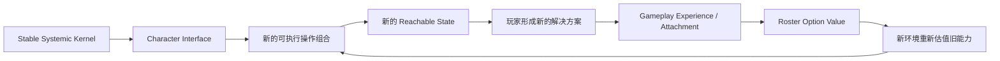

> Agent 标签：`character-economy` `contextual-optimality` `systemic-gameplay`

> 系列：游戏系统的共同语言
>
> 日期：2026-09-02
>
> 状态：草稿
>
> 核心问题：长期角色型游戏持续加入新角色时，怎样让新角色产生真实的新鲜感和长期价值，同时避免通过数值替代、专属锁孔和无限机制膨胀不断淘汰旧角色？
>
> 关键词：Character Economy、Agency、Systemic Gameplay、Contextual Optimality、Roster、Live Service

一个长期运营了五年的角色游戏准备发布新角色。

设计团队必须回答一个很现实的问题：

> 玩家为什么需要这个角色？

最直接的答案通常是：

```text
伤害更高。
```

于是新角色拥有：

```text
更高倍率
更快循环
更完整生存
更方便聚怪
更低操作成本。
```

版本上线以后，新角色表现很好。

玩家愿意获得它。

几个月以后，团队继续面对同一个问题：

> 下一个角色又为什么值得获得？

继续提高倍率当然可以。

但长期下来，一个越来越明显的现象会出现。

旧角色并不是数值上弱一点那么简单。

它们开始失去：

```text
存在理由。
```

过去需要三个角色分别完成的：

```text
输出
控制
生存
资源
```

现在一个新角色就能全部解决。

旧角色仍然可以被玩家喜欢。

仍然可以拥有漂亮的美术和故事。

但从 Gameplay 的角度看，玩家已经很难回答：

> 我为什么还要把它放进队伍？

如果长期角色经济一直依靠这种结构维持新角色价值，设计团队最终会发现：

```text
新角色越多
→
旧角色越难卖出Gameplay价值
→
新角色需要更强机制
→
底层规则越来越复杂
→
旧角色进一步失去适用空间。
```

真正需要解决的，并不是：

> 怎样永远不让新角色比旧角色强。

而是一个更底层的问题：

> **角色加入游戏以后，究竟应该扩大什么？**

## 先说结论：长期角色最好扩大“可能性空间”，而不只是提高已有答案的效率

**系统型角色经济（后文简称“角色作为系统接口”）**：以相对稳定的共享规则内核为基础，让角色通过不同的操作权限、组合方式和表达路径扩大玩家的行动可能性，并让角色价值在持续变化的环境中被重新解释，而不是主要依靠持续数值替代维持新鲜感。

它的理想结构不是：

```text
新环境
→
出现新锁
→
出售新钥匙
→
旧钥匙失效。
```

而更接近：



这里真正增长的不是：

```text
角色平均倍率。
```

而是：

```text
玩家面对同一个世界时
能够尝试的合法解法数量。
```

## Power 与 Agency 是两种不同的角色价值

**Power（后文简称“把原来的事情做得更快”）**：提高既有解决方式的效率。

例如：

```text
伤害 +30%
治疗 +20%
技能冷却 -15%。
```

玩家面对的问题没有真正改变。

原本能够击败 Boss。

现在只是更快击败。

另一种价值是：

**Agency（后文简称“以前做不到的事情现在可以尝试”）**：扩大玩家可以主动产生、修改或利用的游戏状态集合。

例如一个角色拥有：

```text
推动单位和场景物体。
```

这项能力本身可能没有直接：

```text
Damage +30%。
```

但它可以产生：

- 把敌人推下高台；
- 把敌人推入陷阱；
- 把爆炸物推进敌群；
- 把队友推出危险区；
- 把箱子推到门前阻挡路径；
- 把目标推入火焰地形；
- 改变敌人寻路。

一个简单动词改变了许多系统。

这种角色价值不是：

```text
已有答案 ×1.3。
```

而是：

```text
新答案开始存在。
```

## 用可达状态空间理解角色价值

**可达状态空间（后文简称“使用这套工具以后，玩家实际上能够把世界变成哪些状态”）**：从当前世界状态出发，通过玩家拥有的角色能力与系统规则，能够合法达到的 Gameplay State 集合。

可以抽象成：

```text
当前世界状态 S
+
基础系统操作 O
+
角色能力集合 K
+
玩家决策序列 π
→
Reachable States。
```

传统角色强度评价经常问：

```text
这个角色每秒能造成多少伤害？
```

系统型角色设计还会继续问：

```text
这个角色加入以后
哪些原本不可达的状态变得可达？
```

例如：

```text
没有位移能力
→
敌人只能从正面处理

获得 Push
→
地形边缘开始成为武器

获得 Spawn
→
占位和寻路开始成为资源

获得 Terrain Modify
→
地图结构本身可以进入决策

获得 Resource Transform
→
原本互不关联的两套资源开始转换。
```

角色因此不是一组技能倍率。

它更像一组：

```text
对世界规则的操作权限。
```

## Power Creep 最危险的不是数字，而是问题集合被吞掉

假设角色 A 可以很好地处理：

```text
单体爆发
+
有限控制。
```

角色 B 后来加入：

```text
更高单体爆发
+
群体伤害
+
强控制
+
生存
+
自回复。
```

此时问题不只是：

```text
B 的 DPS 高 20%。
```

更危险的是：

```text
A 能解决的问题
几乎全部被 B 覆盖。
```

可以把它理解成：

**能力帕累托支配（后文简称“新角色几乎什么都不比旧角色差，还能做更多”）**。

如果：

```text
P_A
=
A 能有效解决的问题集合

P_B
=
B 能有效解决的问题集合
```

当：

```text
P_A ⊂ P_B
```

时，

B 不只是更强。

它正在吞掉 A 的 Gameplay Niche。

## Capability Compression 比普通数值膨胀更难修

**能力压缩（后文简称“一个角色开始把原本需要组合解决的问题全部自己做完”）**：角色不断减少自身限制，使原本需要队伍、环境、资源和其他角色共同参与的问题，被压缩成单角色完整解法。

例如早期角色可能分别承担：

```text
Damage
Control
Defense
Resource Generation。
```

队伍必须组合。

后来一个新角色拥有：

```text
Damage
+
Control
+
Self Sustain
+
AoE
+
Resource Generation
+
低操作成本。
```

玩家需要做的组合决策反而减少了。

这是一件很反直觉的事情：

> 角色功能更多，不一定意味着系统深度更高。

如果角色越来越“完整”，

其他系统的存在价值就可能越来越低。

系统深度需要的不只是能力。

还需要：

```text
Constraint。
```

## 健康的长期目标不是“所有角色完全一样强”

这同样很重要。

角色长期共存并不意味着：

```text
所有角色
在所有情况下
拥有完全相同表现。
```

真正更合理的目标是：

**Contextual Pareto Front（后文简称“没有全局唯一最优，但不同环境会产生不同情境最优”）**。

即：

```text
Best Character
=
Context
×
Player Strategy
×
Team Structure
×
Player Preference。
```

在地图 A：

```text
Push
非常重要。
```

在地图 B：

```text
远程控制
价值更高。
```

面对 Boss C：

```text
持续单体输出
成为主要需求。
```

面对大量召唤物：

```text
区域控制
重新获得高价值。
```

角色的强弱随问题变化。

而不是：

```text
Version N
角色 B 永远取代角色 A。
```

## 情境最优允许角色真正横向共存

**横向角色扩张（后文简称“角色越来越多，但不是一代代把上一代替换掉”）**并不要求角色完全没有数值差异。

它要求的是：

```text
旧角色仍然拥有
别人无法完全覆盖的行动方式、组合位置或情境价值。
```

于是玩家获得新角色时，

感觉更接近：

```text
我的工具箱又多了一种工具。
```

而不是：

```text
我终于可以把旧工具扔掉。
```

这会进一步改变账号长期价值。

## 账号价值可以从“战力总和”转向“选择空间”

传统账号价值很容易理解成：

```text
Account Value
≈
Rarity
+
Power
+
Collection。
```

另一种理解是：

```text
Account Value
≈
Possibility Space
+
Option Value
+
Expression
+
Attachment。
```

**Gameplay Option Value（后文简称“今天不一定最优，但未来某个环境中可能打开新解法”）**：拥有一个角色等于长期保留一种未来可采取行动的权利。

这种角色不需要：

```text
每个版本都成为最优。
```

只需要产品能够建立一种长期信任：

> 它不会因为新版本加入几个角色，就永久失去系统意义。

这会让：

```text
Roster
```

从不断累积的过期商品，

逐渐变成越来越丰富的战略工具箱。

## 角色经济需要一个稳定系统内核

如果角色价值主要来自 Agency，

还有一个非常现实的问题：

```text
角色越来越多
→
是不是也必须增加越来越多底层规则？
```

如果答案是：

```text
是，
```

系统同样无法长期维护。

因此需要：

**Stable Systemic Kernel（后文简称“多年运营中尽量保持稳定的基础规则语言”）**：由少量可组合、可预测且能跨角色、敌人、地图和装备复用的基础动词与系统规则组成。

可以分成三层。

| 层级 | 职责 | 示例 | 长期变化频率 |
|---|---|---|---|
| Primitive | 最基础游戏动词 | Damage、Move、Push、Spawn、ApplyState | 极低 |
| System Rule | 定义基础动词如何互动 | Fire + Oil、Push + Wall、Spawn + Block | 低 |
| Character Expression | 角色怎样访问和组合公共规则 | Push + Burn、Spawn + Taunt | 高 |

新角色主要应该扩张：

```text
Character Expression。
```

而不是不断修改：

```text
Primitive / System Rule。
```

## 长期健康度更接近“组合空间增长”，而不是“规则数量增长”

假设产品已经拥有：

```text
50 个基础 System Rule
100 个角色。
```

理想增长可能是：

```text
101 号角色
→
以新的方式访问旧规则
→
产生大量新组合。
```

而不是：

```text
101 号角色
→
新增 Rule 51

102 号角色
→
新增 Rule 52

103 号角色
→
新增 Rule 53。
```

后者最终会形成：

```text
角色 = 私有 Mini-System。
```

玩家学习的不是：

```text
游戏世界怎样工作。
```

而是：

```text
每个角色自己的特殊说明书。
```

这会逐渐破坏 System Literacy。

## 深度来自句子变多，而不是词典变厚

一个稳定系统可以拥有：

```text
Push
Burn
Terrain
Spawn
Fear。
```

然后允许组合：

```text
Burn Oil
→
改变地形

Push Enemy
→
进入 Burning Ground

Burning Enemy
→
触发 Fear

Fear
→
改变 AI Path

Spawn Unit
→
阻挡 Fear Path。
```

底层词汇没有很多。

产生的“句子”却很多。

另一种扩张方式是：

```text
新增 BurningPlus
新增 CorrosionMode
新增 SpecialMark
新增 CharacterXState。
```

每个新词只服务少数内容。

这可以称为：

**Mechanic Inflation（后文简称“玩法不是更深，而是需要记住的专有名词越来越多”）**。

长期 Systemic Game 最需要控制的就是这种膨胀。

## Systemic Envelope 应该先于具体角色设计

**Systemic Envelope（后文简称“角色原则上允许操作哪些世界规则”）**：游戏公开允许角色使用、查询、变换和组合的基础系统动词边界。

例如：

```text
DealDamage
MoveEntity
ApplyState
SpawnEntity
ModifyTerrain
GenerateResource
ConsumeResource
ChangeTargeting。
```

设计新角色时，

第一步不应该总是：

```text
它还有什么从来没人见过的机制？
```

更合适的问题可能是：

```text
它能不能用一种以前没有的组合方式
操作现有 Systemic Envelope？
```

这会让角色独特性来自：

```text
规则表达。
```

而不是：

```text
底层例外。
```

## 新机制需要通过 Rule Promotion Test

当然，长期游戏仍然需要真正的新规则。

问题不是禁止新增。

而是：

> 新规则应该有资格成为公共基础设施。

可以进行一次简单检查。

新机制是否：

1. 能被多个角色复用？
2. 能被敌人使用或响应？
3. 能与地图、装备或环境互动？
4. 至少与两个已有系统产生有意义组合？

如果多数答案都是：

```text
否，
```

它更可能只是：

```text
Character-exclusive Mini-System。
```

如果多数为：

```text
是，
```

才更值得考虑晋升成正式 System Rule。

## 角色之间最好通过 Shared State 协同

最难扩展的角色协同之一是：

```text
角色 A
如果队伍中存在角色 B
→
伤害 +30%。
```

这是：

**Authored Pair Synergy（后文简称“设计师手写 A 认识 B”）**。

角色数量增加以后，

可能关系数会快速增长：

```text
A ↔ B
A ↔ C
B ↔ D
...
```

每推出新角色，

设计师需要主动维护越来越多配对关系。

更健康的方向是：

**状态中介型协同（后文简称“角色不需要互相认识，只需要说同一种世界语言”）**。

例如：

```text
角色 A
→
施加 Burning

角色 B
→
消费 Burning

角色 C
→
扩散 Burning

Oil Terrain
→
被 Burning 点燃

敌人 D
→
见到 Burning 进入 Fear。
```

A 不需要写：

```text
if CharacterB exists。
```

B 也不需要知道：

```text
Burning 是谁施加的。
```

它们只共享：

```text
Burning
```

这一世界状态。

## Shared State 可以产生 Emergent Compatibility

**Emergent Compatibility（后文简称“新增角色不用手写所有搭档，也自然能进入旧组合网络”）**来自统一规则语言。

假设第 101 个角色能够：

```text
把 Burning Target 推动。
```

它上线后自然会与：

- 旧 Burning 角色；
- 旧 Push 系统；
- Oil 地形；
- Fear 敌人；
- Trap；

产生交互。

这些组合不需要设计师逐一写：

```text
Character101 × Character37
SpecialSynergy = true。
```

角色库越大，

它可以接入的旧规则网络也越大。

这就是长期系统最理想的内容复利之一。

## 角色库应该产生正向网络效应

**Positive Roster Network Effect（后文简称“角色越多，旧角色反而获得更多可能搭档和新用途”）**：新角色通过共享规则加入既有组合网络，使已有角色的潜在搭配和情境价值随着 Roster 扩大而增加。

危险结构是：

```text
角色越多
→
旧角色越多
→
抽到旧角色越失望
→
账号积累越来越像历史包袱。
```

这是负向 Roster Network Effect。

理想结构则是：

```text
新角色出现
→
产生新 Shared State Interaction
→
旧角色获得新搭档
→
旧能力进入新的组合
→
Back Catalog 再次有价值。
```

玩家感受到的就不是：

> 我的账号里过时资产越来越多。

而是：

> 我的工具箱越来越丰富。

## 新环境最好重新解释能力，而不是定向抬某个角色

长期运营经常需要让旧角色重新获得关注。

最直接的方法是：

```text
新 Boss
拥有特殊 Shield

新角色
专门破 Shield。
```

这确实能制造角色需求。

但如果只有新角色能够合理解决，

本质是：

**Key-Lock Design（后文简称“先造一把锁，再卖唯一钥匙”）**。

更系统化的方式是：

**Systemic Recontextualization（后文简称“新内容改变一整类能力的边际价值”）**。

例如新地图增加：

- 狭窄通道；
- 高低差；
- 可破坏障碍；
- 聚集敌人；
- 危险地形。

那么：

```text
Push
Pull
AoE
Terrain
Trap
Blocking
```

整类能力都会重新估值。

没有唯一解。

旧角色也可能因为环境变化自然重新进入前沿。

## 旧角色再激活最好来自 Context，而不是数值救济

**Back-catalog Appreciation（后文简称“新内容出现以后，旧资产因为新环境重新升值”）**是一种比周期性数值 Buff 更稳定的旧角色维护方向。

数值 Buff 的问题是：

```text
今天 A 太弱
→
A +20%

明天 B 又落后
→
B +25%。
```

系统不断重新追平表格。

Context Revaluation 则尝试：

```text
内容改变
→
问题结构改变
→
不同能力自然进入新的价值区间。
```

这并不能完全消除数值平衡工作。

但它让：

```text
角色重新有价值
```

不必总等同于：

```text
倍率重新变大。
```

## 新内容应该尽量重新激活旧系统

长期服务最昂贵的内容结构之一是：

```text
新角色
需要新状态

新状态
需要新敌人

新敌人
需要新地图规则

所有内容
只服务这个版本。
```

下个版本又重新开始。

这种内容没有复利。

系统型结构则更期待：

```text
新地图
×
旧角色

新角色
×
旧状态

新敌人
×
旧地形

新装备
×
旧资源系统。
```

新增内容越晚，

理论上可交互的旧系统越多。

于是：

**边际内容价值（后文简称“一个新内容能重新激活多少已有东西”）**

开始随着系统库增长。

这是一种更适合长线运营的理想状态。

## 角色价值不应该只在获得那一刻产生

角色经济至少可以拆成四个阶段：

```text
Acquire Motivation
→
为什么想得到？

Ownership Value
→
得到以后为什么继续使用？

Retention
→
几个月以后为什么还记得？

Reactivation
→
旧角色为什么还能重新产生关注？
```

只解决：

```text
为什么抽？
```

很容易让角色价值集中在版本上线窗口。

长期系统更需要继续回答：

> 拿到以后，这个角色还会不会继续产生新的经历？

## Gameplay 可以直接生产角色情感价值

角色依恋不一定全部来自预写故事。

玩家自己经历的：

```text
差一点翻盘
意外组合
极限救场
特殊地图解法
某次随机 Run
```

也会变成角色记忆。

**Emergent Attachment（后文简称“玩家不是被告知这个角色很重要，而是自己和它经历过重要事情”）**：Gameplay 中由玩家决策和系统结果共同生成的个人经历，反过来提高角色长期情感价值。

于是角色经济可以形成：

```text
角色
→
提供新的系统接口
→
玩家产生新的玩法经历
→
形成个人记忆
→
角色依恋增加
→
玩家更愿意再次使用
→
产生新的经历。
```

这是一条很有价值的闭环：

> Gameplay 本身成为角色价值的生产机制。

## “角色作为镜头”比“角色作为答案”更适合长期扩张

**Character as Lens（后文简称“不同角色让玩家用不同方式看待同一个系统”）**并不意味着角色必须弱。

它意味着：

```text
角色独特性
主要来自：
我怎样处理问题

而不是：
只有我能够处理这个问题。
```

例如同一个敌群问题：

```text
角色 A
→
聚集后 AoE

角色 B
→
制造障碍分流

角色 C
→
控制敌人互相攻击

角色 D
→
用召唤物占位。
```

目标相同。

系统规则相同。

解法不同。

角色的身份自然来自：

```text
表达方式。
```

## 长期角色系统需要 Rule Budget 和 Exception Budget

角色数量持续增长后，

不能只依赖：

```text
设计师保持克制。
```

更适合建立明确治理指标。

### Core Rule Budget

控制底层公共规则增长。

真正新 Rule 应拥有高复用潜力。

### Character Exception Budget

每个角色允许拥有少量 Signature Exception。

但大部分技能应通过标准 System API 表达。

### Rule Reuse Ratio

可以粗略观察：

```text
共享机制调用
/
全部机制调用。
```

### Exception Density

观察：

```text
私有例外规则
/
全部规则。
```

这些指标不应该机械成为 KPI。

它们主要用于及时发现：

> 系统正在从组合式规则滑向大量角色私有逻辑。

## 角色设计评审应该新增“存在理由”检查

一个新角色设计完成以后，不应该只看：

```text
强度够不够
循环顺不顺
卖点明显不明显。
```

还可以画一张能力覆盖表：

```text
Character
×
Damage
Control
Mobility
Resource
Terrain
Defense
Summon
Interaction。
```

然后检查：

```text
新角色是否让某个旧角色的有效问题集合
几乎完全变成自己的子集？
```

如果是，

需要重新考虑：

- 增加 Constraint；
- 改变交互方式；
- 强化情境差异；
- 减少能力压缩。

这不是要求：

```text
每个角色只有一个功能。
```

而是要求：

> 每个角色仍然保留可以被解释的系统位置。

## 最优解可以存在，但最好不是全局永久最优

任何复杂系统都会出现 Meta。

目标不应该是：

```text
永远不存在最优解。
```

更合理的是：

```text
最优解随 Context 改变。
```

地图改变。

目标改变。

敌人改变。

队伍改变。

玩家自己的操作偏好改变。

于是：

```text
今天的最优
```

不自动等于：

```text
未来所有内容的最优。
```

这就是情境帕累托前沿真正要保护的东西。

## 这种设计尤其适合小队制系统游戏

角色作为系统接口需要：

```text
角色差异能够被玩家观察和利用。
```

因此它尤其适合：

- 小队战术；
- 回合制；
- 半即时暂停；
- 离散空间；
- Systemic Roguelite；
- 可互动环境较丰富的战斗系统。

原因很简单：

```text
玩家有时间看到
这个能力为什么改变了问题。
```

地图也天然能够成为 Context Generator。

只改变：

- 高低差；
- 路线；
- 敌人位置；
- 障碍；
- 资源；

就可以重新评价整个 Roster。

## Roguelite 可以成为角色长期再估值机器

Roguelite 在这种角色经济中最有价值的职责，不一定是：

```text
每次增加更多随机 Buff。
```

而可以是：

```text
持续制造不同 Context。
```

例如：

```text
Run A
远程敌人很多

Run B
狭窄地形

Run C
资源极少

Run D
召唤物环境。
```

同一批角色不断接受新的环境重解释。

于是旧角色价值不必依赖开发者定向抬升。

随机或半随机 Context 本身就可以成为：

```text
Roster Reactivation Engine。
```

## 这套结构并不适合所有角色型游戏

系统型角色经济不是角色商业化的唯一正确模式。

一些产品的角色价值主要来自：

- 长篇剧情；
- 收藏；
- 审美；
- 陪伴；
- 社交身份。

此时 Gameplay 并不需要承担主要角色价值生成职责。

如果强行要求每一个角色都必须：

```text
显著扩大系统状态空间，
```

反而会制造不必要的设计压力。

所以首先需要回答：

> 当前产品究竟主要靠什么让玩家长期在乎角色？

系统型角色经济只是在：

```text
Gameplay 本身承担较高角色价值责任
```

时尤其值得考虑。

## 高动作复杂度游戏也需要谨慎

如果游戏：

- 操作速度极高；
- 信息密度极大；
- 玩家很难理解完整状态因果；

大量系统交互可能只会增加：

```text
不可读性。
```

Systemic Depth 成立的前提之一是：

> 玩家能够理解自己的操作为什么产生当前结果。

如果最终只有攻略作者才能解释：

```text
到底为什么触发了这个组合，
```

规则组合已经从深度变成黑箱。

## Shared State 同样会制造 QA 组合爆炸

共享状态的优势是：

```text
新增内容自动与旧内容交互。
```

风险也正是：

```text
新增内容自动与旧内容交互。
```

角色越多，

系统组合越多。

因此必须同步建设：

- Interaction Matrix；
- Rule Inspector；
- State Trace；
- Deterministic Scenario；
- Batch Simulation；
- Property-based Test；
- Combination Budget。

否则：

```text
Emergent Compatibility
```

很快就会变成：

```text
Emergent Bug。
```

系统化设计不会减少 QA。

它只是把 QA 从：

```text
每个角色单独检查
```

转移到：

```text
规则组合与不变量检查。
```

## 对工程架构的一个直接要求：角色尽量做 Rule Consumer

代码层最危险的长期形态是：

```text
CharacterAExclusiveSystem
CharacterBExclusiveSystem
CharacterCExclusiveSystem。
```

角色越多，

运行时越像：

```text
几百个小框架同时存在。
```

更理想的结构是：

```text
StatusSystem
MovementSystem
TerrainSystem
ResourceSystem
SpawnSystem
TargetingSystem
AISystem。
```

角色主要调用：

```text
ApplyState
QueryState
MoveEntity
SpawnEntity
ConsumeResource
TransformState。
```

于是：

```text
角色数量增长
```

不会等量增加：

```text
底层系统数量。
```

这是稳定系统内核真正的工程含义。

## 新规则应该属于系统，不应该永久属于某一个角色

假设设计过程中出现一个非常有价值的新机制：

```text
Mark。
```

如果它最终只存在：

```text
Character A
施加 Mark

Character A
消费 Mark。
```

那么系统里只是多了一个 A 专属内部变量。

如果进一步发展成：

```text
多个角色可以施加
敌人可以响应
地图可以强化
装备可以消费
AI 可以识别，
```

它才真正成为公共系统语言。

新规则最有价值的升级路径不是：

```text
角色专属机制越来越复杂。
```

而是：

> 从一个角色想法，晋升成整个世界都理解的新规则。

## 我的长期角色经济检查表

1. 这个角色主要提供 Power，还是 Agency？
2. 新角色加入以后，哪些新的 Gameplay State 变得可达？
3. 它是否只是把旧解法效率提高？
4. 新角色能解决的问题集合是否几乎完全包含某个旧角色？
5. 是否出现明显 Capability Compression？
6. 角色是否拥有仍然清楚的 Constraint？
7. 当前系统是否存在长期 Global Best Character？
8. 最优角色能否随 Context 变化？
9. Roster 是否接近 Contextual Pareto Front？
10. 底层 Primitive 数量是否长期稳定？
11. 新角色是否主要扩展 Combination Space？
12. 角色是否频繁创建新的私有 Resource / State / Subsystem？
13. 是否存在 Core Rule Budget？
14. 是否存在 Character Exception Budget？
15. 新机制是否通过 Rule Promotion Test？
16. Systemic Envelope 是否已经被正式定义？
17. 角色是否主要通过公共 System API 表达能力？
18. 两个角色的协同是否依赖彼此硬编码身份？
19. 是否能通过 Shared State 建立协同？
20. 新角色是否自然进入旧角色的组合网络？
21. Roster 增长是在产生正向还是负向网络效应？
22. 获得旧角色时，玩家是否越来越容易觉得“这是过期资产”？
23. 新内容是否能重新解释旧能力？
24. 环境变化是在抬能力类别，还是定向制造新角色锁孔？
25. 是否大量采用 Key-Lock Design？
26. Back Catalog 是否能够随新 Context 重新升值？
27. 角色价值是否只有 Acquire Motivation？
28. Ownership Value 是否足够？
29. 角色获得数月后还有什么 Retention 来源？
30. 旧角色如何发生 Reactivation？
31. Gameplay 是否能够生成 Emergent Attachment？
32. 玩家是否拥有自己与角色共同产生的系统经历？
33. 账号长期价值是 Power Sum，还是 Option Space？
34. 新角色是否提高 Gameplay Option Value？
35. 新内容能否重新激活已有角色、规则、地图和敌人？
36. Rule Reuse Ratio 是否正在下降？
37. Exception Density 是否不断提高？
38. 系统深度是否来自规则组合，而不是专有名词膨胀？
39. 玩家能否预测不同规则组合的大致结果？
40. 新角色的开发是否需要新增 Character-exclusive Runtime Service？
41. 角色是否更接近 Rule Consumer，而不是 Rule Creator？
42. 真正的新 Rule 是否能够被角色、敌人、地图和装备共同使用？
43. Shared State 组合是否拥有足够调试工具？
44. Interaction Matrix 是否能够发现组合爆炸风险？
45. 新角色是在扩大玩家能够做什么，还是只在扩大策划必须维护什么？

长期角色游戏最容易被看到的是：

```text
角色越来越多。
```

但真正决定系统是否健康的，不是 Roster 本身的长度。

而是：

```text
第 100 个角色出现以后，
第 1 个角色还剩下什么意义？
```

一种答案是：

```text
靠数值重新 Buff。
```

另一种答案是：

```text
给旧角色专门设计一个新环境。
```

更理想、也更难的一种答案则是：

```text
世界一直使用稳定规则，
新角色不断增加新的表达方式，
新环境不断重新改变这些表达方式的情境价值。
```

角色于是不会只是：

```text
版本答案。
```

它们更像玩家长期积累的：

```text
系统接口。
```

Push 是一种接口。

Spawn 是一种接口。

Terrain Control 是一种接口。

Resource Transform 是一种接口。

不同角色以不同组合获得这些接口。

新角色加入以后，

它不必让旧角色失效。

它可以让：

```text
旧角色
+
新角色
+
旧环境
+
新环境
```

产生以前不存在的新解法。

这也是系统型角色经济最值得追求的长期结果：

> **角色库越大，玩家拥有的可能性越多；而不是角色库越大，过期资产越多。**

## 术语对照

| 正式术语 | 文中通俗称呼 |
|---|---|
| 系统型角色经济 | 角色作为系统接口 |
| Power | 把原来的事情做得更快 |
| Agency | 以前做不到的事情现在可以尝试 |
| 可达状态空间 | 使用这套工具以后，玩家实际上能够把世界变成哪些状态 |
| 能力帕累托支配 | 新角色几乎什么都不比旧角色差，还能做更多 |
| 能力压缩 | 一个角色开始把原本需要组合解决的问题全部自己做完 |
| Contextual Pareto Front | 没有全局唯一最优，但不同环境会产生不同情境最优 |
| 横向角色扩张 | 角色越来越多，但不是一代代把上一代替换掉 |
| Gameplay Option Value | 今天不一定最优，但未来某个环境中可能打开新解法 |
| Stable Systemic Kernel | 多年运营中尽量保持稳定的基础规则语言 |
| Mechanic Inflation | 玩法不是更深，而是需要记住的专有名词越来越多 |
| Systemic Envelope | 角色原则上允许操作哪些世界规则 |
| Authored Pair Synergy | 设计师手写 A 认识 B |
| 状态中介型协同 | 角色不需要互相认识，只需要说同一种世界语言 |
| Emergent Compatibility | 新增角色不用手写所有搭档，也自然能进入旧组合网络 |
| Positive Roster Network Effect | 角色越多，旧角色反而获得更多可能搭档和新用途 |
| Key-Lock Design | 先造一把锁，再卖唯一钥匙 |
| Systemic Recontextualization | 新内容改变一整类能力的边际价值 |
| Back-catalog Appreciation | 新内容出现以后，旧资产因为新环境重新升值 |
| Emergent Attachment | 玩家不是被告知这个角色很重要，而是自己和它经历过重要事情 |
| Character as Lens | 不同角色让玩家用不同方式看待同一个系统 |

---

## 内部资料依据

本文主要基于以下材料整理：

- `notes/角色经济型游戏逆向拆解/角色经济型游戏分析_FGO_碧蓝航线_赛马娘.md`
- `notes/角色经济型游戏逆向拆解/系统型角色经济_最深层产品与系统设计.md`
- `notes/角色经济型游戏逆向拆解/系统型角色经济_稳定系统内核与长期运营设计框架.md`
- `notes/角色经济型游戏逆向拆解/README.md`
- `blogs/README.md`
- `blogs/publication.v1.json`

本文是对长期角色经济、系统型 Gameplay 与 Live Service 角色设计的个人设计归纳。

文中的 Systemic Character Economy、Reachable State Space、Contextual Pareto Front、Stable Systemic Kernel、Systemic Envelope、Positive Roster Network Effect、Gameplay Option Value 与 Back-catalog Appreciation 等概念属于分析和设计工具，并不表示任何具体商业游戏采用完全相同的系统结构或内部设计方法。

尤其需要注意：

- “角色应更多提供 Agency”不意味着角色数值强度不重要，也不意味着所有角色都必须改变世界规则；
- “Contextual Pareto Front”是一种长期平衡目标，不意味着任何复杂游戏都能完全避免 Meta 或明显强势角色；
- “Shared State 中介协同”可以降低角色之间的硬编码组合，但会增加系统组合、QA 和调试复杂度；
- “Stable Systemic Kernel”不意味着长期运营不能增加新机制，而是要求真正新增的底层规则具有足够复用价值；
- “Key-Lock Design”并非任何情况下都错误，明确机制教学、阶段性 Boss 和局部内容完全可能合理使用；风险主要来自长期把角色商业价值建立在持续制造唯一锁孔之上；
- 产品比较材料属于逆向研究与设计推导，不等同于相关产品的官方设计说明，也不把产品表现简单归因于单一角色经济结构。
