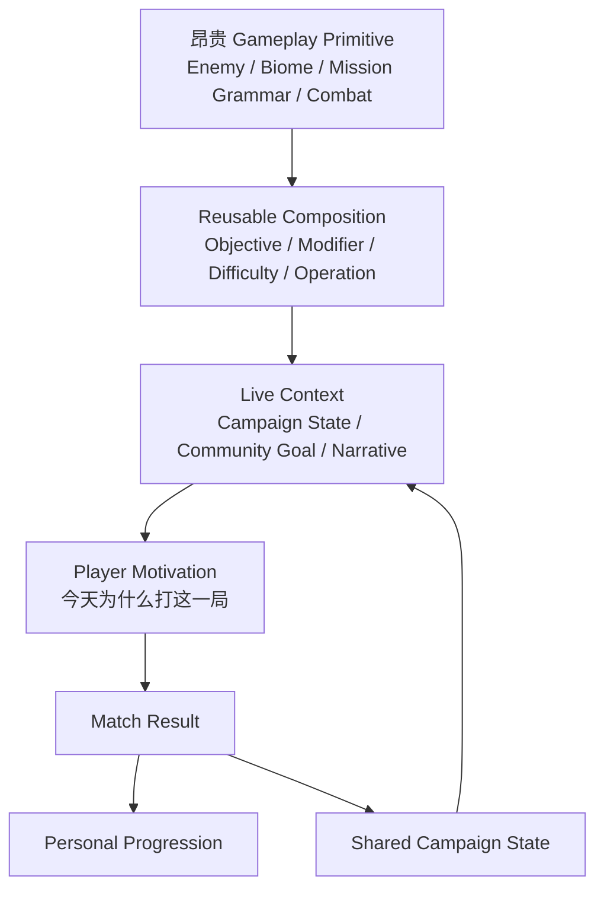
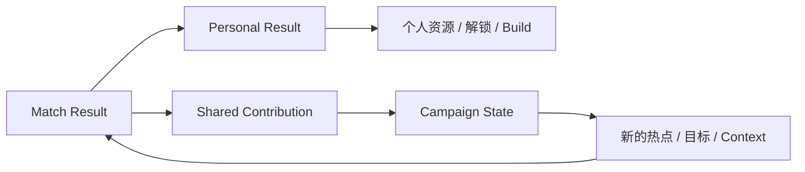
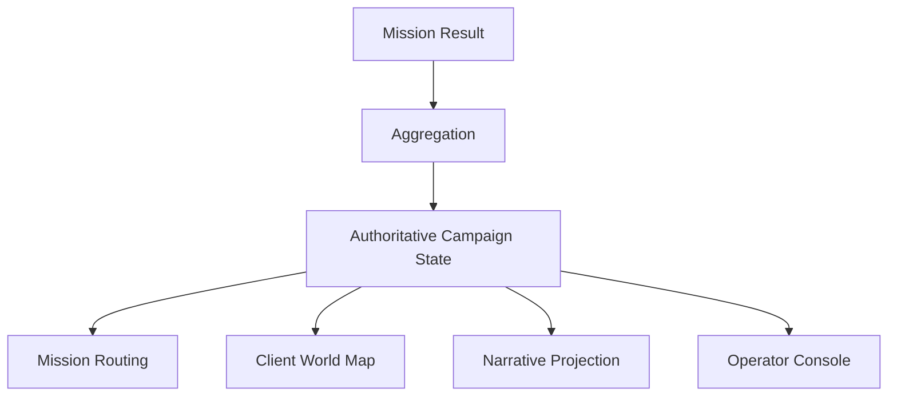

> Agent 标签：`encounter` `lighting` `navigation`

**内容情境杠杆：LiveOps 的共享状态、人口路由与旧内容再编排**

> 系列：游戏系统的共同语言
>
> 日期：2026-09-04
>
> 状态：草稿
>
> 核心问题：长期服务型 PvE 无法每周生产全新的敌人、地图和玩法规则时，怎样通过共享世界状态、社区目标和实时运营重新解释已有内容，让玩家获得新的进入理由，同时又不把“换一层叙事包装”误当成真正的新 Gameplay？
>
> 关键词：Live Service、Content Leverage、Shared Campaign State、Population Routing、Live Narrative

系列目录：游戏系统的共同语言

一个合作 PvE 游戏已经运营了一年。

核心战斗依然很好玩。

敌人反馈仍然扎实。

和朋友组队时，每一局仍然会产生各种意外。

问题是：

玩家已经知道这些地图。

知道这些敌人。

知道这些任务目标。

甚至已经知道：

```text
出生以后往哪里走
哪里容易刷敌人
哪些装备比较稳定
撤离阶段大概会发生什么。
```

这时最昂贵、也最直接的解决办法当然是：

```text
做新地图
做新敌人
做新 Boss
做新 Faction
做新的 Mission System。
```

问题在于：

> 长期产品几乎不可能按照玩家消费速度，持续生产最高成本 Gameplay Content。

一张地图可能需要：

- 关卡；
- 美术；
- Lighting；
- Navigation；
- Encounter；
- VFX；
- Audio；
- Optimization；
- Networking；
- QA。

一个真正的新 Enemy Archetype 也需要：

- Model；
- Animation；
- AI；
- Combat；
- VFX；
- Audio；
- Difficulty；
- Interaction Test。

但玩家可能几个小时就已经：

```text
看过
理解
适应
开始重复。
```

于是 Live Service 很容易走向一个危险假设：

```text
玩家开始重复
=
我们必须继续用同等成本制造全新内容。
```

实际上，在“生产新内容”和“让旧内容继续产生新意义”之间，还存在一整层设计空间。

## 先说结论：低成本 Context 可以放大高成本 Gameplay Content，但不能替代 Gameplay Content

**内容情境杠杆（后文简称“同一份内容，因为世界状态不同而重新变得值得玩”）**：在不重做底层战斗、敌人和地图资产的情况下，通过共享世界状态、限时目标、任务组合、人口热点和叙事解释，改变已有内容当前的战略意义、社会意义或进入理由。

可以把内容生产结构先压缩为：



这里有一个非常重要的不等式：

```text
Context
≠
Gameplay Content。
```

Context 的价值在于：

```text
提高已有 Gameplay Content
被重新消费、重新讨论和重新赋予意义的次数。
```

它不是：

```text
不用再做新 Gameplay。
```

## 内容生产真正需要区分 Primitive 与 Context

长期游戏中的内容可以粗略分成两大层。

### Gameplay Primitive

**玩法原语（即“真正改变玩家怎么操作和怎么解决问题的昂贵内容”）**。

例如：

- 新敌人行为；
- 新武器行为；
- 新地图结构；
- 新 Faction；
- 新 Mission Grammar；
- 新环境机制；
- 新战斗规则。

它们会改变：

```text
玩家具体怎么玩。
```

通常也是生产和 QA 成本最高的一层。

### Gameplay Context

**玩法情境（即“今天为什么要使用这些已有玩法原语”）**。

例如：

- 当前哪片区域处于危机；
- 本周社区主要目标是什么；
- 某类敌人现在成为战略重点；
- 某个区域失守会产生什么后续状态；
- 哪些 Mission 当前属于主战场。

Context 改变的是：

```text
同一个玩法
现在为什么值得做。
```

这两层不能互相冒充。

## Content Leverage Architecture 关注的是昂贵内容的复用倍率

**内容杠杆架构（即“昂贵内容做一次，尽量让上层系统产生很多次新的使用理由”）**可以理解成：

```text
Expensive Primitive
×
Composition Variety
×
Context Variety
=
Effective Content Surface。
```

这不是正式的产能公式。

它只是强调：

> 一个新 Enemy 的长期价值，不只取决于它第一次出现时有多新鲜，还取决于之后能进入多少种 Mission、Context、Difficulty、Community Goal 和系统组合。

假设团队花费大量资源完成一个新 Enemy。

如果它只能存在于：

```text
一个剧情关卡
```

那么玩家完成这段内容以后，它的主要产品价值就已经释放。

如果同一个 Enemy 还能进入：

```text
普通任务
防守任务
特殊 Modifier
社区战争
后续 Campaign
新的组合 Encounter
```

它的长期利用率会明显提高。

因此 Producer 不应该只问：

```text
做这个内容要花多少钱？
```

还应该问：

```text
这项昂贵内容以后能进入多少种合法组合？
```

## Existing Content Recontextualization Rate 是一种值得观察的内容指标

**内容再语境化率（即“同一项旧内容能被多少个新的合法 Context 重新赋予意义”）**不是一个必须精确量化的产品 KPI，但它很适合帮助团队思考内容架构。

例如一个 Biome 只支持：

```text
普通歼灭任务。
```

它的再语境化空间很小。

另一个 Biome 可以同时支持：

- 不同 Faction；
- 不同 Mission Template；
- 不同 Objective；
- 不同 Weather；
- 不同 Campaign State；
- 不同 Community Goal。

它的内容杠杆自然更高。

这里真正追求的不是：

```text
把旧地图无限重复。
```

而是：

> 在底层内容仍然保持足够游戏价值时，提高它被不同系统重新解释的能力。

## 所有内容杠杆都建立在一个前提上：核心玩法本身值得重复

这是最重要的适用边界。

如果一个 PvE Mission：

```text
第一次就不好玩，
```

在外面加：

```text
全球战争
社区进度
限时目标
剧情广播
```

并不能真正修复它。

最多只能让玩家：

```text
为了奖励或义务
多玩几次不好玩的内容。
```

可以把这个前提写成：

```text
Content Leverage
=
Core Gameplay Value
×
Context Multiplier。
```

如果：

```text
Core Gameplay Value ≈ 0，
```

再高的 Context Multiplier 也没有意义。

因此：

> **Live Narrative 是乘数层，不是底层 Gameplay 的替代品。**

## Systemic Drama 可以减少对脚本戏剧的需求

长期合作 PvE 还有一个非常重要的内容杠杆来源：

**系统性戏剧（即“设计师没有预写这件事，但系统自己产生了一段值得记住的故事”）**。

例如：

- 队友误伤；
- 判断错误；
- 临时救援；
- 敌群突然改变局势；
- 资源耗尽；
- 撤离时的混乱；
- 一次极限配合。

这些场景不需要：

```text
Narrative Designer
提前写出每一条发生顺序。
```

它们来自：

```text
Combat Rules
×
Enemy Behavior
×
Cooperation
×
Risk
×
Player Mistakes。
```

于是一次 Mission 不只是：

```text
完成任务模板。
```

还可能成为：

```text
Emergent Story Generator。
```

这对内容型游戏尤其重要。

因为系统性变化能够让相同 Mission Grammar 产生不同记忆。

## 但 Systemic Variation 同样存在耗尽速度

玩家第一次遇到：

```text
队友意外制造大型事故，
```

可能非常有记忆点。

如果所有 Mission 最终都只会产生：

```text
同一批敌人
同一批任务
同一种撤离节奏
同一种事故，
```

系统戏剧同样会进入熟悉区。

因此：

```text
Systemic Variation
```

只能降低脚本内容压力。

不能永久消灭：

```text
新机制
新敌人
新 Mission Grammar
```

的需求。

## 一场 Match 可以同时输出个人进度和共享世界状态

长期 Context 最有价值的结构之一，是让一场普通对局拥有两个不同结果出口。



个人层回答：

```text
这一局对我有什么价值？
```

共享层回答：

```text
这一局对我们共同面对的世界有什么价值？
```

两者不需要完全绑定。

玩家可以：

```text
不关心宏观战争
但仍然追个人成长。
```

也可以：

```text
个人成长已经接近完成
却因为社区目标再次回来。
```

这种多驱动力结构比：

```text
所有留存只依赖一条装备成长线
```

更加有弹性。

## Shared Contribution 不是普通货币

**叙事资源（即“它不能被我存进背包，却能改变大家共同面对的世界状态”）**是一种特殊资源。

传统 Currency：

```text
属于玩家
可以积累
可以消费。
```

Shared Contribution 则更接近：

```text
Mission Result
→
立即投影到 Campaign State。
```

玩家不能：

```text
囤 10000 点战争贡献
以后一次性花。
```

它的价值不是资产所有权。

而是：

> 把个人行为转成全局世界状态的一小部分。

因此这类数据不应该为了“所有资源统一”硬塞进 Inventory System。

它属于另一种状态域。

## Shared Campaign State 是一种社会放大器

单局里，一个玩家真正改变的数值可能非常小。

例如：

```text
Contribution += 0.00003%。
```

如果直接把这个数字显示给玩家：

```text
个人影响几乎不可感知。
```

但全服大量结果聚合以后：

```text
区域状态变化
↓
新的战略方向
↓
社区讨论
↓
新的任务热点。
```

玩家的局部行动获得了：

```text
Community Meaning。
```

这可以理解成：

**社会放大（即“个人动作很小，但因为属于同一套共享历史而获得更大的意义”）**。

大型共享状态系统的价值往往不在于：

```text
每个人都能单独改变世界。
```

而是：

```text
每个人都能明确看见自己的行为属于哪一次共同状态变化。
```

## 全局状态最好使用空间隐喻，而不是活动任务表

后台运营数据完全可以长成：

```text
Event #472
Goal:
Complete Mission Type B 4,000,000 times。
```

这是一份有效配置。

但对玩家来说，它很容易被理解成：

```text
大型周常任务。
```

如果同一份状态通过：

```text
Galaxy
→
Region
→
Sector
→
Planet
→
Control State
```

表达，

玩家看到的则是：

```text
世界正在发生变化。
```

**空间化叙事（即“把后台运营状态翻译成玩家能够理解的世界地理变化”）**能够把抽象 KPI 转成世界故事。

这里真正改变的可能仍然只是 Server State。

但 UX 表达改变了玩家理解它的方式。

## 这不是“换皮”，前提是状态真的拥有后果

如果：

```text
星球失守
```

最终没有任何实际差异。

如果：

```text
玩家赢或输
```

都不会改变后续可见状态。

如果：

```text
下一周一定按照预先安排的同一路线发生。
```

那么空间化叙事最终会退化成：

```text
漂亮的进度条。
```

这就是：

**Agency Credibility（即“玩家相信自己的群体行为真的属于世界状态变化原因之一”）**。

它不要求玩家拥有完全自由的世界控制权。

但至少要求：

```text
玩家结果
和
后续状态
之间存在可信关系。
```

## Agency Illusion Collapse 是共享战役最大的风险之一

**行动幻觉崩塌（即“玩家开始认为不管做什么，结果反正早就决定了”）**一旦出现，

整个宏观层最重要的幻想会失效。

原本：

```text
我在参与战争。
```

会变成：

```text
我只是在给预定剧情填进度条。
```

因此运营团队对世界状态进行人工控制时，需要非常谨慎。

Human-in-the-loop 不等于：

```text
运营可以任意改结果。
```

真正需要的是：

```text
Operator
拥有边界明确的调节权

+
玩家结果
仍然是正式输入。
```

## Human-in-the-loop 比完全自动模拟更适合很多 Live Campaign

**人机联合运营（即“系统负责持续模拟和统计，运营人员只在明确控制面进行调节”）**比两个极端更实际。

极端 A：

```text
所有 Campaign 完全脚本化。
```

玩家结果几乎没有作用。

极端 B：

```text
完全自动模拟。
```

一旦人口、平衡或内容节奏出现异常，

系统只能沿错误趋势继续运行。

更稳健的结构可能是：

```text
System Simulation
+
Live Configuration
+
Bounded Operator Controls。
```

运营人员可以调整：

- 目标；
- 速度；
- 区域；
- Modifier；
- Event Timing；
- 后续路线。

但这些操作需要：

- 权限；
- 审计；
- 配置校验；
- 版本；
- 回滚；
- Telemetry。

否则所谓 Game Master 只是：

```text
可以在线直接改生产状态的人。
```

这不是运营能力。

而是生产风险。

## Live Operator 工具必须成为正式产品基础设施

一旦 Live Campaign 依赖人工运营，

Operator Console 就不再是临时后台页面。

它至少需要回答：

```text
现在世界处于什么状态？
```

```text
这次改动将影响什么？
```

```text
谁执行了这次修改？
```

```text
修改后玩家结果是否异常？
```

```text
是否可以回退？
```

因此：

**运营控制面（即“用受限、可审计方式修改实时世界状态的正式工具”）**

通常需要：

```text
Live Config
State Inspector
Telemetry
Audit Log
Validation
Rollback
Scheduling
Permission。
```

如果产品需要三年运营，

这些工具的长期价值往往高于某一次活动脚本。

## Major Objective 还承担 Population Routing

全局目标还有一个非常现实的产品职责：

**人口路由（即“把原本分散在大量可选内容中的玩家导向有限热点”）**。

假设产品允许玩家自由选择：

```text
10 个区域
30 种任务
多种难度。
```

如果所有内容此刻价值完全相同，

玩家人口可能被平均分散。

结果可能是：

- Matchmaking 等待增加；
- 局部服务器利用率不稳定；
- 某些社区目标很难形成社会感；
- 玩家更难感知“大家正在做同一件事”。

一个全局目标可以暂时宣布：

```text
本周最重要的是区域 X。
```

于是部分人口自然集中。

所以 Major Objective 不只是：

```text
Narrative Quest。
```

它还是：

```text
Population Router。
```

## Population Routing 不能变成唯一正确入口

如果热点奖励高到：

```text
不去热点
=
显著浪费时间，
```

那么系统就不再是：

```text
引导人口。
```

而是：

```text
强制人口。
```

这和异质玩法中的 Forced Progression 是同类风险。

更健康的关系通常是：

```text
热点有额外意义和社区价值
但非热点仍然保持合理基础收益。
```

玩家因为：

```text
共同目标
```

倾向去热点。

而不是因为：

```text
其他地方被系统性惩罚。
```

## 人口规模必须进入全局进度公式

共享进度系统有一个非常危险的正反馈。

假设公式固定：

```text
需要 1,000,000 次完成。
```

产品高峰期有：

```text
100 万活跃玩家。
```

目标很容易推进。

半年后只剩：

```text
10 万活跃玩家。
```

目标突然变成过去十倍困难。

于是：

```text
人口下降
→
目标更难完成
→
世界持续失败
→
玩家觉得游戏正在衰退
→
更多人口下降。
```

这形成：

**人口衰退反馈（即“玩家越少，共享目标越难，于是剩余玩家体验也继续变差”）**。

因此 Campaign Progress 很可能需要考虑：

- Active Population；
- Difficulty；
- Completion Rate；
- Average Contribution；
- Participation Concentration。

重点不是让：

```text
所有目标必定成功。
```

而是避免：

```text
历史高峰人口
```

永久写死未来世界难度。

## Population Normalization 也不能删除真实结果

如果系统过度修正：

```text
今天只有 1000 人
→
每个人自动算 1000 倍贡献。
```

玩家可能再次怀疑：

```text
那我们真正完成多少还有什么意义？
```

因此：

**人口归一化（即“调整目标尺度，而不是假装真实参与人口不存在”）**

需要维持两种事实：

```text
真实玩家参与
```

和：

```text
运营目标可达性。
```

这仍然是一项设计权衡。

并不存在一条所有产品都能复制的固定公式。

## Retention Layer 与 Monetization Layer 不必是同一个系统

一个很健康的长期结构是：

```text
Live Campaign
→
负责 Return Motivation

长期商品 / 内容目录
→
负责 Monetization。
```

也就是说：

```text
回来
```

和：

```text
付费
```

不需要发生在同一个活动按钮里。

**留存—商业分层（即“让玩家回来的系统和让玩家购买东西的系统可以互相支持，但不必互相绑死”）**

可以减少：

```text
每个社区活动
都必须带付费入口
```

的产品压力。

例如：

```text
Campaign
→
让玩家重新进入游戏

重新进入
→
接触到新的 Gameplay Options

Gameplay Options
→
可能产生商业转化。
```

这是间接耦合。

而不是：

```text
想参加社区战争
→
必须购买本期内容。
```

## Evergreen Catalog 会把 FOMO 债务换成 Balance Surface

如果长期商品不会快速过期，

玩家回归压力通常更低。

旧内容也能继续保持销售和消费价值。

但这种结构会产生另一笔债：

**平衡表面积（即“所有仍然有效的 Gameplay Option 与未来内容发生交互的组合总量”）**。

每增加一个 Gameplay-affecting Item：

```text
它就可能继续与：
Enemy
Mission
Difficulty
Modifier
Other Equipment
形成新组合。
```

因此：

```text
Catalog Growth
→
Interaction Testing Surface Growth。
```

“不限时”并不是没有成本。

它只是把：

```text
FOMO Pressure
```

的一部分成本转化成：

```text
长期 Balance / QA Maintenance。
```

## Content Throughput 应按生产成本分层

长期内容团队最危险的目标之一是：

```text
每周都要有新内容。
```

这句话没有区分：

```text
什么等级的新。
```

更可持续的生产可以拆成三层。

| 层级 | 典型内容 | 成本 | 建议职责 |
|---|---|---:|---|
| Tier A | Live Config、Community Goal、Narrative Framing | 低 | 高频改变 Context |
| Tier B | Mission Variant、Modifier、组合变化 | 中 | 周期性改变玩法排列 |
| Tier C | Enemy、Biome、Mechanic、Faction | 高 | 真正扩大 Gameplay Grammar |

这不是固定更新周期。

真正重要的是：

> 不同成本层不能使用同一个产出节奏期待。

如果产品要求：

```text
每周 Tier C，
```

团队几乎必然开始：

- 降低质量；
- 堆技术债；
- 过劳；
- 复制内容；
- 扩大 QA 风险。

## Tier A 的存在，就是为了摊销 Tier C

一个高成本 Enemy 做完以后，

Tier A / B 可以让它进入：

- 不同区域；
- 不同社区目标；
- 不同 Modifier；
- 不同 Operation；
- 不同剧情语境。

于是：

```text
Tier C
负责扩大字典。

Tier A / B
负责不断写新的句子。
```

这和长期系统设计中：

```text
Stable Primitive
+
Combination Space
```

的思想非常接近。

真正好的内容架构不是只有：

```text
更多 Primitive。
```

也不是只有：

```text
重复组合。
```

而是两层按照不同节奏共同增长。

## Content Production Bottleneck 通常不在运营文案

写一个新的全局目标文本，通常不是最昂贵的工作。

真正长期的高成本更接近：

```text
新 Enemy Behavior
新 Mission Grammar
新 Biome
Gameplay-affecting Content
Balance
Cross-platform QA。
```

这意味着 Producer 不应把：

```text
活动数量
```

当成主要内容产能指标。

更重要的是：

```text
底层 Gameplay Grammar
多久真正获得一次扩展？
```

以及：

```text
现有 Primitive
在扩展之间能够被多少个有效 Context 重组？
```

## Mission Grammar 是 Context 无法替代的硬底座

**任务语法（即“玩家进入关卡以后实际反复执行的动作关系”）**包括：

- 进入；
- 移动；
- 搜索；
- 防守；
- 搬运；
- 破坏；
- 击杀；
- 撤离；
- 资源分配；
- 团队协作。

Context 可以说：

```text
这一次防守是为了守住整个战争关键节点。
```

但玩家实际操作仍然是：

```text
同样的防守。
```

当玩家已经完全掌握：

```text
Enemy
Map
Objective
Tool Interaction
```

以后，

叙事重新解释的边际价值会不断下降。

这就是：

**Mission Grammar Exhaustion（即“活动名字还在变化，但玩家实际执行的句子已经全部读过很多遍”）**。

## Content Meaning 比 Content Asset 更容易先耗尽

长期运营时，资产不一定已经过时。

一张地图：

```text
美术仍然漂亮
性能仍然正常
玩法也没有严重问题。
```

但玩家可能已经失去：

```text
为什么今天还要来这里。
```

这就是：

**内容意义耗尽（即“内容本身仍能运行，但它不再产生新的决策理由和社会意义”）**。

Context Layer 正是在处理这种问题。

但 Context 本身也会耗尽。

第一次：

```text
区域失守
```

非常有冲击。

第三十次同样的：

```text
区域失守
```

如果没有新的 Gameplay Consequence，

就会逐渐变成：

```text
后台数字换了。
```

因此 LiveOps 不能只生产：

```text
New Context。
```

还需要持续生产：

```text
New Meaning。
```

## New Meaning 不等于 New Text

这是内容运营非常关键的一项区分。

如果一次新活动只改变：

```text
任务标题
背景文案
奖励数字，
```

玩家对核心操作的理解没有变化。

真正更强的 Meaning Shift 可能来自：

```text
敌人组合变化
Mission 出现概率变化
环境规则变化
支援规则变化
战略路线变化
失败后世界状态变化。
```

也就是说：

```text
Narrative Change
```

最好能够至少在一部分高价值节点上对应：

```text
Gameplay Change。
```

否则 Live Narrative 很容易退化成活动文案流水线。

## Campaign Rule Mutation 比纯目标文本更有长期价值

**战役规则变异（即“全局世界状态不只告诉你去哪打，还真正改变在那里怎样打”）**

是 Context Layer 从：

```text
叙事包装
```

进一步走向：

```text
Gameplay Recontextualization
```

的关键。

例如某次 Campaign State 可以改变：

- 某类敌人密度；
- 可用支援；
- 天气；
- Objective 组合；
- Region Route；
- Resource Availability。

玩家回到旧地图。

但这次处理方式已经改变。

这种 Context 的杠杆明显高于：

```text
同样任务
只是进度条换了名字。
```

## 但 Live Context 不能无限制造例外规则

这里又存在另一个风险。

如果每一次 Campaign 都通过：

```text
临时新增一套特殊规则
```

维持新鲜感，

LiveOps 最终会制造：

```text
大量一次性 Exception。
```

系统复杂度同样会失控。

因此 Campaign Rule Mutation 最好：

> 重新组合已有系统 Primitive，而不是不断给 Runtime 增加活动专属逻辑。

例如：

```text
已有：
Weather
Enemy Modifier
Support Restriction
Spawn Rule
Resource Rule。
```

Live Config 主要组合这些现成能力。

只有真正值得长期复用的新机制，才进入基础系统。

## Content Leverage 的上限由 Gameplay Grammar 决定

可以把整个关系粗略理解为：

```text
Useful Content Lifetime
≈
Gameplay Grammar Depth
×
Systemic Variation
×
Context Reinterpretation。
```

这同样不是正式公式。

它强调三个不同来源：

### Gameplay Grammar

玩家真正能够执行多少种有区别的行为。

### Systemic Variation

同样行为在系统交互中能产生多少变化。

### Context Reinterpretation

为什么此刻这些行为值得执行。

三层缺一不可。

如果 Grammar 太浅：

```text
Context 很快耗尽。
```

如果 Context 完全不变：

```text
高质量 Grammar 也可能缺乏长期进入理由。
```

## 内容杠杆最大的风险，是被拿来掩盖内容枯竭

当团队 Content Throughput 开始下降时，

Context Layer 很容易变成遮羞布：

```text
没有新玩法
→
多做几个全局目标

没有新敌人
→
多写一些战争文本

没有新地图
→
重复切换区域状态。
```

短期数据可能仍然有效。

长期却会制造：

```text
Context Inflation。
```

活动数量不断增加。

真正的 Gameplay Meaning 却越来越少。

因此 Producer 需要不断问：

> 这次 LiveOps 是在重新解释仍然有生命力的内容，还是在掩盖底层内容已经耗尽？

这是两个完全不同的问题。

## 一个简单的 Context Review 可以检查四层变化

每次准备新的社区 Campaign 时，可以检查：

| 层次 | 是否有变化 |
|---|---|
| Narrative | 玩家如何理解当前事件 |
| Strategic | 玩家现在选择哪里、何时、和谁行动 |
| Tactical | Mission 内部怎样处理问题 |
| Mechanical | 玩家实际可执行的规则是否变化 |

不是每次活动都必须四层全部变化。

低成本 Event 可能只改变：

```text
Narrative + Strategic。
```

但如果连续十个活动都只改变：

```text
Narrative，
```

就需要警惕 Meaning Exhaustion。

## 内容杠杆也需要自己的产品指标

除了 DAU 和 Completion Rate，可以观察：

### Voluntary Participation

不考虑强奖励以后，玩家是否仍愿意参与当前 Campaign。

### Population Concentration

全局目标是否成功形成热点，而没有把其他正常内容完全挤死。

### Recontextualization Coverage

旧地图、旧敌人、旧任务有多少真正被新 Context 重新激活。

### Context Repeat Rate

同一种“危机/防守/解放”框架在短期内重复了多少次。

### Mission Grammar Diversity

玩家实际执行的任务结构是否仍在变化。

### Context-to-Primitive Ratio

一项高成本新 Primitive 后续被多少组 Context 有意义地复用。

这些指标都只是分析工具。

重点是让团队不再只看：

```text
本周活动开了多少。
```

## Context 层也需要技术上的唯一真相源

如果 Campaign State 同时存在：

```text
运营后台一份
游戏服务器一份
客户端地图一份
社区页面再算一份，
```

最终一定会出现状态漂移。

更稳健的模型是：



也就是说：

```text
Campaign State
```

首先是一份服务器权威事实。

地图、新闻、Narrative UI 都是它的 Projection。

不要让 UI 自己成为第二套战争状态机。

## Mission Result 和 Campaign Contribution 最好分离

一次 Match 可以产生：

```text
Win / Lose
Objectives
Difficulty
Player Count
Performance。
```

Campaign 系统再根据自己的当前规则决定：

```text
这次结果贡献多少。
```

因此：

```text
MissionResult
```

不应该直接等于：

```text
CampaignContribution。
```

这种分离有几个好处。

第一，Campaign Formula 可以调整。

第二，历史 Match 不需要知道所有未来 Campaign 规则。

第三，Telemetry 可以重算或审计 Contribution。

第四，运营不需要修改 Mission Runtime 内部代码才能调整全局进度。

## Aggregation 应该是可重试且幂等的

在线服务中：

```text
Mission Result
```

可能因为：

- 网络重试；
- Message Redelivery；
- 服务重启；

重复到达 Campaign Aggregator。

如果每次都：

```text
progress += contribution，
```

同一个 Match 就可能被重复计入。

因此：

**幂等贡献提交（即“同一场 Match 可以安全重试，但对全局战局只能正式生效一次”）**

适合使用：

```text
MatchId / ResultId
+
CampaignVersion
```

建立去重身份。

这是任何共享进度系统都应该认真处理的运行时边界。

## Campaign Formula 需要版本身份

假设运营在活动中途调整：

```text
Contribution Formula。
```

随后出现：

```text
旧 Match 的重试结果
```

系统需要知道：

```text
按旧规则？
按新规则？
是否已经提交？
```

因此 Campaign State 最好拥有：

```text
CampaignId
RuleVersion
ConfigVersion
Start / End
State Revision。
```

Live Config 不是一个匿名 Dictionary。

它本身应该进入版本治理。

## Operator 修改最好是 Intent，而不是任意数据库编辑

一个成熟运营工具更适合提供：

```text
AdjustTargetRate
OpenRegion
CloseRegion
ApplyModifier
ScheduleEvent
RollbackRevision。
```

而不是：

```text
直接 SQL 修改 progress 字段。
```

**运营意图命令（即“运营表达要做什么，系统负责验证怎样合法做到”）**

可以附带：

- Actor；
- Reason；
- Preview；
- Validation；
- Audit；
- Rollback。

这和开发工具的 Safe Execution 非常相似。

高权限并不意味着应该暴露最低层写入能力。

## 运营权限越强，越需要 Failure Isolation

如果一次错误配置可以影响：

```text
全服玩家目标，
```

那么 LiveOps 系统必须假定：

```text
配置错误一定会发生。
```

所以需要：

- Dry Run；
- Schema Validation；
- Range Check；
- Versioned Config；
- Rollback；
- Staged Publish；
- Audit Trail。

这里不能依赖：

```text
运营同学仔细一点。
```

Human-in-the-loop 的价值来自人类判断。

风险也同样来自人类操作。

## Context Layer 最好能够安全停机

一个长期产品还应该问：

> 如果今天 LiveOps 团队暂时不能发布新的 Campaign，游戏本身还能不能运行？

如果答案是：

```text
没有全局目标
→
玩家连普通 Match 都不能进入，
```

Context Layer 已经成为整个 Gameplay 的硬单点。

这未必绝对错误。

但它需要获得 Core Infrastructure 级别的：

- SLA；
- Fallback；
- Recovery；
- Monitoring。

更稳健的产品通常允许：

```text
Campaign Layer unavailable
→
Core PvE 仍可运行
→
只失去宏观上下文和部分社区功能。
```

这样 Context 才是真正的 Multiplier Layer。

## 不应该直接照搬“全服战争地图”

这是整套方法最容易被错误复制的地方。

团队看到成功案例后，可能直接做：

```text
全球地图
星球
进度条
全服百分比。
```

但真正应该先回答的是：

1. 底层 Gameplay 是否值得重复？
2. Match Result 是否有适合投影到共享状态的意义？
3. 共享状态是否会改变下一轮玩家选择？
4. 人口热点是否真的对产品有价值？
5. 世界状态是否拥有可信后果？
6. Context 是否可以低成本重新组合已有 Gameplay？
7. 运营团队是否有能力长期维护它？

如果多数答案是否定的，

一张巨大地图只会成为：

```text
昂贵的活动 UI。
```

## 不应该把社区目标等同于玩家 Agency

玩家共同推进一个数字，

并不自动意味着：

```text
玩家真正改变了世界。
```

Agency 还取决于：

- 是否存在多种可选路径；
- 失败是否具有后果；
- 成功是否改变后续状态；
- Operator 是否会无条件纠正任何结果；
- 世界是否记住历史。

共享目标可以只是：

```text
共同劳动。
```

也可以成为：

```text
共同决策。
```

两者的产品体验非常不同。

## 不应该把所有运营变化都升级成 Gameplay Rule

如果每周活动都新增：

```text
EventSpecificSystemV47
EventSpecificDamageRuleV23，
```

长期 Runtime 会被运营内容拖垮。

理想 Live Config 应主要消费：

```text
已有可组合 Primitive。
```

真正的新规则则进入：

```text
正式 Gameplay System
+
长期测试面。
```

这样才能保持：

```text
运营频率高
```

而：

```text
底层规则膨胀速度低。
```

## 我的内容情境杠杆检查表

1. 核心 PvE 在没有 Campaign Context 时是否本身就值得重复？
2. 当前底层 Gameplay Grammar 有多少真实变化空间？
3. 新 Context 是在重新解释内容，还是仅仅修改奖励数字？
4. 一项昂贵 Enemy / Biome / Mechanic 能进入多少合法组合？
5. 是否能够观察 Existing Content Recontextualization Rate？
6. Match Result 与 Campaign Contribution 是否分离？
7. 一场 Match 是否同时拥有个人结果和共享结果？
8. Shared Contribution 是否被正确建模为世界状态输入，而不是普通 Inventory Currency？
9. Campaign State 是否有唯一权威事实源？
10. Client Map、News 和 Narrative 是否只是状态 Projection？
11. Contribution Submission 是否幂等？
12. Campaign / Formula / Config 是否拥有版本身份？
13. Active Population 是否进入目标可达性计算？
14. Population Normalization 是否不会把玩家实际贡献完全抹平？
15. 全局目标是否能够承担 Population Routing？
16. Population Routing 是否没有变成强制唯一入口？
17. 非热点内容是否仍保留合理基础价值？
18. Global Objective 是否真的改变玩家的战略选择？
19. Campaign 成败是否会改变后续世界状态？
20. 是否存在 Agency Illusion Collapse 风险？
21. Operator 干预是否有明确权限、审计和回滚？
22. Live Config 是否通过 Schema 和 Range Validation？
23. Operator 是否提交 Intent，而不是任意修改底层数据库？
24. System Simulation 与 Human Operation 的职责是否分离？
25. Systemic Drama 是否能够产生足够单局变化？
26. 玩家是否已经完全掌握当前 Mission Grammar？
27. 最近多个 Live Event 是否只修改 Narrative，而没有 Tactical / Mechanical 变化？
28. 是否已经出现 Mission Grammar Exhaustion？
29. 是否观察 Context Repeat Rate？
30. 新 Content Context 是否产生真正 New Meaning，而不只是 New Text？
31. Tier A / B / C 内容是否拥有不同合理生产节奏？
32. 团队是否错误要求高成本 Primitive 按高频 LiveOps 节奏生产？
33. 低成本 Context 是否正在有效摊销高成本 Gameplay Asset？
34. 新 Gameplay Primitive 是否具有足够长期复用能力？
35. Evergreen Gameplay Catalog 是否已经产生明显 Balance Surface 债务？
36. Interaction Testing Surface 是否随长期内容持续扩张？
37. Retention Layer 与 Monetization Layer 是否被不必要地强绑？
38. Campaign 暂停时，核心 Gameplay 是否仍可运行？
39. 如果 Context Layer 是硬依赖，它是否获得了对应 SLA 和 Recovery？
40. 当前 LiveOps 究竟是在创造新的意义、重组旧内容，还是在掩盖底层 Gameplay 已经耗尽？

长期服务型游戏永远面对一个非常现实的生产矛盾：

```text
玩家消费内容的速度
>
团队生产最高成本内容的速度。
```

解决这个问题不可能只靠：

```text
更大的团队。
```

也不能只靠：

```text
更慢的玩家。
```

一个更可持续的方向，是让高成本内容具有更高的长期杠杆。

敌人负责提供真正新的战斗问题。

地图负责提供新的空间条件。

Mission Grammar 负责提供新的行动语言。

而 Live Context 负责不断回答：

```text
今天为什么还值得再次使用这些东西？
```

当一次普通 Match 同时属于：

```text
我的个人成长
```

和：

```text
我们共同面对的世界历史，
```

旧内容就获得了新的社会意义。

当全局目标又能把玩家重新路由到不同区域，

相同内容进一步产生新的社区热点。

当 Narrative State 还能改变 Mission Modifier、支援规则或敌人组合，

Context 又开始真正改变 Gameplay 解释。

这就是内容杠杆的价值。

但它最终仍然有明确上限。

玩家可以重新理解同一个任务十次。

很难无限重新理解完全相同的任务。

所以真正健康的长期结构不是：

```text
Context 替代 Content。
```

而是：

```text
昂贵 Primitive
低频扩展 Gameplay Grammar

+

低成本 Context
高频重新组合并解释这些 Primitive。
```

两层使用不同生产节奏。

共同组成内容型 Live Service。

这也是这套设计最值得迁移的原则：

> **昂贵内容负责创造新的 Gameplay Value，廉价 Context 负责提高这些 Gameplay Value 被重新使用和重新理解的次数；但当底层 Grammar 已经耗尽时，最好的运营文案也不能继续替代真正的新玩法。**

## 术语对照

| 正式术语 | 文中通俗称呼 |
|---|---|
| 内容情境杠杆 | 同一份内容，因为世界状态不同而重新变得值得玩 |
| 玩法原语 | 真正改变玩家怎么操作和怎么解决问题的昂贵内容 |
| 玩法情境 | 今天为什么要使用这些已有玩法原语 |
| 内容杠杆架构 | 昂贵内容做一次，尽量让上层系统产生很多次新的使用理由 |
| 内容再语境化率 | 同一项旧内容能被多少个新的合法 Context 重新赋予意义 |
| 系统性戏剧 | 设计师没有预写这件事，但系统自己产生了一段值得记住的故事 |
| 叙事资源 | 它不能被我存进背包，却能改变大家共同面对的世界状态 |
| 社会放大 | 个人动作很小，但因为属于同一套共享历史而获得更大的意义 |
| 空间化叙事 | 把后台运营状态翻译成玩家能够理解的世界地理变化 |
| Agency Credibility | 玩家相信自己的群体行为真的属于世界状态变化原因之一 |
| 行动幻觉崩塌 | 玩家开始认为不管做什么，结果反正早就决定了 |
| 人机联合运营 | 系统负责持续模拟和统计，运营人员只在明确控制面进行调节 |
| 运营控制面 | 用受限、可审计方式修改实时世界状态的正式工具 |
| 人口路由 | 把原本分散在大量可选内容中的玩家导向有限热点 |
| 人口衰退反馈 | 玩家越少，共享目标越难，于是剩余玩家体验也继续变差 |
| 人口归一化 | 调整目标尺度，而不是假装真实参与人口不存在 |
| 留存—商业分层 | 让玩家回来的系统和让玩家购买东西的系统可以互相支持，但不必互相绑死 |
| 平衡表面积 | 所有仍然有效的 Gameplay Option 与未来内容发生交互的组合总量 |
| 任务语法 | 玩家进入关卡以后实际反复执行的动作关系 |
| Mission Grammar Exhaustion | 活动名字还在变化，但玩家实际执行的句子已经全部读过很多遍 |
| 内容意义耗尽 | 内容本身仍能运行，但它不再产生新的决策理由和社会意义 |
| 战役规则变异 | 全局世界状态不只告诉你去哪打，还真正改变在那里怎样打 |
| 幂等贡献提交 | 同一场 Match 可以安全重试，但对全局战局只能正式生效一次 |
| 运营意图命令 | 运营表达要做什么，系统负责验证怎样合法做到 |

---

## 内部资料依据

本文主要基于以下材料整理：

- `notes/《内容向游戏》逆向拆解/Helldivers 2 Galactic War Major Order Warbond 联动拆解.md`
- `notes/《内容向游戏》逆向拆解/README.md`
- `blogs/游戏系统的共同语言/20-异质玩法嵌合.md`
- `blogs/README.md`
- `blogs/publication.v1.json`

本文是在具体长期 PvE / LiveOps 案例研究基础上抽象出的通用生产与系统方法论。

文中的 Content Leverage Architecture、Existing Content Recontextualization Rate、Narrative Resource、Population Router、Mission Grammar Exhaustion、Content Meaning Exhaustion、Campaign Rule Mutation 等概念属于分析与设计工具，并不表示所有长期 PvE 或服务型游戏都必须使用全球地图、全服战争、人工 Game Master 或统一社区目标。

尤其需要注意：

- “Context 可以放大旧内容价值”不意味着 Context 可以修复本身缺乏重复价值的 Core Gameplay；
- “Population Routing”不意味着应通过强奖励把全部玩家锁到唯一活动；
- “Human-in-the-loop”需要配套权限、审计、校验、Telemetry 和 Rollback，不能简单等同于运营人员随时修改线上数值；
- “人口归一化”是共享目标可达性治理方向，不存在所有产品都适用的单一公式；
- “Evergreen Catalog”会降低部分过期压力，但可能扩大长期 Balance / QA Surface；
- “Campaign Rule Mutation”更适合组合已经存在、长期可维护的 Gameplay Primitive，而不是为每次活动不断增加临时 Runtime Exception；
- 本文依据的是产品逆向研究与工程推导，不等同于相关商业产品的官方内部设计说明，也不把其商业或运营表现简单归因于单一系统。
