- 《梦境诊疗室》-俯视角2.5D肉鸽地牢动作游戏（中国大学生游戏开发创作大赛作品）

  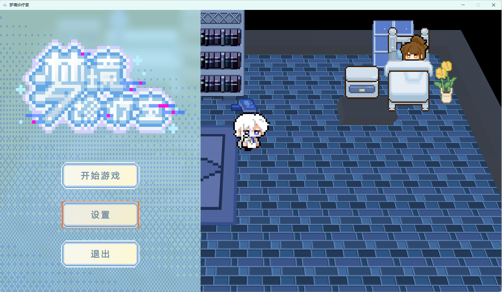

  - **核心机制**：
    - 卡牌赋能 - 手中所持武器具有卡牌槽位（每把武器的槽位和性能不同），这些槽位可以放置卡牌，每一轮载弹中打出对应次数的子弹时触发对应槽位中的卡牌效果（可能是替换本次子弹的性能-例如弹射，穿透，增伤，叠加buff，也可能是从根本上改变本次子弹的类型，例如改为剑气发射出去）
      - 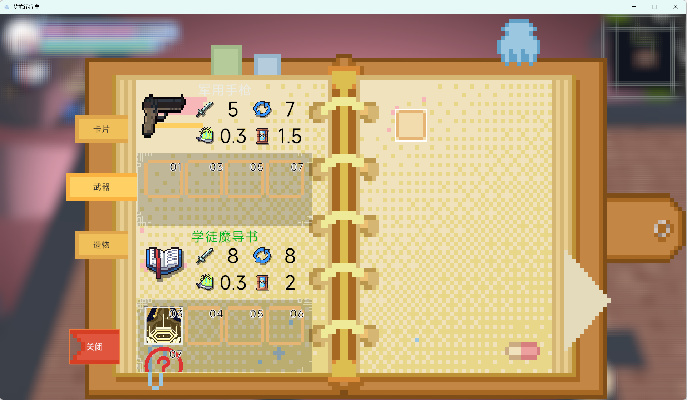
    - 敌人卡牌系统 - 敌我同源机制，怪物身上也由卡牌提供各种技能和增益，死亡后会掉落金币或是卡牌或是武器（存在宝箱中，触碰后获取）
      - 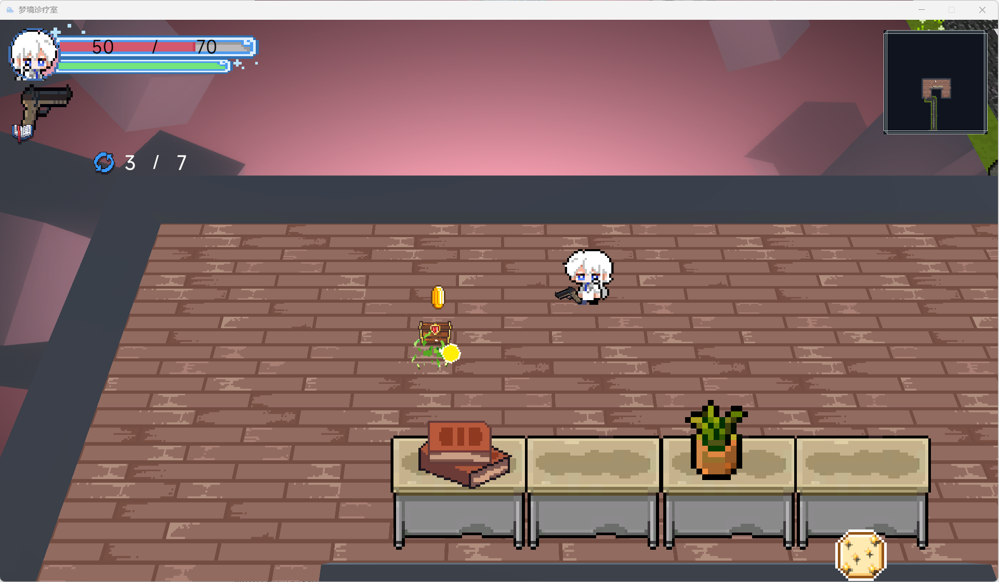
  - 辅助玩法系统：
    - **遗物系统**-提供基础属性提升，主要是收集乐趣
      - 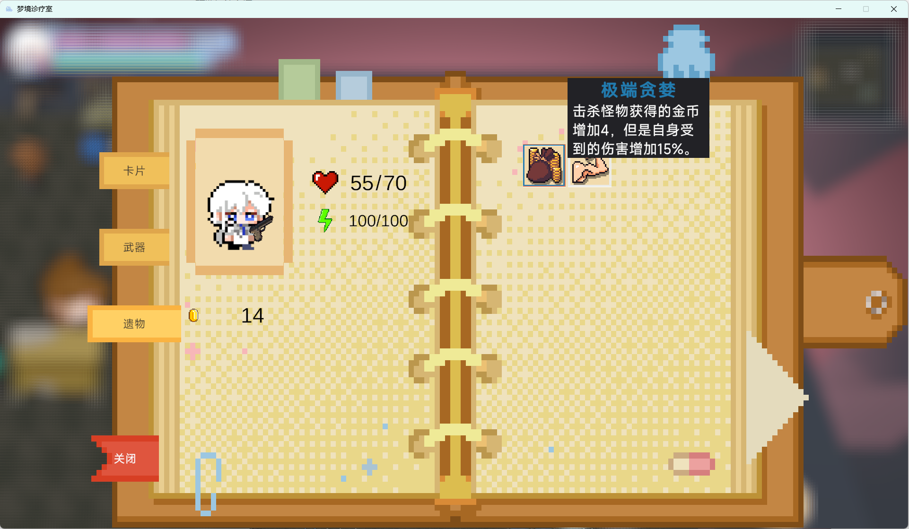
    - **特殊房间**：
      - 事件系统-游玩过程中可以触发各种各样的事件，可能是给予遗物也可能是刷新怪物波次进行战斗也可能是纯粹的减益效果
        - 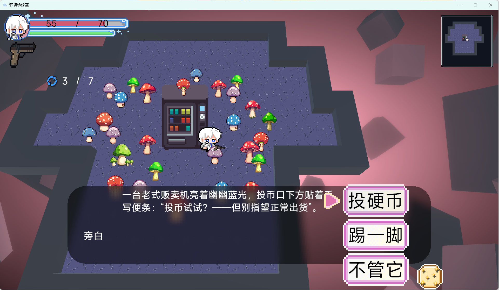
        - 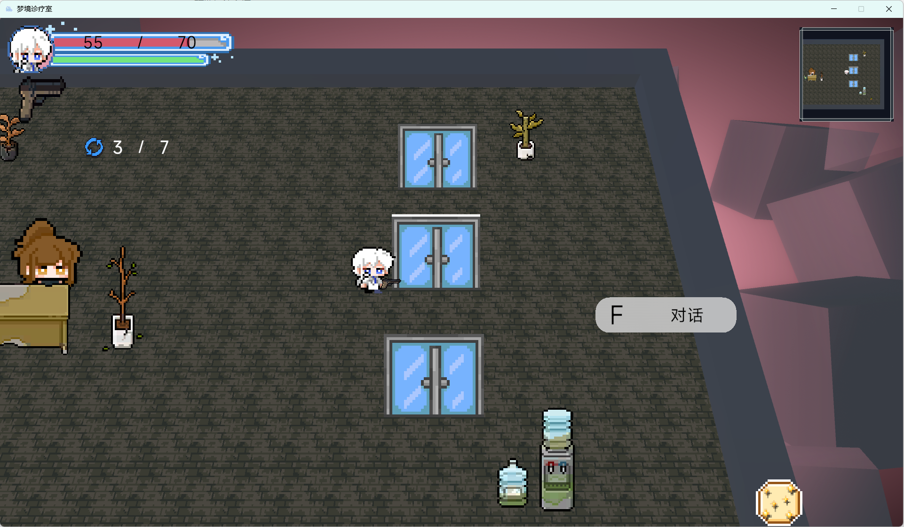
      - 商店系统-在此花费资源购买道具（卡牌或是遗物）提升自己
        - 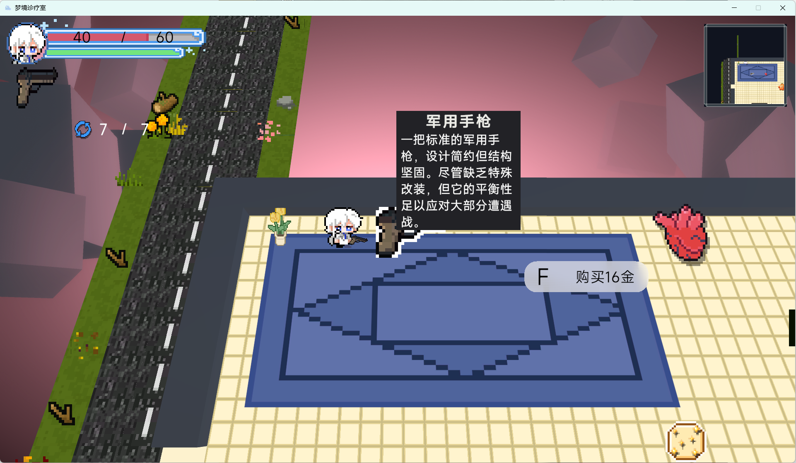
      - 重铸系统-将三份同品质遗物合成一份高品质遗物
        - 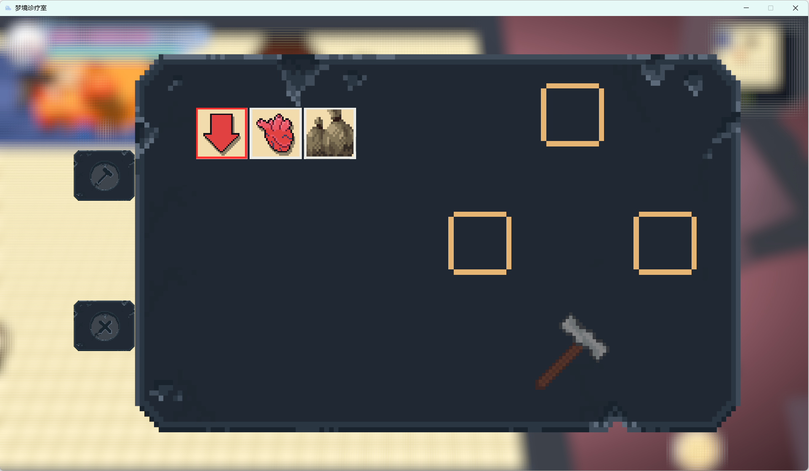
      - 精英怪-存在更强大的怪物挑战，奖励也更为丰厚
        - 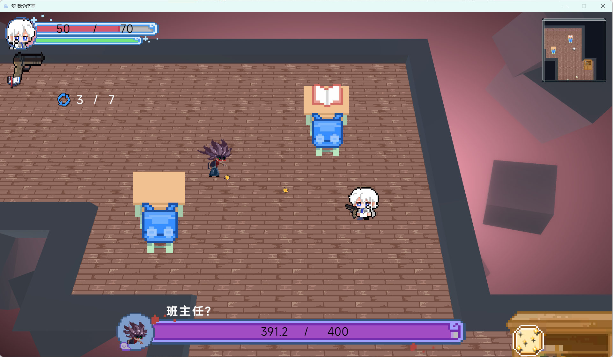
    
    - **可交互场景**-打破场景中的物体，可能掉落金币和血瓶
      - 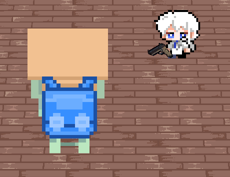
    
  - 基础操作：
    - 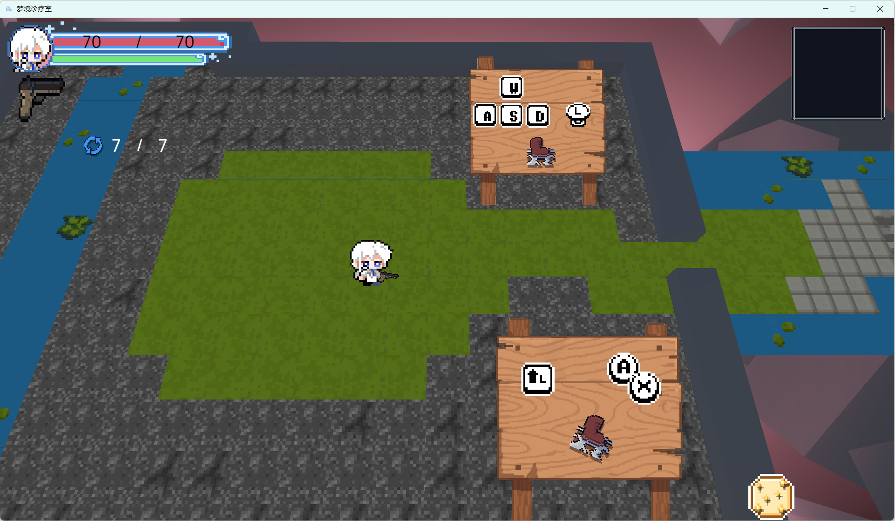
    
    - 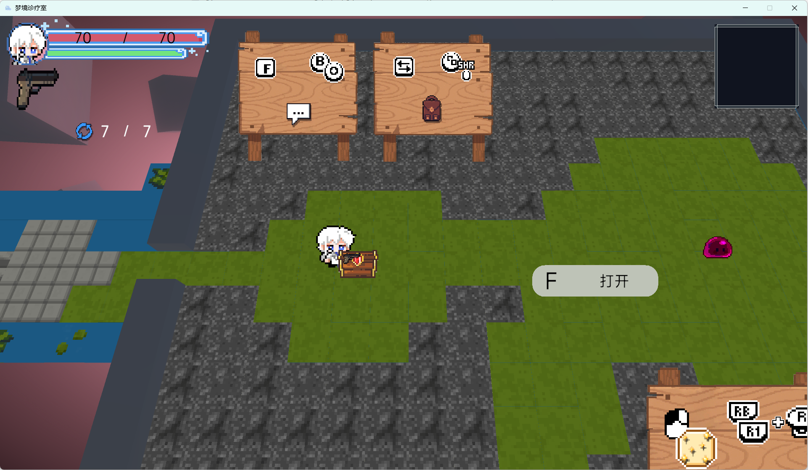
    
  - 游玩流程：
    - 与手术台交互后选择进入梦境
    - 游玩路线分为：层、关卡、房间。关系：一层有许多关卡，一个关卡有许多房间，层底存在Boss，关卡中包含各种特殊房间。选择心仪的路线进行游戏（每一关卡的图标会提示该关卡必定出现什么特殊房间）
      - 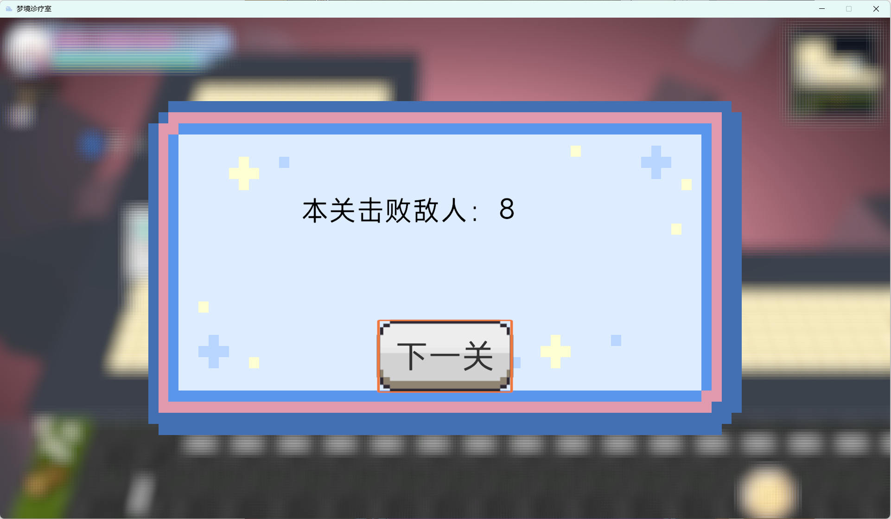
      - 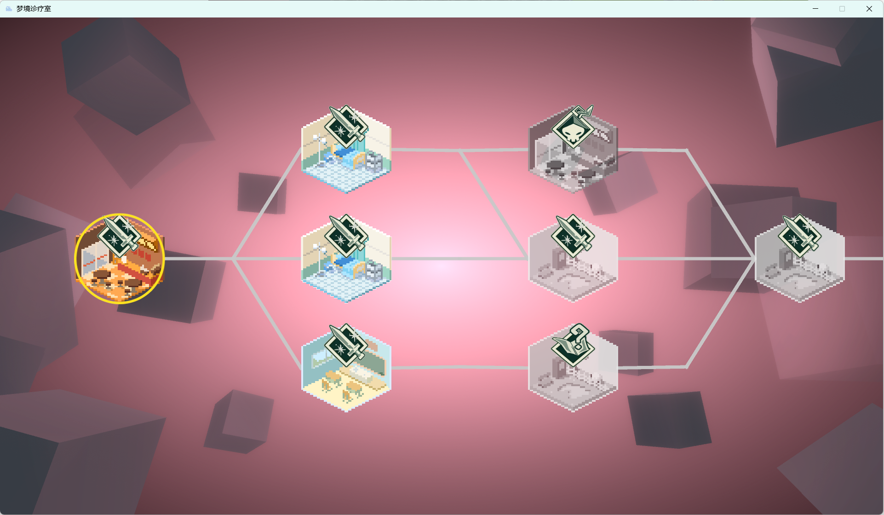
    - 战斗、获取卡牌/遗物、触发事件，装备卡牌，搭配属于自己的独特武器，提升自己，挑战更强大的敌人，直至通关

- 《烟火中的庙会》-模拟经营轻度肉鸽游戏（Unity48小时gamejam极限开发作品，从零开始，较为简陋）
  
  - 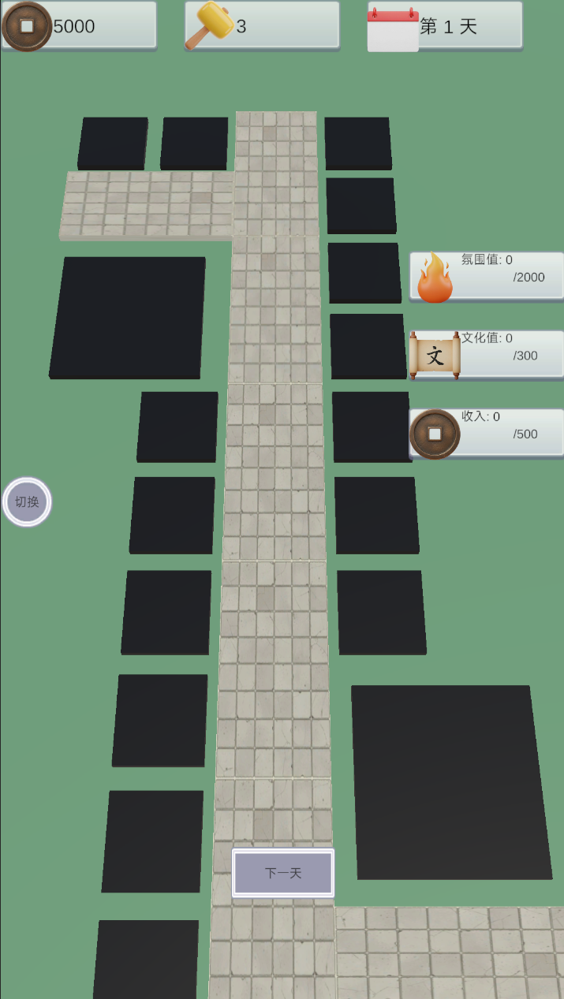
    - 右侧为目标，上方为初始资源，正下方按钮点击进入下一天
  - **核心玩法**：
    - 通过建造建筑、商店进货以及各类随机事件和庙会祝福在有限的资源以及时间内达成营业目标
      - 目标：氛围值、营业额、文化值，每一局数值随机
        - 建造面板
        - 建造前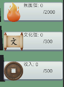
        - 建造后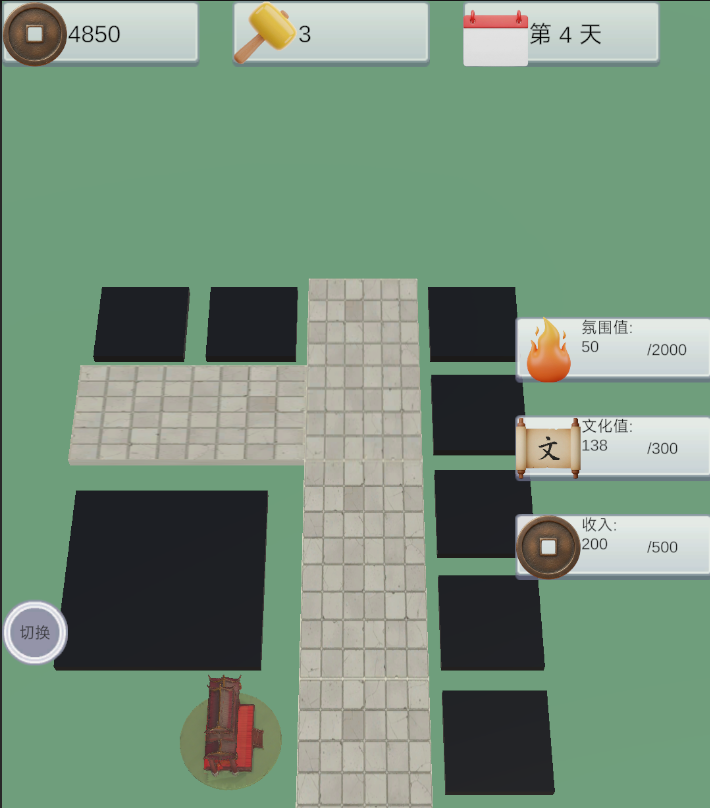
      - 建筑/进货：搭建不同类型的建筑有不同的目标分，其中，商店类型建筑进货可以额外提供营业额，但相对应的氛围值和文化值会获取更少
        - 建筑信息面板，点击进货按钮对下面槽位进行进货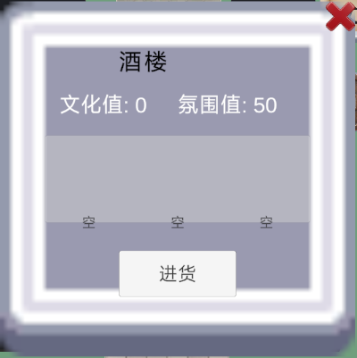
        - 进货面板：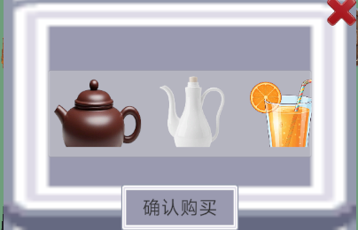
        - 进货后：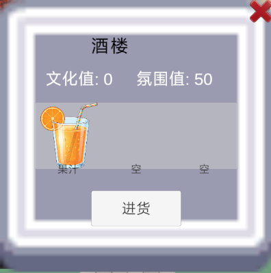
      - 资源：
        - 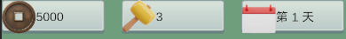
        - （建造消耗预览)
        - 工人，建造建筑时消耗一定数量，完成后返还
        - 资金，建造建筑时消耗一定数量，完成后不返还
        - 日期，隐性资源，在到达指定日期前需要达成目标
      - 随机事件：游戏过程中每天都会有随机事件发生，玩家需要根据随机事件提供的信息，来判断自己接下来的策略
      - 祝福：游戏过程中每五天会提供的随机效果，较为强力，作为核心构筑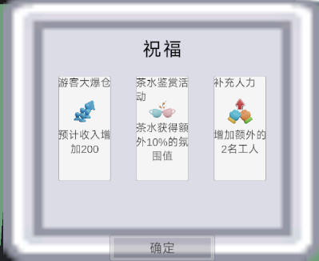
  - 辅助玩法系统：
    - 
      - 视角切换：游戏过程中可以切换视角，近距离观看已构建好的街景
      - 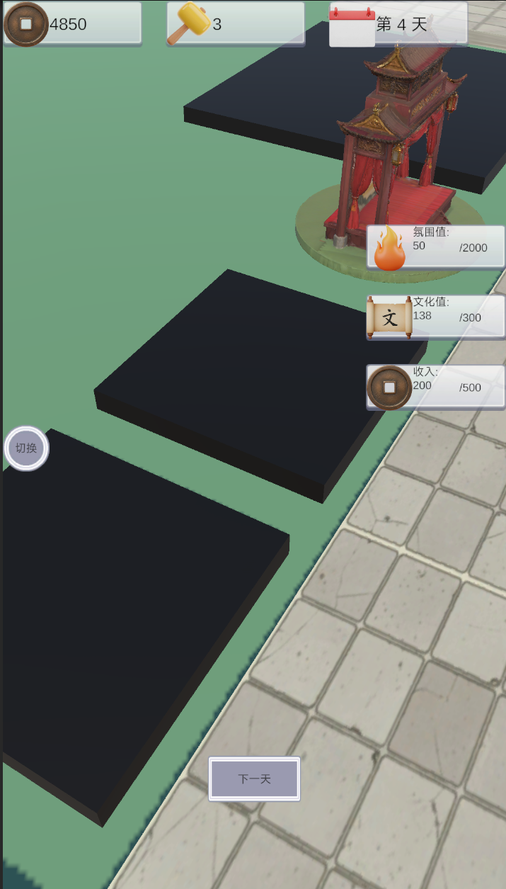
    - 阶段建造：
      - 完成建造前，呈现工地状：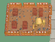
      - 成型后: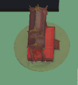
  - 游玩流程：
    - 点击开始游戏按钮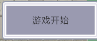
    - 查看右侧各项目标，决定本局初期建设。
    - 点击地块，根据建筑列表消耗资源进行建设，建好后，可以根据建筑类型选择进货（小额提升属性），完成今天安排后点击下一天进入下一轮操作
    - 每天存在随机事件，每五天弹出随机祝福，根据这些增幅，选择本局的中期后期路线，以达成目标完成游戏
